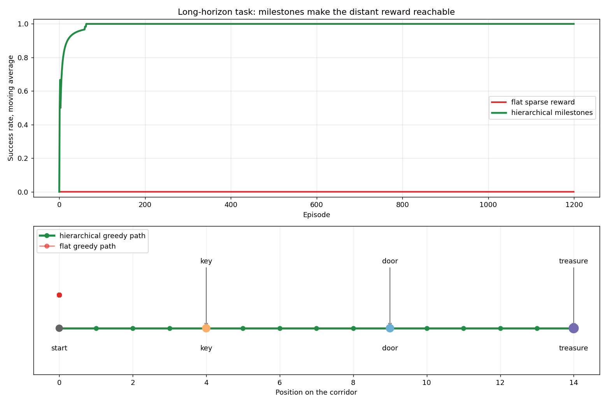

# Long-Horizon Tasks

## The Big Idea: When the Reward Is Very Far Away {#the-big-idea-when-the-reward-is-very-far-away}

Imagine you are a chef trying to learn a new recipe purely by tasting the final dish. You follow 40 steps — chop, sauté, season, simmer, plate — but you only get feedback at the very end: "Too salty." Which of the 40 steps caused the problem? You have no idea.

This is the **long-horizon problem**: when the reward signal is separated from the decisions that caused it by dozens (or hundreds) of steps, learning becomes very hard.

---

## Why Flat Agents Struggle {#why-flat-agents-struggle}

A flat RL agent (like the DQN agents from Phase 3) tries to learn the value of every single step all at once. In short tasks — balance a pole, avoid a wall — this works fine. The reward arrives quickly, and the agent can connect cause and effect.

But in a long task — collect a key, then use it to open a door, then exit the maze — the agent must:

1. Stumble across the key (lucky!)
2. Remember that collecting keys is useful
3. Stumble across the door (lucky again!)
4. Connect the entire sequence to the single reward at the exit

With random exploration, the chance of accidentally completing this whole sequence shrinks exponentially with each new required step. The flat DQN essentially needs to get lucky many, many times before it sees a single positive reward to learn from.

---

## The Hierarchical Solution: Divide and Conquer {#the-hierarchical-solution-divide-and-conquer}

Hierarchical RL breaks the long task into a **two-level structure**:

| Level | Called | Job |
|-------|--------|-----|
| High | **Manager** | Picks the next subgoal |
| Low  | **Worker** | Navigates to that subgoal |

This is exactly how humans tackle complex tasks. You don't plan your road trip turn-by-turn before you leave. Instead:

- **Manager (you, at home):** "First stop: the gas station. Next stop: the highway entrance. Then: exit 42."
- **Worker (you, driving):** Handles all the individual steering decisions to reach each stop.

The manager thinks in *checkpoints*. The worker thinks in *steering wheels*.

---

## Why This Beats Flat Learning on Long Tasks {#why-this-beats-flat-learning-on-long-tasks}

The worker only needs to reach the *next subgoal* — a short task with a clear, nearby reward. It gets feedback quickly and learns efficiently.

The manager only needs to decide the *order of subgoals* — a much simpler problem than planning every individual step.

Together, the two levels divide the hard long-horizon problem into two easy short-horizon problems.

---

## The Key-Door Grid Experiment {#the-key-door-grid-experiment}

Our script tests both approaches on a **9x9 open grid** with two objects:

- A **KEY** at one corner (must be collected first).
- A **DOOR** at the opposite corner (only counts if you have the key).

The only real reward is +1 when the agent reaches the door *after* picking up the key. That single reward requires two sequential sub-tasks to be chained correctly.

Two agents compete:

**Flat DQN:** Must stumble across both sub-tasks in the right order by accident, then back-propagate a signal through both. Because success requires two lucky finds in one episode, the DQN rarely learns anything useful.

**Hierarchical Agent:**
- Manager rule: "Go to key first, then go to door."
- Worker gets **+1 each time it reaches a subgoal** — whether key or door.
- Two separate short tasks, each with a clear nearby reward.

---

## What the Charts Show {#what-the-charts-show}

**Left — Success Rate Over Time:** The hierarchical agent (blue) learns to solve the maze far earlier than the flat DQN (red). The flat agent may eventually learn too — given enough episodes — but the hierarchical agent gets there faster because its learning signal is dense and local.

**Right — Final Performance:** The bar chart shows the success rate averaged over the last 500 episodes. The hierarchical agent's advantage is clear: breaking the problem into subgoals makes it tractable.

---

## Where Long-Horizon Thinking Shows Up {#where-long-horizon-thinking-shows-up}

| Domain | Long horizon example |
|--------|---------------------|
| Robotics | Assemble a device with 30 parts in order |
| Games | Win a match of chess (many moves, one winner) |
| Language | Write a full research paper (many writing decisions, one quality score) |
| Science | Run a multi-month experiment and evaluate results |

This is exactly why Feudal Networks (an architecture where managers set directional goals for lower-level workers) and HIRO (Hierarchical RL with subgoals) were invented — as flat RL hit walls on these problems, hierarchical decomposition became the dominant strategy.

---

## The Connection to Goal-Conditioned Policies {#the-connection-to-goal-conditioned-policies}

Notice that the **worker** in our hierarchical agent is essentially a **goal-conditioned policy** — it receives a subgoal and navigates to it. This is the standard design in HIRO and related papers: the manager sets goals, the worker is a goal-conditioned policy that chases them.

The two ideas — goal-conditioned policies and hierarchical structure — are therefore two sides of the same coin, which is why they appear together in this module.

---

## One-Sentence Summary {#one-sentence-summary}

> **Long-horizon tasks are hard because the reward arrives too late to teach individual decisions — hierarchical RL solves this by inserting nearby subgoals that let the worker learn quickly while the manager handles the big-picture sequence.**
