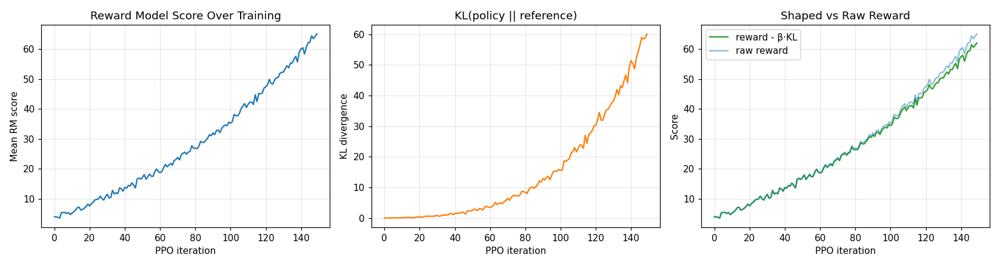

# PPO Fine-Tuning: Polishing A Model Without Breaking It

## The Big Idea

Once we have a reward model that scores responses, we want our language
model to produce responses with higher scores. PPO (Proximal Policy
Optimization) does exactly this - but it adds a safety belt so the model
does not chase the score and forget how to write normal text.

Think of it as a polish step. The model already speaks fluently; we just
nudge it to speak in a way the reward model rewards, while keeping its
voice recognizable.

## A Real-Life Analogy

Imagine a chef who already cooks well but is now learning to please a
specific food critic.

After each dish the critic gives a score. The chef has two pressures:

1. **Get a higher score.** Cook in a way the critic likes.
2. **Do not become unrecognizable.** If the chef abandons their own style
   completely - throwing in salt by the cup just to chase a score - the
   food becomes weird. Customers stop coming.

PPO captures both pressures:

- The **reward** part pushes the model toward responses the judge likes.
- The **KL penalty** part tugs the model back toward how it spoke before
  training started. KL is just a way of measuring "how different is the
  new behavior from the old behavior."

Together they say: *get better, but stay yourself*.

## How The Learning Works (Intuition Only)

Each training round looks like:

1. Take some prompts. Let the current model produce responses.
2. Score the responses with the reward model.
3. Compare against the **reference model** - a frozen copy of the model
   from before training. If the new responses are wildly different,
   subtract a KL penalty from the reward.
4. Nudge the model toward responses that scored well.

The "Proximal" in PPO means *do not take big jumps*. Each update is a
small, careful step. Big jumps in policy training cause crashes, which is
why earlier methods like vanilla policy gradient were so unstable.

## What The Experiment Shows

We start with a fresh policy and a trained reward model. PPO runs for 150
iterations, sampling batches of responses and updating the policy.

- **Left** - the average reward-model score climbs steadily. The policy is
  learning to produce responses the judge likes.
- **Middle** - KL divergence from the reference model grows. The policy is
  moving away from where it started. This is expected, but if it grew
  unchecked, the model would drift into nonsense.
- **Right** - the shaped reward (raw reward minus the KL penalty) tracks
  the raw reward closely at first, then falls behind as KL climbs. The
  penalty is doing its job: making the model "pay" for drifting too far.

In a real RLHF system, you tune the KL coefficient until the score still
goes up but the model stays coherent. Too small a penalty and the model
hacks the reward by emitting weird repeating phrases. Too large and the
model never improves.

## Where This Sits In The RLHF Pipeline

This is step two of the classic RLHF recipe:

1. Train a reward model from preferences.
2. **Fine-tune the language model with PPO using that reward model.**
3. (Optional) Skip step 2 with DPO if you want a simpler path.

PPO is the workhorse that companies like OpenAI and Anthropic used for the
first wave of aligned models, including InstructGPT and the original
ChatGPT.

## Why This Matters Outside The Lab

The "improve, but do not drift" pattern shows up everywhere:

- A pianist practicing a hard piece does not change their whole technique
  to nail one passage - that would break the rest of the recital.
- A company tweaking a website to lift signups still has to keep the brand
  recognizable to existing users.
- A factory adjusting one knob in a process keeps the others close to the
  known-good settings.

PPO is just a careful version of this universal idea, written in math.

## One-Sentence Summary

**PPO fine-tuning pushes a model toward higher reward while a KL penalty
keeps it close to its original behavior - improve, but stay yourself.**
