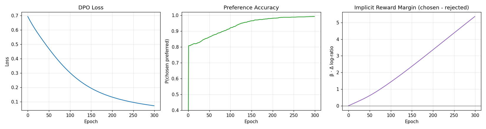

# DPO: Den Richter überspringen und direkt zur Quelle gehen

## Die Kernidee

Klassisches RLHF besteht aus zwei Stufen: Zuerst wird ein Belohnungsmodell (Reward Model) trainiert, dann wird PPO verwendet, um dessen Bewertungen zu maximieren. DPO (Direct Preference Optimization) stellt eine clevere Frage:

*Wenn das Belohnungsmodell nur ein Zwischenschritt ist, können wir es dann überspringen?*

Es stellt sich heraus: Ja. DPO trainiert das Sprachmodell direkt anhand von Präferenzpaaren, ohne separaten „Richter“, ohne PPO-Sampling-Schleife und ohne einen KL-Koeffizienten, den man mühsam einstellen muss. Es verwendet eine elegante Formel und verhält sich wie Supervised Learning.

Dies macht DPO einfacher in der Ausführung, stabiler und schneller – weshalb es rasch zur Standardwahl für viele quelloffene, ausgerichtete (aligned) Modelle geworden ist.

## Eine Analogie aus dem echten Leben

Angenommen, Sie coachen einen Schüler im Schreiben von Aufsätzen.

Der PPO-Ansatz ist: Sie stellen einen Lehrer ein, der die Aufsätze benotet. Dann lassen Sie den Schüler Aufsatz um Aufsatz schreiben und passen sein Schreiben basierend auf den Noten des Lehrers an.

Der DPO-Ansatz ist: Sie zeigen dem Schüler zwei Aufsätze gleichzeitig und sagen: „Dieser hier ist besser – versuche eher so zu schreiben wie dieser und weniger wie jener.“ Kein Lehrer dazwischen. Der Schüler passt sein Verhalten direkt aus den Vergleichen an.

Beides kann funktionieren. DPO ist normalerweise schneller am Ziel, weil niemand einen separaten Lehrer ausbilden und bezahlen muss.

## Wie das Lernen funktioniert (Intuition)

DPO verwendet dieselben Präferenzpaare wie das Reward Modeling: Prompt, gewählte Antwort (chosen), abgelehnte Antwort (rejected). Für jedes Paar werden zwei Fragen gestellt:

1. Ist die Wahrscheinlichkeit, dass das Modell die gewählte Antwort erzeugt, höher geworden, als sie es beim Referenzmodell gewesen wäre?
2. Ist die Wahrscheinlichkeit, dass das Modell die abgelehnte Antwort erzeugt, geringer geworden, als sie es beim Referenzmodell gewesen wäre?

Das Training drückt beide Zahlen gleichzeitig in die richtige Richtung. Entscheidend ist, dass das Referenzmodell beim Vergleich immer dabei ist – es spielt die gleiche Rolle wie die KL-Strafe bei PPO. Das Modell darf sich verändern, aber die Veränderungen sind immer *relativ zum* Ausgangspunkt.

Ein subtiles und schönes Ergebnis des DPO-Papers ist, dass diese eine Loss-Funktion mathematisch äquivalent zu „trainiere ein Belohnungsmodell und führe dann PPO mit einer KL-Strafe aus“ ist. Dasselbe Ziel, ein einfacherer Weg.

## Was das Experiment zeigt

Wir haben eine Policy direkt auf 2.000 Präferenzpaaren über 300 Epochen trainiert.

- **Links** — der DPO-Loss sinkt, während das Modell lernt, gewählte Antworten gegenüber abgelehnten zu bevorzugen.
- **Mitte** — die Präferenzgenauigkeit (wie oft die Policy der gewählten Antwort eine höhere implizite Belohnung zuweist) steigt auf etwa 99 %.
- **Rechts** — die implizite Belohnungsspanne (Margin) wächst. DPO nennt nie explizit eine „Belohnung“, aber die Lücke zwischen den Log-Wahrscheinlichkeiten von gewählten vs. abgelehnten Antworten, skaliert mit Beta, kann als solche gelesen werden. Sie weitet sich stetig aus, was bedeutet, dass das Modell in seinen Präferenzen immer sicherer wird.

Beachten Sie, wie sauber das im Vergleich zu PPO aussieht. Es gibt keine Sampling-Schleife, kein Explorationsrauschen und kein separates Belohnungsmodell, das mitlaufen muss. Jede Epoche ist ein reines Update im Supervised-Stil über den Präferenzdatensatz.

## Wo DPO in der RLHF-Pipeline steht

DPO ist eine *Alternative* zu Schritt zwei der klassischen Pipeline:

- **Klassisch:** Präferenzen → Belohnungsmodell → PPO → ausgerichtetes Modell.
- **DPO:** Präferenzen → ausgerichtetes Modell. (Fertig.)

Der Haken ist, dass DPO auf einem festen Präferenzdatensatz trainiert. PPO kann im Prinzip weiter explorieren, da es in jeder Runde neue Antworten generiert. In der Praxis gewinnt DPO bei den meisten Anwendungsfällen, in denen es um die „Ausrichtung auf einen kuratierten Präferenzdatensatz“ geht.

## Warum das außerhalb des Labors wichtig ist

Das Muster „die mittlere Messung überspringen“ findet sich überall:

- Ein Trainer korrigiert die Form eines Schwimmers durch direktes Vormachen (Seite-an-Seite-Vergleich), anstatt jede Bahn mit der Stoppuhr zu bewerten.
- Ein Fotograf bearbeitet zwei Fotos gleichzeitig und wählt das bessere aus, anstatt ein Bewertungsschema für „gute Fotos“ zu erstellen.
- Ein Personalverantwortlicher vergleicht zwei Lebensläufe direkt, anstatt jeden nach einer 30-Punkte-Checkliste zu bewerten.

Wenn man nur *rangordnen* muss, benötigt man keine absolute Skala. DPO ist diese Erkenntnis, angewendet auf Sprachmodelle.

## Zusammenfassung in einem Satz

**DPO verwandelt Präferenzpaare direkt in ein besseres Modell, ohne ein Belohnungsmodell dazwischen – einfacher als PPO und oft genauso gut.**
