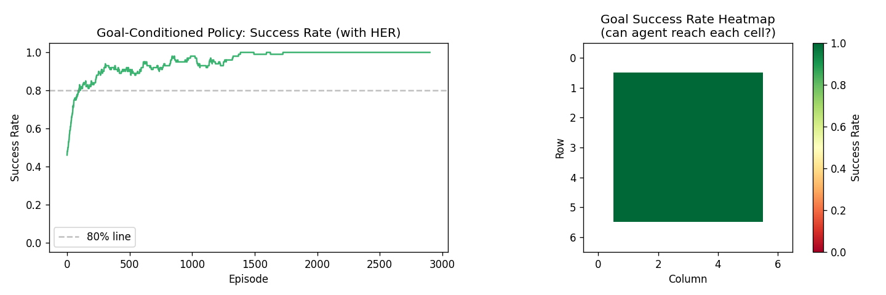

# Política Condicionada a Objetivos (Goal-Conditioned Policy)

## La Gran Idea: Una Política para Dominarlas a Todas

Imagina que eres un repartidor. No necesitas un conjunto de habilidades completamente diferente para cada dirección. Sabes conducir, leer un mapa y navegar por el tráfico; simplemente introduces el *destino de hoy* y te pones en marcha.

Una **política condicionada a objetivos** funciona de la misma manera. En lugar de entrenar a un agente que solo puede ir a un objetivo fijo, entrenamos a un único agente que acepta cualquier objetivo como entrada y descubre cómo llegar allí.

---

## En qué se diferencia del RL estándar

In el RL estándar (como se cubre en las fases anteriores del plan de estudios), la función de recompensa está integrada: "llega a la celda (7, 7), obtén +1". El agente aprende exactamente una cosa: cómo llegar a *esa* celda.

En el RL condicionado a objetivos, la recompensa depende de si el agente alcanza *cualquier objetivo que se le haya dado esta vez*. La política aprende:

> **"Dado dónde estoy y dónde quiero estar, ¿qué debo hacer?"**

El objetivo viaja *con* el agente, como un destino escrito en una aplicación de navegación.

---

## El Problema de la Recompensa Escasa

Este es el truco: aprender de recompensas escasas (solo +1 en el objetivo, 0 en todos los demás lugares) es brutalmente difícil. La mayoría de los intentos fallan — el agente deambula al azar, nunca choca con el objetivo y la red no obtiene nada útil de lo que aprender.

Imagina intentar aprender a lanzar un dardo con los ojos vendados. Lanzas mil veces y siempre fallas. Después de mil fallos, sigues sin tener ni idea de cómo se siente "un buen lanzamiento".

Aquí es donde entra en juego el **Búfer de Repetición por Retrospección (Hindsight Experience Replay, HER)**.

---

## HER: Fallar hacia adelante

El truco de HER es maravillosamente simple. Después de un episodio fallido, HER pregunta:

> *"Aunque no hayas alcanzado tu objetivo... ¿dónde has acabado realmente?"*

Luego **reproduce ese mismo episodio**, pero finge que la posición final real del agente **era** el objetivo todo el tiempo. De repente, un episodio fallido se convierte en uno exitoso — para un objetivo diferente.

Es como un jugador de baloncesto que sigue tirando a la canasta y fallando. HER diría: "Vale, le das a la pared izquierda todas las veces. ¡Enhorabuena, eres genial dándole a la pared izquierda! Registremos esos tiros como intentos exitosos de dar a la pared izquierda". Con el tiempo, el jugador desarrolla la habilidad de dar a *cualquier* objetivo y, finalmente, transfiere eso a la canasta real.

Esto convierte miles de "fallos" en una rica biblioteca de navegaciones *exitosas* a muchos puntos diferentes. El agente aprende a llegar a todos ellos, lo que se generaliza al objetivo real.

---

## Analogía de la vida real: Un niño aprendiendo a apilar bloques

Un niño pequeño que intenta poner un bloque en un cubo falla constantemente. Pero cada "fallo" deja el bloque en *algún lugar*. Si reproduces cada fallo como "¡estabas intentando ponerlo *justo ahí* — y lo has conseguido!", el niño desarrolla habilidades motoras finas en toda la mesa. Pronto podrá colocar un bloque en cualquier lugar, incluso en el cubo.

---

## Qué hace nuestro código

El script `goal_conditioned_policy.py` se ejecuta en un **laberinto de 7x7** con paredes. Al principio de cada episodio, se elige una celda objetivo al azar. El agente debe encontrarla.

La política toma dos entradas en cada paso:
1. Dónde se encuentra el agente actualmente.
2. Adónde quiere ir.

Después de cada episodio (con éxito o no), HER genera varios "éxitos" sintéticos adicionales reetiquetando las posiciones reales visitadas como objetivos alternativos.

El entrenamiento dura 3,000 episodios con una tasa de exploración decreciente — el agente explora más al principio y luego confía cada vez más en lo que ha aprendido.

---

## Qué muestran los gráficos

**Izquierda — Tasa de éxito durante el entrenamiento**: Cada episodio es un éxito (llegó al objetivo) o un fracaso. La curva sube de forma constante a medida que mejora la habilidad de navegación universal del agente. Al final, el agente llega a cualquier objetivo casi siempre.

**Derecha — Mapa de calor de tasa de éxito por objetivo**: Después del entrenamiento, probamos al agente en cada celda objetivo posible y coloreamos cada celda según la frecuencia con la que el agente llega a ella. El verde significa que el agente llega a ese punto de forma fiable; el rojo significa que todavía tiene dificultades. Un agente bien entrenado muestra mayoritariamente verde en todo el laberinto.

---

## Dónde aparece esto en el mundo real

| Aplicación | El "objetivo" |
|-------------|------------|
| Brazo robótico alcanzando algo | Posición objetivo en 3D |
| Coche autónomo | Coordenadas GPS |
| Asistente de modelo de lenguaje | Instrucción del usuario |
| Personaje no jugador en un videojuego | Cualquier punto de referencia en el mapa |

Las políticas condicionadas a objetivos son una de las piezas clave para HIRO (Hierarchical RL with subgoals) — el gestor de alto nivel elige un subobjetivo, y el trabajador de bajo nivel es exactamente este tipo de política condicionada a objetivos.

---

## Resumen de una frase

> **Una política condicionada a objetivos es un único agente que puede navegar a cualquier destino — y HER hace posible el aprendizaje a partir del fallo fingiendo que cada tiro fallido apuntaba a donde quiera que aterrizara.**
