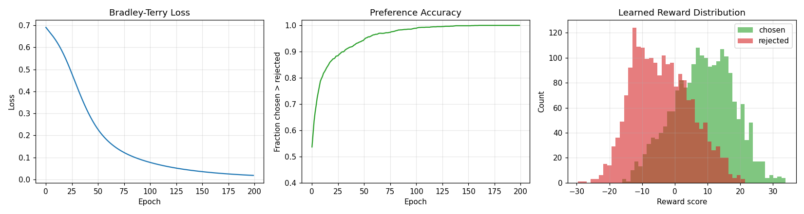

# Modélisation de la Récompense : Apprendre à un Ordinateur ce que les Humains Préfèrent

## L'Idée Maîtresse

Un modèle de récompense est un petit juge. Vous lui montrez deux réponses à la même question, vous lui dites laquelle une personne a préférée, et avec le temps, il apprend à donner un score plus élevé aux réponses que les gens préféreraient.

Pourquoi avons-nous besoin d'un tel juge ? Parce que la plupart de ce que nous attendons d'un modèle de langage est difficile à formuler mathématiquement. Il n'y a pas d'équation unique pour "utile", "poli" ou "bien écrit". Mais les gens peuvent presque toujours désigner la meilleure de deux options. Le modèle de récompense transforme ces simples votes "celui-ci est meilleur" en un score qu'un algorithme d'apprentissage peut utiliser.

## Une Analogie Concrète

Imaginez que vous apprenez à un ami à cuisiner des brownies.

Vous ne lui remettez pas un manuel de 50 pages sur "ce qui fait un bon brownie". Au lieu de cela, vous goûtez deux fournées et dites :

"Celle-ci est meilleure."

Après quelques tours, votre ami commence à remarquer des schémas. Peut-être que le plus fondant gagne toujours. Peut-être que celui qui est trop cuit perd toujours. Votre ami construit un système de notation mental à partir de vos comparaisons.

Un modèle de récompense fait exactement cela, mais avec des chiffres. Il n'a pas besoin de savoir *pourquoi* la réponse choisie est meilleure. Il a juste besoin de nombreux exemples de "celui-ci bat celui-là" et il apprend progressivement un score qui s'aligne sur les préférences.

## Comment fonctionne l'apprentissage (Intuition uniquement)

Chaque exemple est un triplet : une invite (prompt), une réponse **choisie** et une réponse **rejetée**. Nous voulons que le modèle donne un score plus élevé à la réponse choisie qu'à la réponse rejetée — peu importe l'écart.

L'incitation à l'entraînement est simple dans l'esprit :

- Le score de la réponse choisie est trop bas ? On l'augmente.
- Le score de la réponse rejetée est trop haut ? On le diminue.
- Ils sont déjà dans le bon ordre avec un écart net ? On n'y touche pas.

Cette incitation est appelée la perte de Bradley-Terry (Bradley-Terry loss), et c'est la recette standard dans les systèmes RLHF modernes.

## Ce que l'expérience montre

Nous avons entraîné un modèle de récompense sur 2 000 paires de préférences synthétiques. Le graphique ci-dessous montre trois vues de la même session d'entraînement.

- **À gauche** — la perte (loss) diminue rapidement. Le modèle devient plus confiant dans ses classements.
- **Au milieu** — la précision des préférences grimpe à près de 100 %. Sur presque chaque paire, la réponse choisie obtient un score plus élevé que la réponse rejetée.
- **À droite** — les distributions de scores pour les réponses choisies vs rejetées s'écartent. Au début, elles se chevauchaient ; après l'entraînement, les réponses choisies se situent nettement à droite.

Cette séparation est tout l'intérêt. Une étape ultérieure (PPO ou DPO) peut maintenant utiliser ce score comme cible à optimiser.

## Sa place dans le pipeline RLHF

Le plan de route décrit le RLHF comme "l'alignement des modèles avec les préférences humaines". Le modèle de récompense est la première de trois étapes :

1. **Modèle de récompense (ce fichier)** — convertir les votes de préférence en un score.
2. **Ajustement fin avec PPO** — pousser le modèle de langage vers des scores plus élevés tout en restant proche de son comportement initial.
3. **DPO** — un raccourci plus récent qui évite complètement le modèle de récompense.

Ainsi, la modélisation de la récompense est le pont entre le *jugement humain* et l'*optimisation machine*. Si ce pont est mal construit, chaque étape suivante sera mal orientée.

## Pourquoi c'est important en dehors du laboratoire

La même idée se retrouve dans de nombreux endroits :

- **Systèmes de recommandation** : ils apprennent ce que vous aimez à partir des clics, des zaps et du temps passé à regarder.
- **Moteurs de recherche** : ils apprennent le classement à partir du résultat sur lequel vous avez cliqué.
- **Restaurants** : ils apprennent les plats populaires grâce aux commandes répétées, pas parce que les clients écrivent des dissertations sur ce qu'ils ont aimé.

Chaque fois qu'il est plus facile de *comparer* que de *noter*, un modèle de récompense est l'outil approprié.

## Résumé en une phrase

**Un modèle de récompense est un juge appris qui transforme les préférences "celui-ci est meilleur" en un score numérique que le reste du RLHF peut optimiser.**
