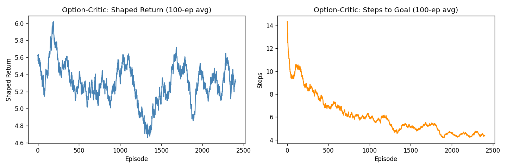

# Arsitektur Option-Critic

## Ide Besar: Bekerja dalam Bab, Bukan Kata demi Kata {#the-big-idea-working-in-chapters-not-word-by-word}

Bayangkan Anda sedang menulis novel. Anda tidak merencanakan setiap kata sebelum memulai. Sebaliknya, Anda berpikir dalam **bab**: "Bab 1 memperkenalkan pahlawan. Bab 2 adalah pencarian. Bab 3 adalah pertarungan terakhir." Di dalam setiap bab, Anda mencari tahu detailnya sambil jalan.

Itulah tepatnya cara arsitektur Option-Critic berpikir tentang keputusan.

---

## Apa Itu Agen "Datar"? {#what-is-flat-agent}

Agen RL normal (seperti yang ada di Fase 3 dan 4 kurikulum) memutuskan satu tindakan pada satu waktu, setiap langkah tunggal. Ini seperti GPS yang menghitung ulang seluruh rute dari awal setiap kali Anda bergerak satu meter. Ini berhasil, tetapi melelahkan dan lambat untuk dipelajari.

---

## Apa Itu "Option"? {#what-is-an-option}

Sebuah **option** adalah **keterampilan bernama** — kebijakan mini (mini-policy) yang dapat dijalankan agen selama beberapa langkah berturut-turut sebelum menyerahkan kendali kembali.

Bayangkan seperti manajer yang mendelegasikan kepada spesialis:

| Siapa | Apa yang mereka lakukan |
|-----|-------------|
| **Manajer (meta-policy)** | Memutuskan spesialis *mana* yang akan dikirim untuk suatu pekerjaan |
| **Spesialis A** | Ahli dalam menavigasi ruangan kiri atas |
| **Spesialis B** | Ahli dalam melewati ambang pintu |
| **Spesialis C** | Ahli dalam menyerbu menuju tujuan |
| **Spesialis D** | Spesialis cadangan umum |

Manajer memilih spesialis. Spesialis bekerja sampai mereka memutuskan mereka selesai (ini disebut **terminasi**). Kemudian manajer memilih lagi.

---

## Tiga Bagian yang Bergerak {#the-three-moving-parts}

Setiap option memiliki tiga komponen — bayangkan sebagai **deskripsi pekerjaan** spesialis tersebut:

1. **Inisiasi (Initiation)**: Kapan spesialis ini dapat dipanggil? *(misalnya, "Spesialis A hanya aktif di dekat ruangan kiri atas.")*
2. **Kebijakan intra-option (Intra-option policy)**: Apa yang dilakukan spesialis saat mereka bekerja? *(misalnya, "Berjalan menuju sudut kiri atas.")*
3. **Terminasi (Termination)**: Kapan spesialis menyerahkan kembali kendali? *(misalnya, "Berhenti setelah mencapai ambang pintu.")*

Keindahan dari Option-Critic adalah ketiganya **dipelajari secara otomatis** — Anda tidak perlu merancang spesialis secara manual. Algoritma tersebut mencari tahu sendiri bahwa berguna untuk memiliki satu option untuk setiap ruangan, atau satu untuk bergegas ke tujuan.

---

## Sehari dalam Kehidupan Agen Option-Critic {#a-day-in-the-life-of-an-option-critic-agent}

1. Agen memasuki ruangan baru (status).
2. **Manajer** melihat ruangan dan memilih sebuah option — misalnya, Option 2.
3. **Spesialis Option 2** mengambil alih: berjalan menuju ambang pintu, langkah demi langkah.
4. Pada suatu titik, Option 2 berkata "Saya selesai di sini" (terminasi).
5. **Manajer** bangun, memilih option baru untuk situasi baru tersebut.
6. Ulangi.

Bandingkan ini dengan agen datar: agen datar bersusah payah memikirkan setiap langkah tunggal. Option-Critic mendelegasikan seluruh rentang perilaku, membiarkan setiap spesialis menjadi mahir dalam pekerjaan sempitnya.

---

## Mengapa Ini Membantu? {#why-does-this-help}

Di dalam labirin, agen perlu mencapai tujuan yang mungkin berjarak 30–50 langkah. Dengan pembelajaran datar, setiap langkah di jalur tersebut sama-sama "tidak terlihat" sampai imbalan akhirnya tiba di akhir — sinyal tersebut harus merambat mundur melalui lusinan langkah.

Dengan option, jalur tersebut terpecah menjadi **sub-tugas**. Setiap sub-tugas mendapatkan sinyal imbalan mini sendiri (mencapai ambang pintu, memasuki ruangan berikutnya). Pembelajaran merambat melalui segmen yang lebih pendek. **Agen belajar lebih cepat pada masalah yang membutuhkan banyak langkah.**

Ini adalah ide inti di balik semua RL Hierarkis — dan Option-Critic adalah salah satu implementasi terbersihnya.

---

## Apa yang Dilakukan Kode Kami {#what-our-code-does}

Skrip `option_critic.py` menempatkan agen Option-Critic ke dalam **gridworld 7x7** dengan tujuan tetap. Agen mulai di mana saja di kisi dan harus menavigasi ke sel tujuan.

Agen memiliki empat option dan harus secara simultan mempelajari:

- Kebijakan untuk setiap option (ke mana harus berjalan)
- Kapan harus mengakhiri setiap option (kondisi terminasi)
- Meta-kebijakan untuk memilih di antara option

Imbalan menggunakan **pembentukan berbasis potensi (potential-based shaping)** — agen mendapatkan bonus kecil setiap langkah ia bergerak lebih dekat ke tujuan, di atas +1 untuk mencapainya. Umpan balik yang padat ini membuat pembelajaran cukup stabil untuk melihat option berfungsi dalam 2.500 episode.

Tidak ada manusia yang pernah memberi tahu apa yang harus dilakukan setiap option. Algoritma tersebut menemukan area kisi mana yang dispesialisasi oleh masing-masing option.

---

## Apa yang Ditunjukkan Grafik {#what-the-charts-show}

**Kiri — Shaped Return:** Return yang lebih tinggi berarti agen mencapai tujuan dengan lebih andal *dan* mengambil jalur yang lebih pendek (pembentukan imbalan memberi bonus per langkah yang lebih dekat). Kurva yang naik kemudian stabil menunjukkan option-option belajar untuk berkoordinasi.

**Kanan — Steps to Goal:** Semakin sedikit langkah berarti agen menemukan jalur yang lebih efisien. Tren menurun menunjukkan option-option tersebut mulai matang menjadi keterampilan koheren yang memandu agen secara lebih langsung menuju tujuan.

Kurva yang dihaluskan menunjukkan tren umum di seluruh jendela 100-episode — beberapa noise adalah hal normal dalam RL, terutama ketika beberapa komponen (option, terminasi, meta-policy) belajar secara bersamaan.

---

## Ringkasan Satu Kalimat {#one-sentence-summary}

> **Option-Critic mengajarkan agen untuk bekerja dalam keterampilan daripada langkah tunggal — manajer memilih spesialis mana yang berjalan, setiap spesialis melakukan pekerjaannya, dan seluruh sistem belajar bersama dari sinyal imbalan yang sama.**
