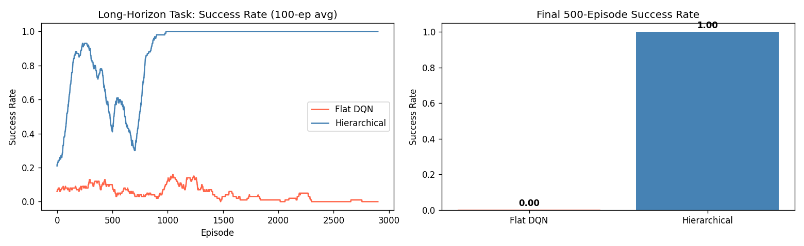

# Taken met een lange horizon

## Het grote idee: wanneer de beloning heel ver weg is {#the-big-idea-when-the-reward-is-very-far-away}

Stel je voor dat je een chef-kok bent die een nieuw recept probeert te leren, puur door het laatste gerecht te proeven. Je volgt 40 stappen – hakken, sauteren, kruiden, sudderen, opdienen – maar je krijgt pas helemaal aan het einde feedback: ‘Te zout.’ Welke van de 40 stappen heeft het probleem veroorzaakt? Je hebt geen idee.

Dit is het **lange-horizonprobleem**: wanneer het beloningssignaal tientallen (of honderden) stappen gescheiden is van de beslissingen die dit hebben veroorzaakt, wordt leren erg moeilijk.

---

## Waarom platte agenten worstelen {#why-flat-agents-struggle}

Een platte RL-agent (zoals de DQN-agents uit fase 3) probeert in één keer de waarde van elke afzonderlijke stap te leren kennen. Bij korte taken – een paal balanceren, een muur vermijden – werkt dit prima. De beloning komt snel en de agent kan oorzaak en gevolg met elkaar verbinden.

Maar bij een lange taak – een sleutel verzamelen, deze gebruiken om een ​​deur te openen en vervolgens het doolhof te verlaten – moet de agent:

1. Struikel over de sleutel (gelukkig!)
2. Onthoud dat het verzamelen van sleutels nuttig is
3. Struikel over de deur (weer geluk!)
4. Verbind de hele reeks met de enkele beloning bij de uitgang

Bij willekeurige verkenning wordt de kans dat deze hele reeks per ongeluk wordt voltooid, exponentieel kleiner bij elke nieuwe vereiste stap. De platte DQN moet in essentie vele malen geluk hebben voordat hij ook maar één positieve beloning ziet waar hij van kan leren.

---

## De hiërarchische oplossing: verdeel en heers {#the-hierarchical-solution-divide-and-conquer}

Hiërarchische RL verdeelt de lange taak in een **structuur met twee niveaus**:

| Level | Called | Job |
|-------|--------|-----|
| Hoog | **Manager** | Kiest het volgende subdoel |
| Laag  | **Werknemer** | Navigeer naar dat subdoel |

Dit is precies hoe mensen complexe taken aanpakken. Je plant je roadtrip niet stap voor stap voordat je vertrekt. In plaats van:

- **Beheerder (u, thuis):** "Eerste halte: het tankstation. Volgende halte: de oprit van de snelweg. Vervolgens: afrit 42."
- **Werknemer (jij, rijdend):** Behandelt alle individuele stuurbeslissingen om elke stop te bereiken.

De manager denkt in *checkpoints*. De arbeider denkt in *stuurwielen*.

---

## Waarom dit beter is dan plat leren bij lange taken {#why-this-beats-flat-learning-on-long-tasks}

De werker hoeft alleen maar het *volgende subdoel* te bereiken: een korte taak met een duidelijke, nabije beloning. Het krijgt snel feedback en leert efficiënt.

De manager hoeft alleen maar de *volgorde van de subdoelen* te bepalen – een veel eenvoudiger probleem dan het plannen van elke afzonderlijke stap.

Samen verdelen de twee niveaus het moeilijke probleem met de lange horizon in twee gemakkelijke problemen met de korte horizon.

---

## Het Key-Door Grid-experiment {#the-key-door-grid-experiment}

Ons script test beide benaderingen op een **9x9 open raster** met twee objecten:

- Een **SLEUTEL** in een hoek (moet eerst worden opgehaald).
- Een **DEUR** in de tegenoverliggende hoek (telt alleen als je de sleutel hebt).

De enige echte beloning is +1 wanneer de agent de deur bereikt *na* het ophalen van de sleutel. Die ene beloning vereist dat twee opeenvolgende subtaken correct aan elkaar worden gekoppeld.

Twee agenten concurreren:

**Flat DQN:** Moet per ongeluk beide subtaken in de juiste volgorde tegenkomen en vervolgens een signaal door beide heen verspreiden. Omdat succes twee gelukkige vondsten in één aflevering vereist, leert de DQN zelden iets nuttigs.

**Hiërarchische agent:**
- Managerregel: "Ga eerst naar de sleutel en ga dan naar de deur."
- Werknemer krijgt **+1 elke keer dat hij een subdoel** bereikt, ongeacht of het een sleutel of een deur betreft.
- Twee afzonderlijke korte taken, elk met een duidelijke beloning in de buurt.

---

## Wat de grafieken laten zien {#what-the-charts-show}

**Links – Succespercentage in de loop van de tijd:** De hiërarchische agent (blauw) leert het doolhof veel eerder op te lossen dan de platte DQN (rood). De platte agent kan uiteindelijk ook leren – als er voldoende afleveringen zijn – maar de hiërarchische agent komt daar sneller omdat zijn leersignaal compact en lokaal is.

**Rechts – Eindprestatie:** Het staafdiagram toont het gemiddelde succespercentage van de afgelopen 500 afleveringen. Het voordeel van de hiërarchische agent is duidelijk: het opdelen van het probleem in subdoelen maakt het hanteerbaar.

---

## Waar het denken over de lange horizon opduikt {#where-long-horizon-thinking-shows-up}

| Domain | Long horizon example |
|--------|---------------------|
| Robotica | Stel een apparaat met 30 onderdelen op volgorde samen |
| Spellen | Win een schaakpartij (veel zetten, één winnaar) |
| Taal | Schrijf een volledig onderzoekspaper (veel schrijfbeslissingen, één kwaliteitsscore) |
| Wetenschap | Voer een experiment van meerdere maanden uit en evalueer de resultaten |

Dit is precies de reden waarom feodale netwerken (een architectuur waarin managers richtinggevende doelen stellen voor werknemers op een lager niveau) en HIRO (hiërarchische RL met subdoelen) zijn uitgevonden – toen platte RL tegen deze problemen aanliep, werd hiërarchische ontbinding de dominante strategie.

---

## De verbinding met doelgericht beleid {#the-connection-to-goal-conditioned-policies}

Merk op dat de **werker** in onze hiërarchische agent in wezen een **doelgericht beleid** is: hij ontvangt een subdoel en navigeert ernaartoe. Dit is het standaardontwerp in HIRO en aanverwante artikelen: de manager stelt doelen, de werknemer is een doelgericht beleid dat deze doelstellingen najaagt.

De twee ideeën – doelgericht beleid en hiërarchische structuur – zijn daarom twee kanten van dezelfde medaille en daarom verschijnen ze samen in deze module.

---

## Samenvatting van één zin {#one-sentence-summary}

> **Taken met een lange horizon zijn moeilijk omdat de beloning te laat komt om individuele beslissingen aan te leren. Hiërarchische RL lost dit op door nabijgelegen subdoelen in te voegen waardoor de werknemer snel kan leren terwijl de manager het grote geheel afhandelt.**