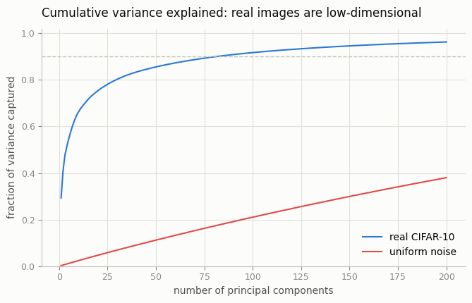
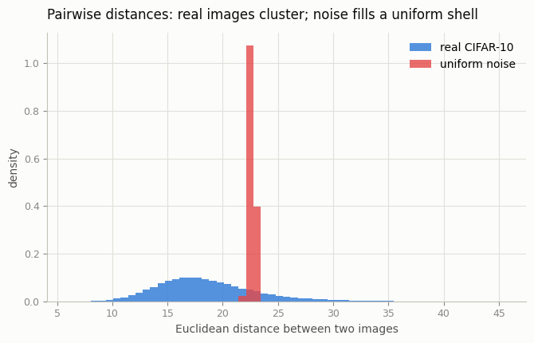
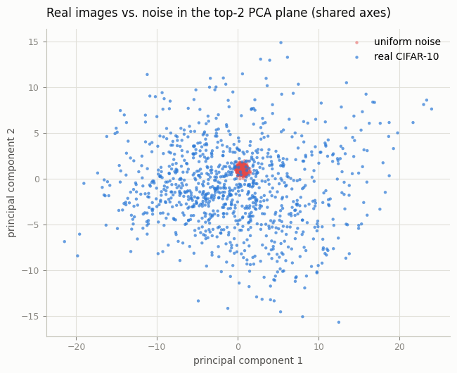
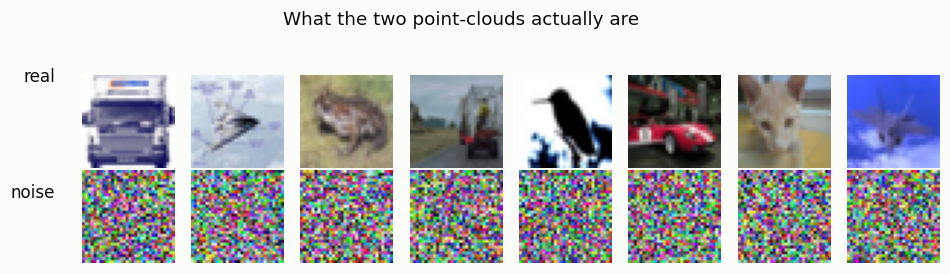

# Manifold Visualizer

## ELI5 (Explain Like I'm 5)

- **The Big Idea:** A tiny 32×32 color photo is really just a list of 3,072
  numbers. There are unimaginably many possible lists — but almost all of them
  look like TV static. Real photos are incredibly rare and special: they huddle
  together on a thin, curved "sheet" floating inside that giant space of
  numbers. This project draws a picture of that sheet so you can *see* how real
  images clump together while random static spreads out into nowhere.
- **Analogy:** Imagine every possible 3,072-number list is a grain of sand in a
  vast desert. Real photographs are like grains that all lie along one winding
  footpath through the dunes. If you scatter *random* grains, they land all over
  the desert, evenly, nowhere near the path. Learning to generate images means
  learning to walk that footpath and never step off into the empty sand.
- **Example:** We take 1,000 real CIFAR-10 photos and 1,000 pure-noise images
  and measure them three ways. Real images need only ~80 "directions" to
  describe 90% of their variety; noise needs ~730. Real images sit close to each
  other (distances 8–30); noise images are *all* exactly ~22.6 apart, evenly
  filling a shell. The footpath is real, and you can measure it.

## Key Insight

A 32×32 color image lives in a space with 3,072 numbers — the picture is a 32×32 grid, which is 32 × 32 = 1,024 pixels, and each pixel needs *three* numbers (one each for how much red, green, and blue it has), so 1,024 × 3 = 3,072 numbers in total. Listing all 3,072 is like giving the image one very long, 3,072-digit address that pins down exactly where it sits. But real photos do not fill that space — they cluster on a thin, curved surface called the [manifold](/shared/glossary/#manifold). This project draws 1,000 real [CIFAR-10](/shared/glossary/#cifar-10) images and 1,000 images of pure random noise, then squashes both groups down to 2D with [PCA](/shared/glossary/#pca-principal-component-analysis) so you can see them on a plot. The real images form a tight, structured blob while the random ones scatter everywhere, making the manifold visible to the eye. That single picture explains why generation is hard: the model must learn to land only on that thin blob and avoid the vast emptiness around it.

## What's in this directory

| File | Role |
|------|------|
| `pca_manifold.py` | Loads real + noise images, runs PCA, and produces the scatter, the intrinsic-dimension curve, and the pairwise-distance histogram — no training |

```bash
python pca_manifold.py --data-dir data      # ~10s on CPU, no training
```

## Three ways to see the manifold

**1. Intrinsic dimension — the rigorous version.** Fit PCA to each set and ask
how many directions you need to capture 90% of the variety. Real images: **81**
of 3,072. Noise: **730**. Real photos are effectively *low-dimensional* — the
manifold hypothesis, measured:



**2. Pairwise distances — real cluster, noise scatters everywhere.** How far
apart are two images? Real images span a broad range (8–30) — some pairs are
near-twins, some very different, the signature of *structure*. Noise images are
*all* ~22.6 apart with almost zero spread: they fill a uniform high-dimensional
shell, every point equally far from every other — "scattered everywhere" in the
most literal sense:



```
metric,real,noise
pcs_for_90pct_variance,81,730
top2_variance_fraction,0.408,0.005
mean_pairwise_distance,18.5,22.6
std_pairwise_distance,4.4,0.2
```

**3. The 2D PCA shadow — and a twist worth understanding.** Projected onto the
top-2 principal components, real images spread out and noise collapses to a
tight dot — the *opposite* of what you might expect:



Why the inversion? PCA picks the two directions of *greatest* variance, and
those are dominated by real-image structure (the top-2 PCs capture 41% of real
variance but only 0.5% of noise variance). Noise spreads its variance evenly
across all 3,072 dimensions, so any single 2D shadow of it captures almost none
and looks compressed. Noise really is scattered everywhere — that's exactly *why*
it vanishes in a 2D slice, and exactly what the distance histogram (view 2) shows
without the projection artifact.

## The example images

The two point-clouds are just these: structured photos vs. static.



## Why this is the whole game

Every generative model in this guide is, at bottom, a machine for staying on the
manifold — for outputting one of the rare 3,072-number lists that looks like a
photo instead of one of the overwhelming majority that looks like noise.
Likelihood models get punished for wasting probability on the empty space around
it; GANs and diffusion sidestep that by only ever learning to *land on* it. The
81-vs-730 gap is the reason the problem is tractable at all: the target is thin.

## Things to try

- Swap CIFAR for MNIST (even lower intrinsic dimension — digits are simpler) and
  watch the 90%-variance point drop further.
- Color the real scatter by class label to see the manifold split into
  per-category sub-clusters.
- Replace uniform noise with Gaussian noise, or with shuffled real pixels, and
  see which "fake" distributions the distance histogram can still tell apart.
