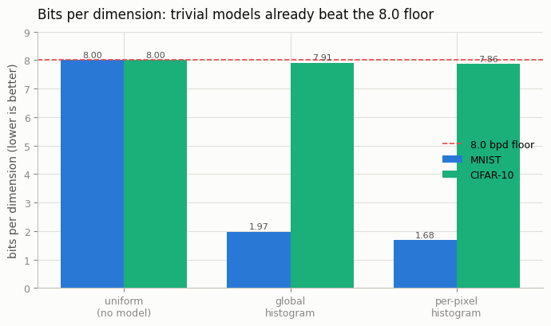
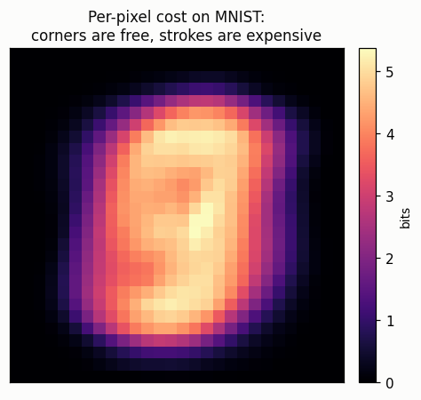

# Bits-per-Dim Baseline

## ELI5 (Explain Like I'm 5)

- **The Big Idea:** "Bits per dimension" is a score for how *surprised* a model
  is by each pixel — fewer bits means less surprise means a better model. The
  worst possible model shrugs and says "every pixel value is equally likely,"
  and that costs exactly 8 bits per pixel-number, always. That 8 is the bar to
  beat: if your fancy model can't do better than a shrug, it learned nothing.
- **Analogy:** It's like guessing letters in Hangman. If you assume every letter
  is equally likely, you waste lots of guesses. But once you know English, you
  guess "E" and "T" first and finish way faster — you're "less surprised." A
  good image model is less surprised by real pictures than the shrugging model
  is, and bits-per-dim measures exactly how much less.
- **Example:** We compute the 8-bit floor, then two lazy "models" that just
  *count* how often each pixel value appears. On MNIST (mostly black) this lazy
  counting already crushes the floor — down to 1.7 bits, with 177 corner pixels
  costing *zero* bits because they're always black. On CIFAR photos the same
  lazy trick barely helps (7.9 bits): color-photo structure hides in how pixels
  *relate*, which counting-in-isolation can't see.

## Key Insight

[Bits per dimension](/shared/glossary/#bpd-bits-per-dimension) measures how many bits a model needs, on average, to store each number in an image — lower is better, because a good model is "surprised" less often. This project computes the score for the dumbest possible model: one that thinks every pixel value from 0 to 255 is equally likely. That gives exactly 8 bits per dimension, the "no model at all" ceiling. Any real generative model must beat this number to prove it learned anything, so it is the first baseline you should always compute.

## What's in this directory

| File | Role |
|------|------|
| `bpd_baseline.py` | Computes the 8.0 floor and two independent-pixel histogram baselines on MNIST and CIFAR — pure counting, no training |

```bash
python bpd_baseline.py --data-dir data      # ~15s on CPU, no training
```

## What bits-per-dim actually is

For a model that assigns probability `p(x)` to an image with `D` numbers
(pixels × channels), bits-per-dim is `-log2 p(x) / D`, averaged over the data.
Three "models", in rising order of cleverness (but all trivial):

- **uniform** — `p(value) = 1/256` for every value → `-log2(1/256) = 8.0` bpd,
  exactly, for any dataset. The floor.
- **global histogram** — count how often each value 0–255 occurs across *all*
  pixels; bpd is the entropy of that one distribution.
- **per-pixel histogram** — a *separate* count for each pixel position; bpd is
  the average per-position entropy. This one "knows" that some positions never
  vary.

None of these need training — a model that treats pixels as independent has a
bpd equal to the average entropy of its per-value counts.

## Results

**Trivial models already beat the floor — but by wildly different margins:**



```
model,mnist_bpd,cifar_bpd
uniform (no model),8.000,8.000
global histogram,1.968,7.911
per-pixel histogram,1.678,7.859
```

The split is the real lesson. **MNIST collapses to 1.7 bpd** from counting
alone, because its structure is *marginal*: most pixels are black, and 177 of
784 positions are black in *every* image — literally zero bits. **CIFAR barely
moves (7.86 bpd)** because a natural color pixel's value, taken in isolation, is
nearly uniform; its structure lives in the *correlations between* pixels (this
patch of sky is blue *because* the patch next to it is), which an
independent-pixel model cannot represent.

**The per-pixel cost, mapped.** On MNIST the bits-per-pixel map is a ghost of
the "average digit" — free at the corners, expensive where strokes wander:



## Why this is the right first baseline

Two takeaways every practitioner should internalize. First, **always compute the
floor**: a model reporting 7.9 bpd on CIFAR has done almost nothing (an
independent histogram gets that). Second, **the gap between per-pixel and joint
modeling is the whole problem**: MNIST's easy win hides that natural images need
a model of pixel *relationships*. Capturing those relationships is exactly what
the [Tiny PixelCNN](../03-tiny-pixelcnn/README.md) does next (predicting each
pixel from its neighbors) — and what diffusion does later. Watch its bpd drop
well below these independent baselines.

## Things to try

- Add a "shuffled MNIST" run (permute pixel positions consistently) — the
  per-pixel bpd is unchanged (it ignores spatial layout), proving these
  baselines see no geometry at all.
- Compute the *conditional* entropy of a pixel given its left neighbor on CIFAR;
  it drops well below the marginal, previewing why autoregressive models win.
- Report bpd after 5-bit quantization (values 0–31) and watch every number
  shift by the change in dimension's value range.
