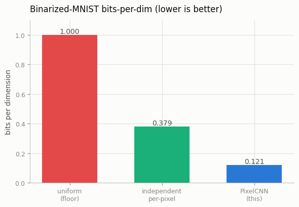
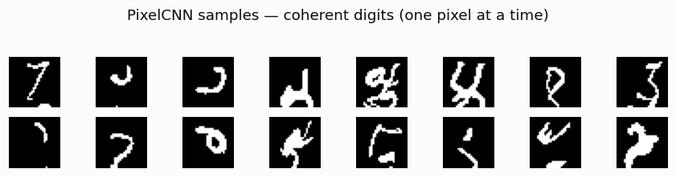
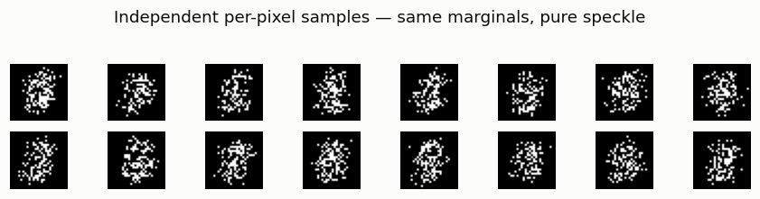

# Tiny PixelCNN

## ELI5 (Explain Like I'm 5)

- **The Big Idea:** PixelCNN draws a picture the way you'd write a sentence —
  one pixel at a time, left to right, top to bottom, each new pixel chosen based
  on everything drawn so far. Because it looks at the neighbors it already drew,
  the strokes connect into real shapes. The price: to make a picture it has to
  take hundreds of tiny turns in order, which is *slow*.
- **Analogy:** It's like a game of "finish the drawing" where each person adds
  one dot, having seen all the dots so far. Because everyone sees the picture
  developing, the dots form a coherent doodle. Compare that to everyone adding a
  dot *blindfolded*, only told "put white here about 30% of the time" — you get
  a dot-cloud shaped vaguely right but with no connected lines. That blindfolded
  version is the "independent" model, and it's the perfect foil.
- **Example:** We train a tiny PixelCNN on black-and-white MNIST. It scores a
  great 0.12 bits-per-pixel and its samples are connected, digit-like strokes.
  A blindfolded independent model with the *exact same* per-pixel odds scores
  0.38 and samples pure speckle. Same marginals, wildly different pictures —
  because coherence lives in the *correlations* only PixelCNN models.

## Key Insight

[PixelCNN](/shared/glossary/#pixelcnn) is an [autoregressive model](/shared/glossary/#autoregressive-model): it builds an image one pixel at a time, predicting each new pixel from the pixels it has already drawn — like writing a sentence word by word. This project trains a small version on [MNIST](/shared/glossary/#mnist) digits and samples from it row by row, so you feel both its strengths and its weakness firsthand. The quality is surprisingly good and the math is clean, but sampling is painfully slow because every pixel has to wait for the one before it. That slowness is exactly why later approaches like diffusion, which generate all pixels in parallel, eventually took over.

## What's in this directory

| File | Role |
|------|------|
| `pixelcnn.py` | Masked-convolution PixelCNN on binarized MNIST: trains it, computes the independent-pixel baseline, samples both row-by-row, and plots the comparison |

```bash
python pixelcnn.py --data-dir data      # ~8 min on CPU (train + slow sampling)
```

## How masked convolutions make it work

The trick is the *masked* convolution. A normal conv at pixel `(i,j)` sees a
neighborhood including pixels below and to the right — the future. PixelCNN zeros
out those kernel weights so each output depends only on pixels already generated
in raster order. Two mask types: type **A** (used once, at the input) excludes
the center pixel itself; type **B** (all later layers) includes it. With this
constraint, the *whole* autoregressive factorization
`p(x) = Π p(x_i | x_{<i})` trains in a single forward/backward pass on the real
image — the network predicts every pixel's distribution at once, and each
prediction is honestly blind to its own answer.

We use binarized MNIST (each pixel 0 or 1), so each pixel is a single Bernoulli
and bits-per-dim is just the binary cross-entropy in bits. The uniform floor
here is `log2(2) = 1.0` bpd.

## Results

**Bits-per-dim — modeling dependencies wins.** PixelCNN reaches **0.121 bpd**,
a third of the independent per-pixel model's 0.379 and far below the 1.0 floor:



```
model,bpd
uniform floor,1.000
independent per-pixel,0.3794
PixelCNN,0.1208
```

**Why the likelihood gap matters — the sample contrast.** This is the punchline
of the whole phase. Both models below have the *same* per-pixel marginals. The
independent model samples each pixel in isolation and produces a digit-shaped
*speckle* — the right dots in the right places, but no connected strokes.
PixelCNN, conditioning each pixel on its neighbors, produces coherent digits:

**PixelCNN — coherent digits:**



**Independent per-pixel — same marginals, pure speckle:**



Coherence is not in the marginals; it is in the *correlations between pixels*,
and only a model that conditions on other pixels can capture them.

**The catch: sampling is painfully slow.** Training was one pass per image, but
generating is not — each of the 784 pixels needs a *full network forward pass*
because it depends on the previous one. Here that is **~0.7 s per 28×28 image**
(784 sequential forwards). Scale that to a 512×512×3 image and autoregressive
sampling becomes hopeless — which is exactly why the field moved to models that
denoise all pixels in parallel.

## Why this is the path not taken

PixelCNN is conceptually the cleanest generative model in this guide: an exact
likelihood, a simple cross-entropy loss, no adversarial game, no variational
bound. It even connects straight back to [bits-per-dim](../02-bits-per-dim-baseline/README.md)
— it is a real model that crushes the independent baselines from project 02. But
its strict raster-order dependency makes sampling inherently sequential and
therefore slow at any real resolution. Diffusion keeps the "learn the data
distribution" goal while denoising every pixel at once — trading PixelCNN's exact
likelihood for parallel, scalable sampling.

## Things to try

- Raise `--n-samples` and watch total sampling time grow linearly — the cost is
  per-image, and every image pays the 784-forward tax.
- Model 4-bit (16-level) MNIST instead of binary and watch bpd and sample
  fidelity both rise, at a higher floor (`log2(16) = 4.0`).
- Feed the model a half-finished image (fix the top rows) and let it complete
  the bottom — autoregressive models do inpainting for free in raster order.
