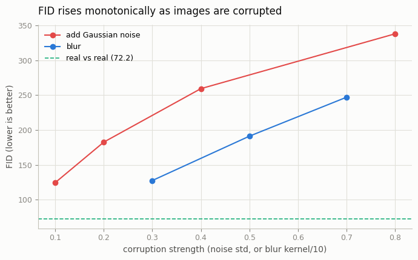
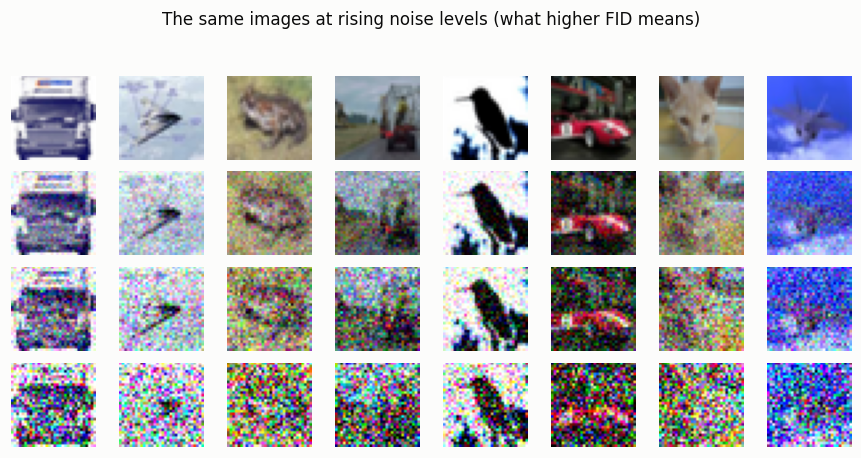

# FID from Scratch

## ELI5 (Explain Like I'm 5)

- **The Big Idea:** How do you score a pile of AI-generated pictures with one
  number? FID doesn't compare pictures one-to-one. Instead it asks a smart,
  pretrained network to boil each picture down to a "fingerprint" of what's in
  it, then checks whether the *cloud* of fake fingerprints sits in the same
  place as the cloud of real ones. Close clouds = low score = the fakes blend
  in. Far clouds = high score = something's off.
- **Analogy:** Imagine describing every photo by two summary stats — its average
  "vibe" and how much the vibes vary. FID measures the distance between the
  real set's (average, spread) and the fake set's (average, spread). It's like
  comparing two crowds not person-by-person, but by their average height and how
  varied their heights are — a quick way to tell if two groups came from the
  same population.
- **Example:** We don't even need a generator to see FID work. We take real
  CIFAR photos, corrupt them by known amounts (add noise, blur), and watch FID
  climb smoothly from ~72 up past 330 as the damage grows. And FID of a set with
  itself is exactly 0 — the sanity check every metric must pass.

## Key Insight

[FID](/shared/glossary/#fid) is the standard way to score how realistic a [batch](/shared/glossary/#batch) of generated images looks, and this project builds it by hand instead of calling a library. You run both real and generated images through a pretrained [Inception network](/shared/glossary/#inception-network) to turn each image into a feature vector, summarize each set by its mean and [covariance](/shared/glossary/#covariance) (its center and spread), and plug those into a [closed-form](/shared/glossary/#closed-form) distance formula. A lower FID means the two [clouds](/shared/glossary/#point-cloud) of features overlap more, i.e. the fakes look statistically like the reals. Implementing it yourself demystifies the single number — one scalar score that compresses the entire real-vs-fake comparison into a value you can put on a chart — that nearly every image-generation paper reports.

## What's in this directory

| File | Role |
|------|------|
| `fid.py` | The full FID pipeline from scratch: Inception features → per-set Gaussian (mean, covariance) → Fréchet distance with an eigendecomposition matrix-sqrt. Validates it by corrupting real images |

```bash
python fid.py --data-dir data      # ~5 min on CPU (Inception feature extraction dominates)
```

## The formula, built piece by piece

FID models each set of Inception features as a Gaussian and measures the
Fréchet (Wasserstein-2) distance between the two Gaussians:

```
FID = ||mu_r - mu_g||^2  +  Tr(C_r + C_g - 2 (C_r C_g)^{1/2})
       ^ centers differ      ^ shapes/spreads differ
```

Every piece is a few lines: `gaussian_stats` (mean + covariance),
`sqrtm_psd` (matrix square root via a symmetric eigendecomposition — no scipy),
and `frechet_distance` (the formula above). The only numerical subtlety is that
with fewer images than feature dimensions (512 < 2048) the covariance is
singular, so a tiny diagonal ridge keeps the matrix square root well-behaved —
without it, even an identical-set FID can drift slightly negative.

## Results

**It behaves exactly as a distance should.** FID of a set with *itself* is 0.
Two *disjoint real* sets score 72 — not zero, because of a real caveat below.
And every corruption pushes FID monotonically upward:



```
setting,fid
self (A vs A),0.000
real vs real (A vs B),72.198
noise σ 0.1,124.6      blur k=3,127.5
noise σ 0.2,182.6      blur k=5,191.2
noise σ 0.4,259.3      blur k=7,247.0
noise σ 0.8,337.9
```

**What rising FID looks like.** The same CIFAR images at increasing noise — the
feature clouds drift further from the real cloud as recognizability drops:



## The caveat every FID user must know

Two *disjoint real* sets should be identically distributed, so their "true" FID
is 0 — yet we measure **72**. That gap is **small-sample bias**: FID is biased
*upward*, and the bias grows as the sample count shrinks and the feature
dimension (2048) grows. With only 512 images the covariance is severely
under-estimated and the score inflates. This is why published FIDs specify a
large, fixed sample count (typically **50,000**) and why you must **never
compare FIDs computed at different `n`**. The *trends* here are trustworthy
(more corruption → higher FID); the absolute 72 baseline is an artifact of `n`,
not a property of the images.

## Why one flawed number still rules the field

FID compresses "do these fakes look like reals?" into a single scalar you can
plot over training — invaluable for tracking progress and comparing models. But
it is only a proxy: it inherits whatever biases Inception has, it is blind to
prompt adherence (an astronaut riding a horse and a horse riding an astronaut
can score the same), and it is gameable and `n`-sensitive as shown. Every later
phase leans on FID while also warning you not to trust it alone — a tension you
now understand from the inside, having built it.

## Things to try

- Rerun with `--n 2048` and watch the real-vs-real baseline fall toward zero as
  the small-sample bias shrinks — the single most important FID gotcha, made
  visible.
- Add a "swap in a different class" corruption (compare cars-vs-planes) and see
  FID rise even though each image is individually pristine — FID scores
  *distributions*, not images.
- Replace Inception features with raw pixels and watch FID lose almost all
  discriminative power — the learned feature space is doing the real work.
