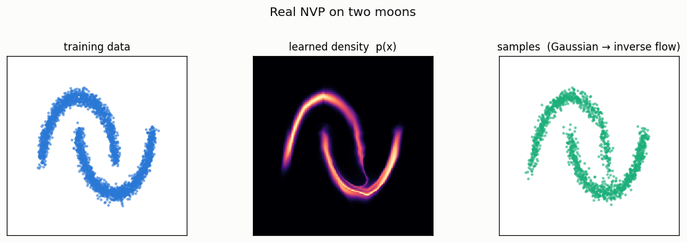
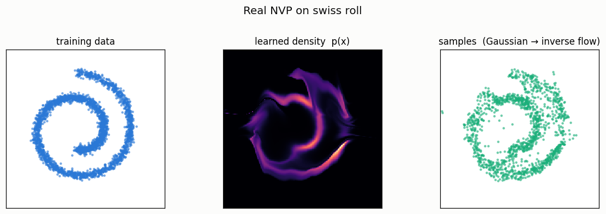

# Real NVP Toy

## ELI5 (Explain Like I'm 5)

- **The Big Idea:** A normalizing flow is a machine that turns a boring blob of
  random dots (a Gaussian) into a fancy shape (like two crescent moons) by
  bending space through a series of steps. The magic rule: every step must be
  *undoable*. Because you can always run the machine backwards, you can take
  *any* point and ask "how likely is this?" — something most image generators
  can't tell you exactly.
- **Analogy:** Think of it as a reversible dough press. You start with a plain
  ball of dough (the Gaussian) and press it through molds until it takes a
  shape. Since every press can be run in reverse, you can take any finished
  cookie and unpress it back to the ball — and by tracking how much each press
  stretched the dough, you know exactly how much dough ended up at each spot
  (the probability).
- **Example:** We train the flow on 2D "two moons" and "swiss roll" shapes, then
  draw its learned probability as a heatmap and let it generate new points. The
  heatmap lights up exactly where the data lives, the samples land on the shape,
  and the reverse trip recovers the input to seven decimal places (error ~1e-7).

## Key Insight

A [normalizing flow](/shared/glossary/#normalizing-flow) learns to generate data by warping simple random noise through a series of reversible steps, and because every step is reversible it can also report the exact probability of any point — something most generative models cannot do. This project trains a small [Real NVP](/shared/glossary/#real-nvp) flow on easy 2D shapes like two moons or a swiss roll, then visualizes both the density it learned and the samples it draws. Working in 2D lets you actually *see* the learned distribution as a heatmap, which makes the otherwise abstract idea of "modeling a [probability density](/shared/glossary/#probability-density)" concrete. Why insist on reversibility at all? Because the flow's whole superpower — reading off the *exact* probability of any point — depends on it. To score a point, the flow runs it *backwards* through every step until it lands in the simple noise it must have come from, tracking how much each step squished or stretched space along the way; if even one step could not be undone, that backward trip would be impossible and the probability uncomputable. It is like a currency exchange that promises a fixed rate both ways: because you can always convert dollars → euros → dollars and get your exact amount back, you can always work out what any pile of euros is worth. A one-way paper shredder gives you no way back — and no way to value what went in. The catch you will notice: keeping every step reversible heavily constrains the architecture, which is why flows lost ground to diffusion on real images.

## What's in this directory

| File | Role |
|------|------|
| `realnvp.py` | Synthesizes 2D toy data, trains a Real NVP flow (affine coupling layers), and renders data / learned-density / samples side by side — no dataset download |

```bash
python realnvp.py      # ~1 min on CPU, synthetic data
```

## How the affine coupling layer works

The whole flow is a stack of these, and each is just algebra:

- **split** the 2D vector into a "kept" half and a "changed" half (a binary
  mask; alternate which is which every layer);
- **forward** `z = x_changed · exp(s(x_kept)) + t(x_kept)`, leaving `x_kept`
  untouched. `s` and `t` are little MLPs of the *kept* half only;
- because `x_kept` is unchanged, the Jacobian is triangular and
  `log|det J| = sum(s)` — trivial;
- **inverse** is immediate: `x_changed = (z − t(x_kept)) · exp(−s(x_kept))`.

Training maximizes `log p(x) = log N(f(x)) + Σ log|det J|`. Sampling runs the
stack backwards from a Gaussian draw.

## Results

**Two moons** — the flow nails a cleanly separated, curved distribution. Left:
data. Middle: the *exact* learned density (only reachable because the model is
invertible). Right: fresh samples:



**Swiss roll** — a harder, spiral topology. The flow captures the overall spiral,
but the tight center stays fuzzy: affine coupling layers struggle to wind space
into a tight roll. That visible limitation *is* the point about flows —
reversibility constrains what shapes they can represent:



```
dataset,nll,roundtrip_mae
two moons,1.355,1.24e-07
swiss roll,1.807,1.44e-07
```

**Reversibility, verified.** The round-trip error `|x − f⁻¹(f(x))|` is ~`1e-7`
— machine precision. That is not an accident or an approximation; it is the
architectural guarantee that lets the flow compute exact likelihoods at all. A
GAN or a VAE cannot hand you this number.

## Why flows matter even though diffusion won

Flows are the one model family in this guide that gives you an *exact,
tractable* likelihood for any point — invaluable for anomaly detection, exact
density estimation, and as a clean teaching device for change-of-variables. They
lost the image-quality race precisely because of the trade-off you can see in
the swiss-roll panel: forcing every layer to be invertible with a cheap Jacobian
limits expressiveness. Diffusion keeps the "warp noise into data" idea but drops
the invertibility straitjacket, buying far more flexible transformations at the
cost of exact likelihoods.

## Things to try

- Increase the number of coupling layers and watch the swiss-roll center
  sharpen — more layers buy more expressiveness at more compute.
- Replace the Gaussian base with a uniform base and observe how the density
  edges change.
- Print `log p(x)` for an on-manifold point vs. an off-manifold point (say the
  origin between the moons) to see the flow assign low probability to the gap.
