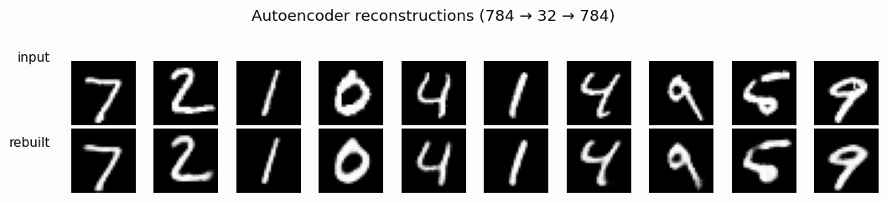
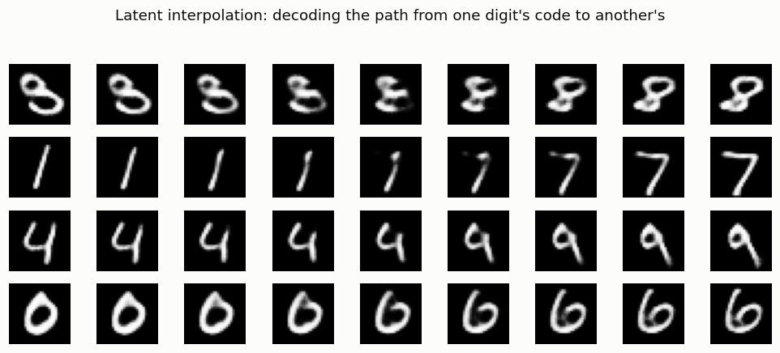
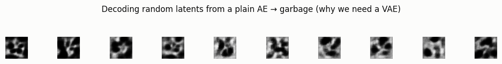

# Tiny AE on MNIST

## ELI5 (Explain Like I'm 5)

- **The Big Idea:** An autoencoder is a "squeeze and rebuild" machine. It takes
  a 784-number picture of a digit, squeezes it through a narrow funnel down to
  just 32 numbers, then tries to rebuild the original picture from only those 32.
  To succeed, the funnel is forced to keep only what truly matters about a digit
  and throw away the rest — it *learns* what a digit is.
- **Analogy:** It's like describing a friend's face well enough that a sketch
  artist could redraw it from your description alone. You can't list every pore,
  so you keep the essentials ("round face, curly hair, big smile"). Those
  essentials are the 32 numbers. And here's the fun part: if you blend two
  descriptions halfway, the artist draws a believable in-between face.
- **Example:** We squeeze each MNIST digit to 32 numbers and rebuild it. Then we
  take the 32 numbers for a "3" and for an "8", average them, and rebuild — out
  comes a convincing 3-becoming-8. But feed the machine *random* 32 numbers and
  it draws nonsense, because a plain autoencoder never tidied up its funnel.
  That mess is exactly what the VAE fixes next.

## Key Insight

An [autoencoder](/shared/glossary/#autoencoder) is the simplest way to learn a compressed code for images. This project squeezes each 28×28 [MNIST](/shared/glossary/#mnist) digit (784 numbers) down to just 32 numbers and then rebuilds it, forcing the network to keep only what matters. Those 32 numbers form the [latent space](/shared/glossary/#latent-space), and the real magic is what happens *between* points: take the codes for a "3" and an "8", average them, decode the result, and you get a believable in-between digit. That smooth blending is the first sign the model learned genuine structure rather than memorizing pixels — and it is the foundation every fancier generator builds on. Notice there is no randomness yet: a plain autoencoder can rebuild and interpolate, but it cannot invent new digits from nothing, which is exactly the gap the VAE closes next.

## What's in this directory

| File | Role |
|------|------|
| `vae_lib.py` | Shared conv encoder/decoder + `AE` and `VAE` classes, reused by projects 07, 08, 11 |
| `ae.py` | Trains the autoencoder and produces the reconstruction, interpolation, and random-latent figures |

```bash
python ae.py --data-dir data      # ~2 min on CPU
```

## What the autoencoder is

Two conv nets back to back: an **encoder** compresses `28×28 = 784` pixels to a
`32`-number [latent](/shared/glossary/#latent-space) code, and a **decoder**
rebuilds the image from just those 32 numbers. Training minimizes the
reconstruction error (per-pixel binary cross-entropy) — there is no randomness
and no prior, just "squeeze then rebuild." The 24× bottleneck is the whole point:
it forces the network to encode *what a digit is*, not *which pixels are on*.

## Results

**Reconstructions.** 784 → 32 → 784 loses fine detail but keeps the digit:



**Latent interpolation — the payoff.** Encode two digits, walk a straight line
between their codes, and decode along the way. The in-between images are
*believable digits*, morphing smoothly from one class to another. That
smoothness means the 32-number space has genuine structure — nearby codes decode
to similar images:



**The gap the VAE fills.** A plain AE can rebuild and interpolate, but it cannot
*generate*. Its latent space has no defined shape, so if you feed the decoder a
random code it has never organized around, you get garbage:



```
metric,value
latent_dim,32
test_recon_bce,58.2
```

## Why this is the foundation

Every model in Phase 2 — and the VAE buried inside every modern latent-diffusion
system — is this same squeeze-and-rebuild skeleton. The autoencoder proves two
things a generator needs: that images compress to a low-dimensional code (the
[manifold](/shared/glossary/#manifold) from Phase 1, made usable), and that the
code space is smooth enough to interpolate. What it *lacks* is a known
distribution to sample from — you can't draw a "random valid code" because the AE
never constrained where valid codes live. The [Vanilla VAE](../07-vanilla-vae/README.md)
adds exactly that constraint, turning this rebuild-only machine into a generator.

## Things to try

- Shrink the latent to 8 or grow it to 128 and watch reconstructions blur or
  sharpen — the bottleneck width *is* the compression/quality dial.
- Interpolate between two examples of the *same* digit; the path stays within
  one class, tracing style (slant, thickness) instead of identity.
- Add small Gaussian noise to a real digit's code before decoding and see how
  far you can push before the digit breaks — a preview of why the VAE's noise
  forces robustness.
