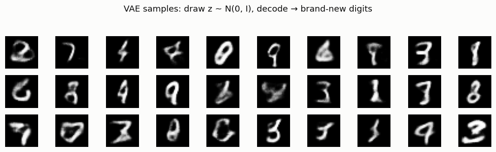
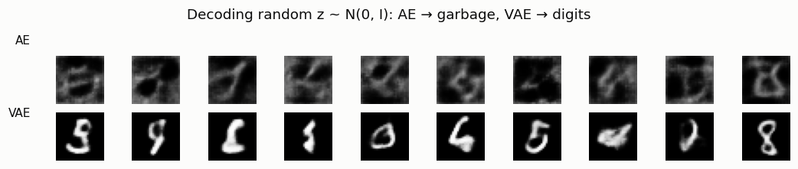
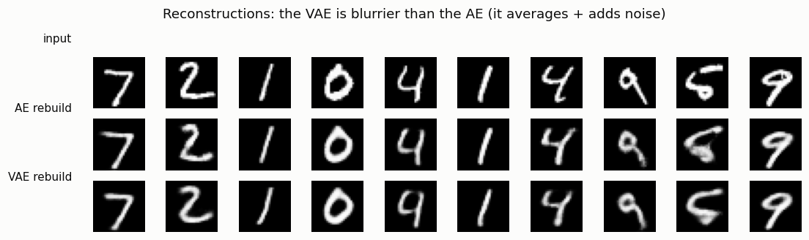

# Vanilla VAE

## ELI5 (Explain Like I'm 5)

- **The Big Idea:** A VAE is an autoencoder that learned to be *organized*.
  Instead of squeezing each image to a single point, it squeezes it to a little
  fuzzy cloud, and it's trained so all the clouds pile up into one neat, standard
  bell-shaped heap. Once they're neatly piled, you can grab a random spot in the
  heap, hand it to the decoder, and it draws a brand-new digit — real generation,
  which a plain autoencoder can't do.
- **Analogy:** The plain autoencoder files each photo at a random spot in a
  warehouse, so "grab a random shelf" gives you an empty shelf (garbage). The
  VAE insists every photo be filed inside one tidy, bell-shaped room. Now "grab a
  random spot in the room" always lands on a real filed photo — you can generate.
  The catch: to keep everything tidy the VAE files slightly fuzzy copies, so what
  you pull out is a bit blurry.
- **Example:** We train a VAE and a same-size autoencoder. Draw random codes and
  decode: the AE gives smudgy nonsense, the VAE gives real (if soft) digits.
  Rebuild the same input with both: the AE is crisp, the VAE is blurrier — the
  exact price of being able to generate.

## Key Insight

A [vanilla](/shared/glossary/#vanilla) [VAE](/shared/glossary/#vae) upgrades a plain autoencoder with one crucial twist: its encoder outputs a small *cloud* of possibility for each image rather than a single point, and it is trained on the [ELBO](/shared/glossary/#elbo), which gently presses all those clouds to pile up under one standard bell curve. Once trained, you can ignore the encoder entirely, draw a random point straight from that bell curve, decode it, and get a brand-new digit — something a plain autoencoder simply cannot do. The price is blur: because the model averages over every plausible reconstruction and the sampling step adds noise, VAE samples look softer than the originals. The [reparameterization trick](/shared/glossary/#reparameterization-trick) is the small piece of math that makes all this trainable, letting gradients pass through the random sampling step. Comparing its fuzzy samples to the sharp-but-uncreative autoencoder shows you the central trade of generative modeling laid bare.

## What's in this directory

| File | Role |
|------|------|
| `vae.py` | Trains a VAE and a same-size AE on MNIST and produces the samples, reconstruction-sharpness, and generation-comparison figures |

Reuses `vae_lib.py` from [project 06](../06-tiny-ae-on-mnist/README.md).

```bash
python vae.py --data-dir data      # ~3 min on CPU (trains an AE and a VAE)
```

## The two changes that turn an AE into a generator

1. **The encoder outputs a distribution, not a point.** For each image it emits a
   mean `μ` and a log-variance `log σ²`; the latent is *sampled* as
   `z = μ + σ · ε`, `ε ~ N(0, I)`. This is the
   [reparameterization trick](/shared/glossary/#reparameterization-trick) — the
   randomness is pushed into `ε` so gradients still flow through `μ` and `σ`.
2. **The loss adds a KL term.** The [ELBO](/shared/glossary/#elbo) is
   `reconstruction + KL(q(z|x) ‖ N(0, I))`. The KL pulls every per-image cloud
   toward the standard normal prior, so the whole latent space fills in as one
   `N(0, I)` blob you can sample from.

## Results

**The VAE generates.** Draw `z ~ N(0, I)`, decode, and get brand-new digits that
were never in the training set (soft, but clearly digits):



**Only the VAE's latent is sample-able.** Feed both models random codes from
`N(0, I)`. The AE never organized its latent, so random codes decode to garbage;
the VAE's KL-regularized latent makes every random code a valid digit:



**The price is blur.** Rebuilding the same inputs, the AE is crisp and the VAE is
softer — it averages over plausible reconstructions and injects sampling noise:



```
metric,value
latent_dim,16
vae_kl,23.19
```

## Why blur is the whole story of Phase 2

The VAE's blur is not a bug you can fully tune away — it is intrinsic to a model
that (a) uses a pixel-wise likelihood (so it hedges by averaging) and (b) samples
a noisy latent. This single limitation drives the rest of the guide: [β-VAE](../08-beta-vae-study/README.md)
studies the knob that trades blur against latent structure; VQ-VAE (Phase 3)
swaps the noisy continuous latent for a discrete one; and latent *diffusion*
(Phase 7) keeps the VAE only as a compressor and hands generation to a sharper
model. The VAE rarely generates the final image in modern systems — but its
`N(0, I)` latent is the space almost everything else generates *in*.

## Things to try

- Anneal `β` from 0 to 1 over training (KL warm-up) and watch samples sharpen —
  a standard trick to avoid early posterior collapse.
- Raise the latent dimension; reconstructions sharpen but samples can get worse
  as the prior fills less of the space — the tension [β-VAE](../08-beta-vae-study/README.md) makes explicit.
- Interpolate between two `z` values as in [project 06](../06-tiny-ae-on-mnist/README.md);
  the VAE's path stays on-manifold the whole way because the latent is dense.
