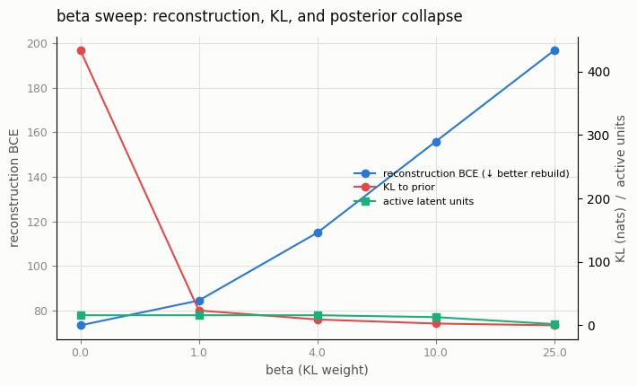
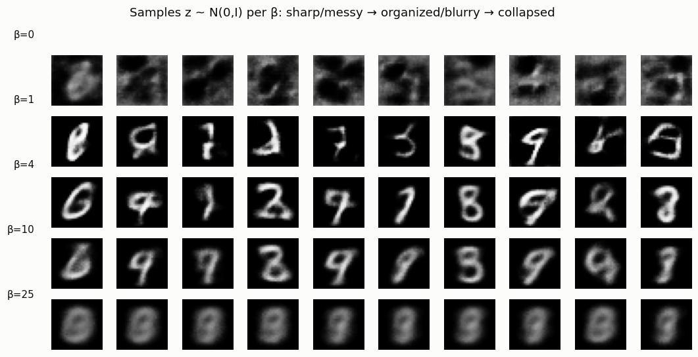

# β-VAE Study

## ELI5 (Explain Like I'm 5)

- **The Big Idea:** A VAE has two jobs — rebuild the picture accurately, and keep
  its internal "filing system" tidy. β is a knob that says how much to care about
  tidiness versus accuracy. Turn β up and the filing gets neater but the pictures
  get blurrier; turn it up *too* far and the model gives up on the files entirely
  and just draws the same average blob every time.
- **Analogy:** Picture a Secretary (encoder), a Filing Cabinet (latent space),
  and a Report Writer (decoder). Low β: the Secretary tosses papers in messily —
  great detail kept, chaotic cabinet. High β: everything is standardized into
  neat folders, but details get trimmed, so reports come out generic. Way too
  high β: every paper becomes a blank sheet, the Report Writer ignores the
  useless cabinet and just guesses — that's collapse.
- **Example:** We train the same VAE at β = 0, 1, 4, 10, 25 and watch the three
  regimes appear. At β=25 the model uses only **2 of its 16** latent
  dimensions and every generated digit is the same fuzzy blob — collapse,
  measured and pictured.

## Key Insight

A [β-VAE](/shared/glossary/#β-vae) adds a single knob, β, that multiplies the [KL divergence](/shared/glossary/#kl-divergence) term of the VAE's loss. This term acts as a strict regulator, pushing the model to keep its internal "filing cabinet" (the latent space) tidy and close to a standard bell curve. 

This project sweeps β from 0 up to 10 to observe the trade-offs across three distinct states. To make this easier to understand, imagine the model consists of a Secretary (Encoder), a Filing Cabinet (Latent Space), and a Report Writer (Decoder).

* **1. Low β (Sharp but Messy):** The model reconstructs the input sharply, but leaves a messy latent space. 
    * *Analogy:* The Secretary throws documents into the cabinet without any system. The Report Writer can see all the unique details to create a highly accurate reconstruction, but the cabinet itself is structurally unorganized.
* **2. High β (Structured but Blurry):** The model organizes the latent space beautifully, but the output becomes blurry. 
    * *Analogy:* The Secretary perfectly standardizes every document to fit into exact folders. However, the unique details of the data are trimmed away to fit this strict format, forcing the Report Writer to produce a generalized, blurry output.
* **3. Too High β ([Posterior Collapse](/shared/glossary/#posterior-collapse)):** Pushing β too far causes the Decoder to do the job alone, ignoring the latent space entirely. The latent code stops carrying any information about the input.
    * *Analogy:* The Secretary is so obsessed with perfect uniformity that every document is turned into an identical blank sheet. The Report Writer realizes the cabinet is useless, ignores it completely, and just guesses the output blindly.

Seeing these failure directions in one sweep teaches a valuable lesson: generative training is always a balancing act between mathematical structure and information retention. There is never a single "best" setting.

## What's in this directory

| File | Role |
|------|------|
| `betavae.py` | Trains one VAE per β value and measures reconstruction, KL, and active-unit count, then plots the trade-off and per-β samples |

Reuses `vae_lib.py` from [project 06](../06-tiny-ae-on-mnist/README.md).

```bash
python betavae.py --data-dir data      # ~7 min on CPU (one VAE per β)
```

## Results

**The three quantities trade off across β.** Reconstruction error climbs (worse
rebuild), KL to the prior shrinks (tidier latent), and — past a point — the
number of *active latent units* collapses:



```
beta,recon_bce,kl,active_units
0,73.44,433.69,16      ← sharp rebuild, messy latent (huge KL)
1,84.53,23.48,16       ← balanced
4,114.98,9.33,16       ← organized, blurrier
10,155.94,2.88,13      ← collapse begins
25,196.68,0.10,2       ← collapse: only 2/16 dims still used
```

("Active units" = latent dimensions whose encoded means still vary across the
data; a collapsed dimension is stuck at the prior and carries no information.)

**The same story in samples.** Drawing `z ~ N(0, I)` and decoding at each β walks
straight through the three regimes: at β=0 the latent is so messy that prior
samples are garbage; β=1–4 is the sweet spot of coherent digits; by β=25 every
sample is the *same* fuzzy blob — the decoder has stopped listening to the latent
entirely:



## The subtlety worth noticing

β=0 is a pure autoencoder (no KL) — it rebuilds well but its latent is *not*
organized into `N(0, I)`, so sampling from the prior fails (top row, garbage),
exactly as in [project 06](../06-tiny-ae-on-mnist/README.md). That is the flip
side of collapse: too little regularization and you can't sample; too much and
the latent carries nothing to sample *from*. Useful generation lives in the
narrow band between, and β is how you find it. β-VAE's original purpose was
disentanglement — a moderate β>1 tends to line latent axes up with independent
factors of variation, which the [latent-traversal](../11-latent-traversal/README.md)
project demonstrates directly.

## Things to try

- Add a KL *warm-up* (ramp β from 0 to its target over the first few hundred
  steps) and watch high-β runs avoid early collapse.
- Plot reconstruction vs. KL as a scatter (the "rate–distortion" curve); every β
  is one point on a single achievable frontier.
- Push β past 25 and confirm active units reach 0 — the decoder becomes a plain
  unconditional average of the dataset.
