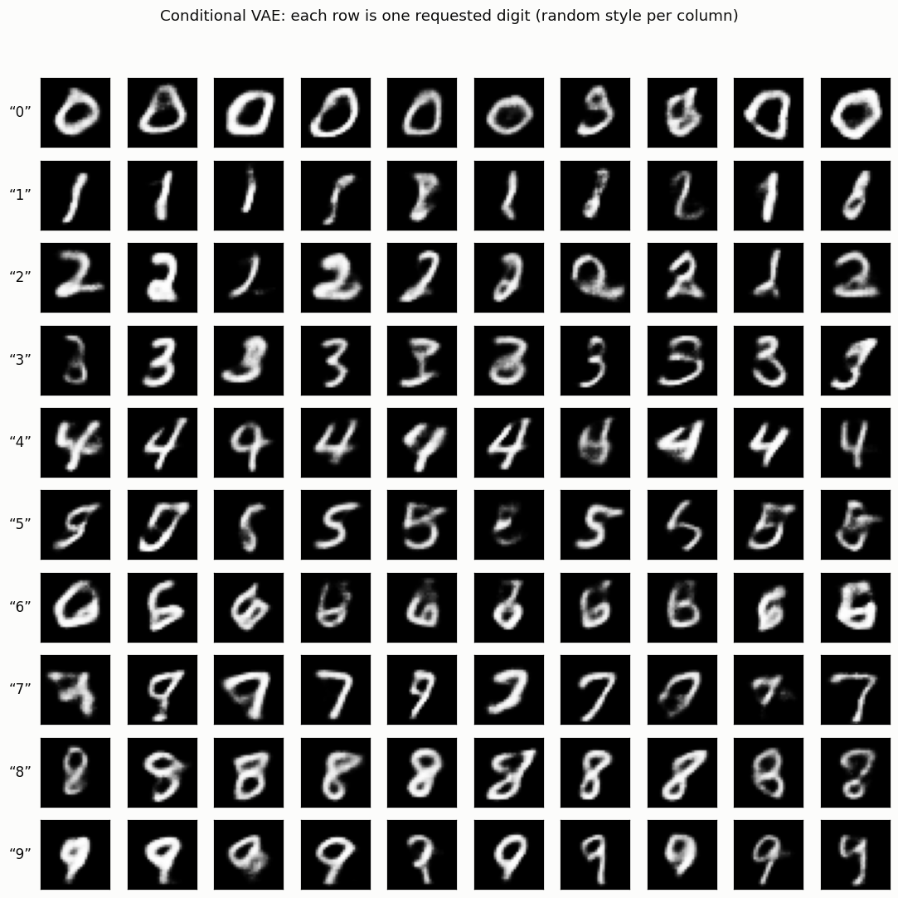

# Conditional VAE

## ELI5 (Explain Like I'm 5)

- **The Big Idea:** A plain VAE dreams up *a* digit, but you can't choose which
  one. A conditional VAE also gets told the label — both when it studies an image
  and when it draws one. So it stops wasting effort remembering "which digit is
  this?" (the label already says) and instead learns only *style*. Ask it for a
  "7", hand it a random style, and out comes a 7.
- **Analogy:** Imagine an artist who can draw any letter. A plain VAE artist
  flips a coin to pick the letter. The conditional artist takes your request —
  "draw a 7" — plus a mood ("loopy today"), and gives you a 7 in that mood. The
  request is the label; the mood is the random latent.
- **Example:** We label the VAE and then ask for each digit 50 times. An
  automatic classifier confirms the model drew the digit we asked for **90% of
  the time** — and the sample grid shows each row locked to one digit while the
  columns vary the handwriting style.

## Key Insight

A plain [VAE](/shared/glossary/#vae) can dream up new [MNIST](/shared/glossary/#mnist) digits, but it picks *which* digit at random — you cannot ask it for a "7." [Class conditioning](/shared/glossary/#class-conditioning) fixes this by feeding the digit label into both the encoder and the decoder, so the model learns a separate region of its latent space for each class. At generation time you simply hand it the label you want, draw a random latent, and reliably get that exact digit. This tiny change is the seed of all controllable generation: the same idea, scaled up, is how text-to-image models turn a written prompt into the picture you asked for.

## What's in this directory

| File | Role |
|------|------|
| `cvae.py` | Defines and trains the conditional VAE, samples a labelled grid, and measures label adherence with the Phase-10 MNIST classifier |

Reuses project 58's `mnist_classifier.py` as the automatic reader.

```bash
python cvae.py --data-dir data      # ~3 min on CPU
```

## The one change from a vanilla VAE

Feed the label in **twice**:

- into the **encoder**, concatenated to the image features, so `q(z | x, y)`
  doesn't need to store the class in `z`;
- into the **decoder**, concatenated to the latent, so generation is
  `p(x | z, y)` — you supply `y`, sample `z ~ N(0, I)`, and decode.

Because the class is handed to the decoder directly, the latent `z` is freed to
model only *style* (slant, stroke width) — the same disentangling logic as
text-to-image conditioning, in miniature.

## Results

**Ask, and you receive.** Each row is one requested digit; each column is a fresh
random style code. The class is locked, the handwriting varies:



**Measured adherence.** Asking for each digit 50 times and reading the results
back with a classifier: **90.4%** overall land on the requested digit.

```
digit,adherence
0,0.98   3,0.90   6,0.98   9,0.74
1,0.92   4,0.90   7,1.00
2,0.98   5,0.94   8,0.70
overall,0.904
```

(The stragglers are 8 and 9 — the two digits a blurry VAE most often smears into
each other; the classifier, trained on sharp MNIST, is strict about the
softened samples.)

## Why this is the seed of everything controllable

Conditioning is the entire bridge from "a generator" to "a *useful* generator."
The mechanism here — inject the desired attribute into encoder and decoder — is
exactly what scales up to text-to-image: swap the 10-way digit label for a
77-token CLIP text embedding and the class-conditional VAE becomes, in spirit,
Stable Diffusion's conditioning path. Everything in [Phase 9](../50-lora-fine-tune/README.md)
(LoRA, ControlNet, personalization) is more elaborate ways to steer a generator;
this project is the first and simplest of them.

## Things to try

- Fix the latent `z` and sweep only the label 0→9 — the same "style" rendered as
  every digit, proving `z` and `y` factor cleanly.
- Drop the label from the *encoder* only (keep it in the decoder) and see
  adherence hold — the decoder's copy is what does the steering.
- Replace the one-hot label with a 2-D "style + class" grid and interpolate the
  class embedding between two digits for a controllable morph.
