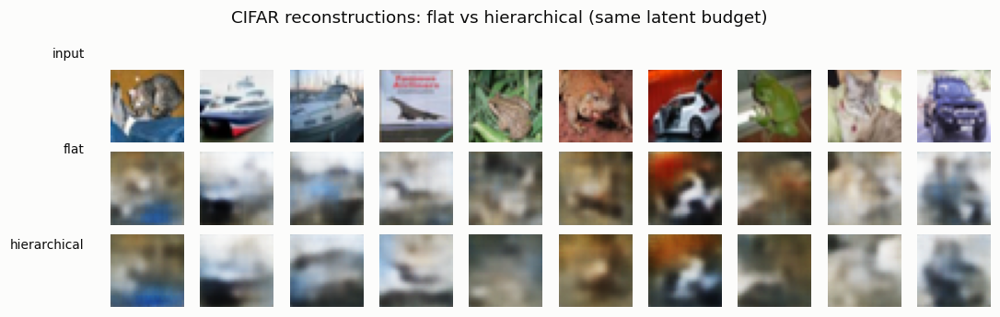
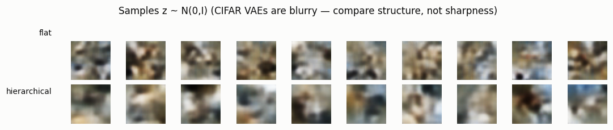

# Hierarchical VAE

## ELI5 (Explain Like I'm 5)

- **The Big Idea:** A normal VAE describes a whole picture with one list of
  numbers. A hierarchical VAE uses *two* lists at different zoom levels: a tiny
  coarse list for the big picture (overall shape and color) and a bigger fine
  list for local detail. Splitting the job by zoom level matches how real photos
  are built — big shapes *and* fine texture at the same time — so it rebuilds
  them a bit better.
- **Analogy:** It's how an artist paints: first a rough blocking pass for
  composition and color, then a detail pass for texture. One list handles the
  blocking, the other the details. Trying to do both with a single list is like
  painting a whole canvas at one brush size — you lose either the big shapes or
  the fine grain.
- **Example:** We give a flat VAE and a two-level VAE the *exact same* latent
  budget (512 numbers) and train them identically on CIFAR photos. The
  two-level model rebuilds test images with ~5% lower error — a real, if modest,
  win from dividing the work across scales.

## Key Insight

A [hierarchical VAE](/shared/glossary/#hierarchical-vae) stacks more than one layer of latent variables at different sizes — here an 8×8 grid and a smaller 4×4 grid — so the model can split its work across scales. The coarse 4×4 level captures the big picture (overall shape and color) while the finer 8×8 level fills in local detail, much like sketching rough shapes before adding texture. This project trains such a two-level model on [CIFAR-10](/shared/glossary/#cifar-10) and asks a simple question: does dividing the labor across scales beat a single flat [latent space](/shared/glossary/#latent-space)? For natural images, which contain structure at many sizes at once, the answer is usually yes — and that is why the strongest VAEs and modern image generators are all multi-scale.

## What's in this directory

| File | Role |
|------|------|
| `hvae.py` | Defines a flat VAE and a two-level hierarchical VAE with equal latent budget, trains both on CIFAR, and compares reconstruction error and samples |

```bash
python hvae.py --data-dir data      # ~9 min on CPU (two CIFAR VAEs)
```

## The two architectures, matched fairly

Both models get **512 latent numbers**; only the *arrangement* differs:

- **Flat** — one `8×8×8` latent grid. Encode → sample → decode.
- **Hierarchical** — a coarse `4×4×16` top latent (256 numbers) *and* a fine
  `8×8×4` bottom latent (256 numbers). The decoder upsamples the coarse latent to
  8×8 and fuses it with the fine latent, so global structure and local detail are
  produced by different variables at different resolutions.

Same budget, same training, same everything else — so any difference is due to
the multi-scale *structure* alone.

## Results

**Reconstructions.** Both are blurry (a small VAE on CIFAR always is), but the
hierarchical model holds onto slightly more structure and color detail:



**Quantified — the fair comparison.** At equal latent budget, the two-level model
rebuilds held-out images with **4.7% lower MSE**:

```
model,latent_budget,test_mse
flat,512,0.01398
hierarchical,512,0.01333   ← 4.7% better
```

**Samples.** Drawing from the prior gives blurry color blobs either way — a VAE
this size cannot make sharp CIFAR images. Compare *structure*, not sharpness:
the hierarchical samples show marginally more coherent layout:



## Why multi-scale is the rule, not the exception

The win here is modest because the model is tiny and CIFAR is small — but the
*direction* is the point, and it holds all the way up. Real images have
structure at every scale simultaneously (a face has a head shape *and* eyelash
texture), and forcing one flat latent to represent all of it is inefficient.
Every strong image system is multi-scale: NVAE and Very Deep VAE stack dozens of
latent levels; VQ-VAE-2 (Phase 3) uses a top/bottom code pyramid; latent
diffusion's U-Net is multi-resolution by construction. This project is the
smallest possible demonstration of why. It also exposes the VAE's ceiling on
natural images — the blur that motivates the discrete tokenizers of Phase 3 and
handing generation to diffusion in Phase 7.

## Things to try

- Shift the budget between levels (fatter coarse vs. fatter fine) and see which
  split helps most — natural images usually want more capacity in the fine level.
- Add a *third* latent level at 16×16 and check whether the reconstruction gain
  compounds.
- Make the bottom latent's prior depend on the top (a true top-down conditional
  prior, as in Ladder/NVAE) instead of independent `N(0, I)` priors, and compare.
