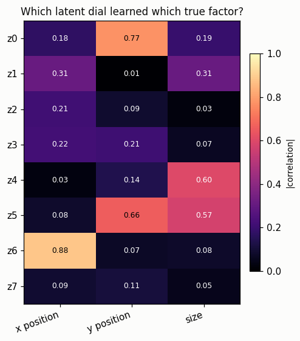
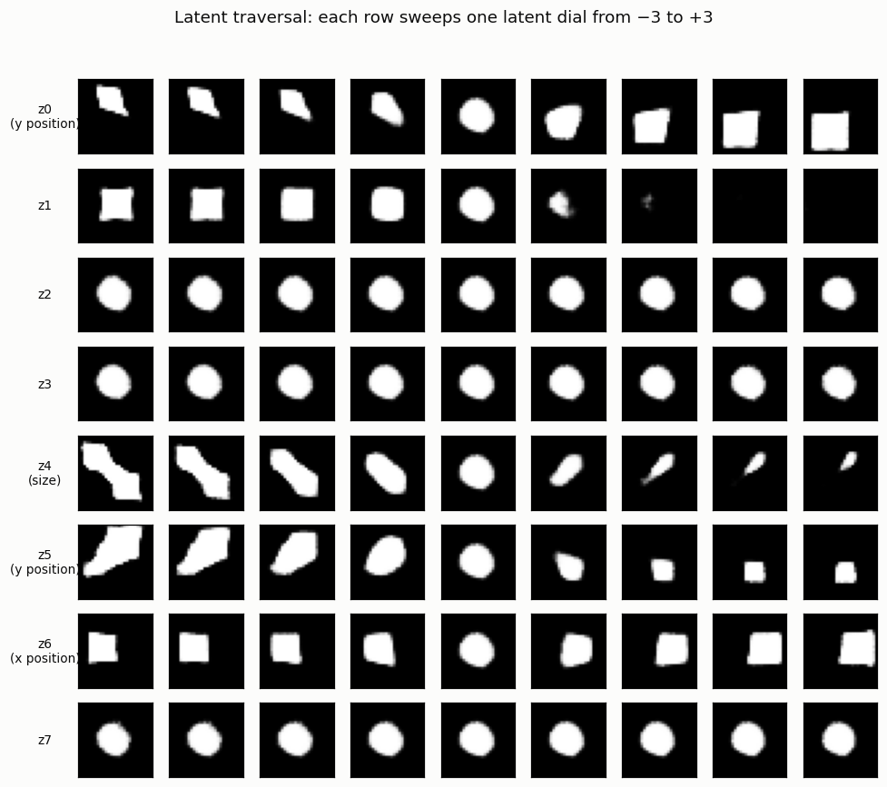

# Latent Traversal

## ELI5 (Explain Like I'm 5)

- **The Big Idea:** After a VAE learns, its latent code is a row of dials.
  Nobody told the model what the dials should mean — but if you freeze all of
  them and slowly turn just *one*, the picture changes in a single, meaningful
  way: one dial slides the object left and right, another makes it bigger and
  smaller. The model *discovered* the hidden knobs the data varies along, all by
  itself.
- **Analogy:** Imagine finding a mixing board with unlabeled sliders. You push
  one and only the bass changes; another, only the treble. You just reverse-
  engineered what each slider controls by wiggling it. A latent traversal wiggles
  each of the VAE's sliders and watches what happens.
- **Example:** CelebA faces aren't downloadable in this offline setup, so we use
  simple shapes where we *know* the true knobs — a square's x-position,
  y-position, and size. After training, one latent dial turns out to control
  x-position (correlation 0.88 with the true value), another size (0.60) — the
  model recovered the real factors without ever being told they exist.

## Key Insight

Once a [VAE](/shared/glossary/#vae) is trained on a dataset of faces like [CelebA](/shared/glossary/#celeba), its [latent space](/shared/glossary/#latent-space) is not just random storage — individual directions in it often line up with human-meaningful features. A *traversal* means freezing every latent number except one, then slowly turning that single dial up and down and decoding at each step to watch the face change. Do this across many dimensions and you discover that one controls hair color, another a smile, another the lighting direction — without anyone ever labeling those concepts during training. This is the clearest hands-on proof that a good generative model does not memorize images; it discovers the hidden knobs that the data varies along.

## What's in this directory

| File | Role |
|------|------|
| `traversal.py` | Generates a synthetic sprites dataset with known factors, trains a β-VAE, sweeps each latent dial, and measures which dial aligns with which true factor |

Reuses `vae_lib.py` from [project 06](../06-tiny-ae-on-mnist/README.md).

```bash
python traversal.py      # ~4 min on CPU, synthetic data (no download)
```

## A deliberate substitution (and why it's better here)

CelebA (~1.4 GB, Google-Drive-gated) isn't reachable in this offline CPU
environment, and a face VAE good enough to show clean hair/smile dials needs far
more than a 10-minute CPU budget. So we use a synthetic **sprites** dataset in
the spirit of dSprites: a white square whose **x-position, y-position, and size**
are the *known* generative factors. Known factors turn the usual hand-wavy
traversal ("that one kind of looks like hair") into a *measurement*: we can
correlate each latent dial against each true factor and check the model actually
found them. Everything transfers to faces — only the factors change names.

## Results

**Which dial learned which factor?** We encode 2,000 sprites and correlate each
latent dimension with each true factor. Bright cells are the disentangled dials
the model discovered on its own:



```
factor,best_latent,abs_correlation
x position,z6,0.88
y position,z0,0.77
size,z4,0.60
```

**The traversals themselves.** Each row freezes all dials but one and sweeps it
from −3 to +3. The labelled rows do exactly what the correlation predicts — **z6**
slides the square left→right, **z4** grows/shrinks it — while a few dims (z2, z3,
z7) barely move, meaning the model didn't need them:



The disentanglement is real but imperfect (β-VAE at β=4, briefly trained): y-position
is split across z0 and z5, and shape wobbles leak into a couple of dials. That
partial success is honest — perfect disentanglement is hard and famously
sensitive to β and seed.

## Why this is the clearest proof a model *understands*

A memorizing model would give you a lookup table, not dials. The fact that
*single* directions in an unsupervised latent map onto *single* real factors —
position, size, (on faces) smile, hair, lighting — is the strongest evidence
that the VAE learned the data's underlying structure, the
[manifold](/shared/glossary/#manifold)'s actual coordinates. This is the whole
promise of representation learning, and it's why β-VAE's disentanglement work
mattered: controllable generation is easy once the knobs are separated. The same
idea, scaled to text conditioning, is how you later steer a generator with words.

## Things to try

- Raise β (e.g. 8, 16) and watch disentanglement sharpen — up to the point where
  posterior collapse (see [project 08](../08-beta-vae-study/README.md)) starts
  killing dials entirely.
- Add a fourth factor (rotation, or square-vs-circle shape) and see whether a
  fresh dial claims it.
- Traverse *two* dials at once on a 2-D grid to watch position and size vary
  together — the latent space's coordinate system made visible.
