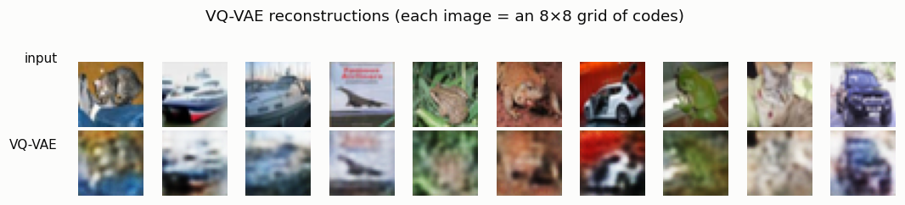
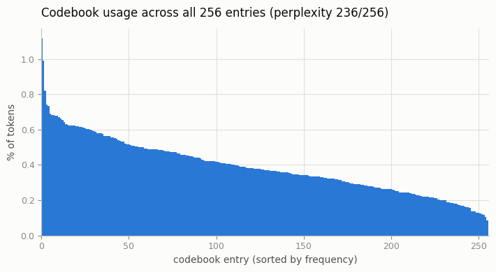
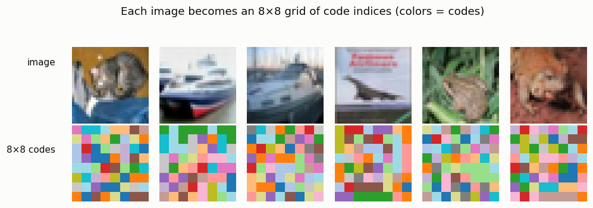

# VQ-VAE on CIFAR-10

## ELI5 (Explain Like I'm 5)

- **The Big Idea:** A VQ-VAE is an autoencoder that must describe each image
  using only entries from a small fixed "paint set" (the codebook). The encoder
  looks at each little patch of the picture and picks the closest paint chip from
  a numbered set of 256; the decoder repaints the whole image from just those
  chip numbers. So a 32×32 photo becomes an 8×8 grid of 64 numbers — a tiny,
  *discrete* summary.
- **Analogy:** It's paint-by-numbers in reverse. Instead of you filling numbered
  regions with given colors, the model *invents* a set of 256 reusable
  "patch-colors," then rewrites every image as a grid of those numbers. Because
  the vocabulary is small and shared, an image turns into a short list of
  symbols — which is exactly what lets a transformer later treat a picture like
  a sentence.
- **Example:** We compress CIFAR photos to an 8×8 grid of codes from a 256-entry
  codebook and rebuild them. All 256 codes get used (nothing wasted), and the
  reconstructions clearly show the object — proof that a tiny learned vocabulary
  is enough to describe whole pictures.

## Key Insight

A [VQ-VAE](/shared/glossary/#vq-vae) is an [autoencoder](/shared/glossary/#autoencoder) whose hidden code is forced to be *discrete*: instead of any continuous numbers, the encoder must describe each patch of the image using entries chosen from a small fixed list called a [codebook](/shared/glossary/#codebook) — like painting only with the colors in a numbered paint set. This project builds one on [CIFAR-10](/shared/glossary/#cifar-10) with a 256-entry codebook that turns each 32×32 image into an 8×8 grid of code indices, then decodes that grid back into pixels. The 8×8 grid is a *compression* choice: the encoder shrinks the image 4× on each side (32 ÷ 4 = 8), so each code summarizes a 4×4 block of pixels and the whole picture becomes just 64 codes — a 16×16 grid would shrink only 2×, keeping 256 codes that preserve more detail but cost four times as many positions to store and later generate. (This grid size — the number of code *positions* — is a separate knob from the 256-entry codebook, which sets how many distinct values each position may take.) By plotting how often each codebook entry is used and comparing the rebuilt images to the originals, you can see how a tiny vocabulary of learned patterns is enough to reconstruct whole pictures. The trick that makes training possible — passing gradients straight through the non-differentiable lookup — is the [straight-through estimator](/shared/glossary/#straight-through-estimator).

## What's in this directory

| File | Role |
|------|------|
| `vq_lib.py` | Shared encoder/decoder + two quantizers (`VectorQuantizer`, `VectorQuantizerEMA`), reused by projects 13/14/15/16/17 |
| `vqvae.py` | Trains the VQ-VAE and produces the reconstruction, codebook-usage, and token-grid figures |

```bash
python vqvae.py --data-dir data      # ~4 min on CPU
```

## Two mechanisms that make it work

1. **The straight-through estimator.** The codebook lookup (pick the nearest
   entry) has no gradient. VQ-VAE copies the decoder's gradient straight back to
   the encoder as if the lookup were the identity — `z_q = z_e + (z_q −
   z_e).detach()` — so the encoder still learns.
2. **EMA codebook + dead-code re-init.** A codebook trained purely by the
   commitment loss *collapses* to a couple of entries on this data (perplexity
   dropped to ~2 in testing). We instead update the codebook with exponential
   moving averages of the vectors assigned to it and periodically revive unused
   entries — the standard VQ-VAE-2 recipe. The collapse failure it avoids is the
   whole subject of [project 13](../13-codebook-collapse-hunt/README.md).

## Results

**Reconstructions.** 64 discrete codes per image is aggressive compression, so
detail softens — but the object and layout survive:



**A healthy codebook.** Every one of the 256 entries gets used, with a smooth
frequency curve (perplexity 236/256 — the effective vocabulary size). No entry
dominates and none is dead:



```
metric,value
codebook_size,256
latent_grid,8x8
test_recon_mse,0.0186
perplexity,236.0
codes_used,256
```

**Images as token grids.** Each image really is an 8×8 array of code indices
(colored below). That grid — a short sequence of symbols from a 256-word
vocabulary — is the object every later project operates on:



## Why discretizing is the pivot of the whole guide

Turning an image into a grid of discrete tokens is the move that unlocks a
different family of generators. A continuous latent (Phase 2's VAE) pairs
naturally with diffusion; a *discrete* latent pairs naturally with the entire
language-model toolkit — autoregressive transformers, masked prediction, "GPT
for images." The codebook is the bridge. The rest of Phase 3 sharpens these
tokens ([VQ-GAN](../14-vq-gan/README.md)), simplifies making them
([FSQ](../15-fsq-tokenizer/README.md)), and then *generates* with them
([16](../16-tiny-image-transformer/README.md), [17](../17-masked-token-model/README.md)).

## Things to try

- Shrink the codebook to 32 entries and watch reconstructions get blockier — the
  vocabulary size is a direct quality knob.
- Use a 16×16 latent (downsample only 2×) and see detail return at 4× the token
  count — the compression trade-off made concrete.
- Swap the EMA quantizer for the plain `VectorQuantizer` and watch perplexity
  crash — a preview of [project 13](../13-codebook-collapse-hunt/README.md).
