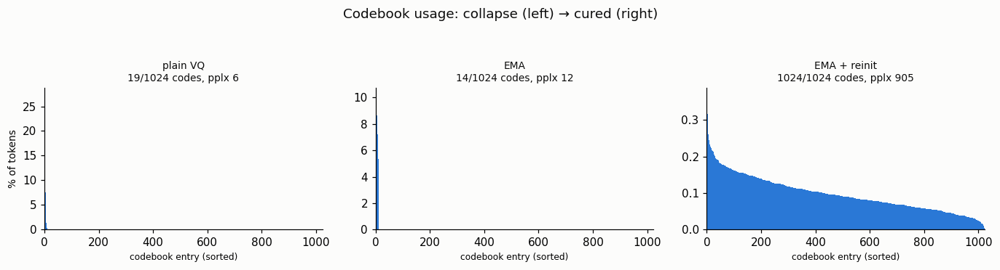
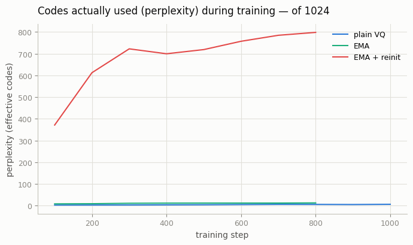

# Codebook Collapse Hunt

## ELI5 (Explain Like I'm 5)

- **The Big Idea:** A VQ model has a "box of crayons" (the codebook) to describe
  images. Codebook collapse is when the model gets lazy and only ever grabs 5
  crayons out of a box of 1,000, leaving the rest to dry up. With only a few
  colors, its pictures stay crude no matter how long it practices. We provoke
  this on purpose, then fix it so the whole box gets used.
- **Analogy:** Imagine a huge box of 1,024 crayons but the kid only reaches for
  the same handful every time — the other 1,000 sit unused. Two fixes: (1) gently
  slide each crayon toward the colors it's actually being used for (EMA), and
  (2) notice which crayons are gathering dust and swap them for fresh ones placed
  right where the kid is drawing (dead-code re-init). Now the whole box comes
  alive.
- **Example:** With a 1,024-entry codebook, plain VQ uses just **19** entries.
  Adding EMA barely helps (**14**). Adding dead-code re-init revives the whole
  box — **1,024/1,024** used — and reconstruction error drops by 3×.

## Key Insight

With a discrete [codebook](/shared/glossary/#codebook), a common failure is [codebook collapse](/shared/glossary/#codebook-collapse): the model leans on just a handful of entries and lets the rest go unused, like a writer who knows ten thousand words but only ever reaches for the same fifty. A collapsed codebook wastes capacity and caps how much detail the model can store, so reconstructions stay blurry no matter how long you train. This project deliberately provokes the problem by using a codebook far larger than needed, then fixes it with two standard tools: [EMA](/shared/glossary/#ema-weights) updates that smoothly nudge entries toward the data they should represent, and dead-code re-initialization that recycles never-used entries by moving them next to popular ones — concretely, you take a dead entry and overwrite its vector with a copy of a heavily-used entry (or a random encoder output from the current batch) plus a tiny bit of noise, so the revived entry now sits right where real data lands and finally starts getting picked. Watching the usage histogram fill in is the clearest way to feel what "collapse" really means.

## What's in this directory

| File | Role |
|------|------|
| `collapse.py` | Trains one tokenizer per fix (`--config plain / ema / ema_reinit`) with the same 1024-entry codebook, then `--plot` combines them into the figures |

```bash
python collapse.py --data-dir data --config plain
python collapse.py --data-dir data --config ema
python collapse.py --data-dir data --config ema_reinit
python collapse.py --plot            # ~5 min total on CPU
```

(Each config runs in its own short invocation so the whole study fits in small
time slices.) Reuses the encoder/decoder and both quantizers from
[project 12](../12-vq-vae-on-cifar-10/README.md).

## The two fixes, and why only both together work

1. **EMA codebook updates.** Instead of training the codebook by gradient
   (which collapses), update each entry as a moving average of the encoder
   vectors assigned to it. This keeps live entries well-placed — but an entry
   that is *never* selected gets no assignments, so it never moves. **Dead codes
   stay dead.**
2. **Dead-code re-initialization.** Track how long each entry has gone unused;
   once an entry is stale, overwrite it with a random encoder output from the
   current batch (plus a little noise). The revived entry now sits *where real
   data is*, so it immediately starts getting picked. This is what actually
   fills the codebook.

## Results

**The usage histograms tell the whole story.** Plain VQ and EMA pile every token
onto ~15 entries (near-empty plots); EMA + re-init spreads usage smoothly across
all 1,024:



**Perplexity during training** — the effective number of codes in use. Plain VQ
and EMA flatline near zero; only re-init climbs, toward ~900 of 1,024:



```
config,recon_mse,perplexity,codes_used,codebook
plain VQ,0.0643,6.2,19,1024
EMA,0.0380,12.5,14,1024
EMA + reinit,0.0189,905.2,1024,1024
```

The reconstruction error tracks the codebook usage exactly: 0.064 → 0.038 →
**0.019**. A collapsed codebook literally cannot store enough distinct patterns
to rebuild the image, so fixing collapse *is* fixing quality.

## Why every serious VQ model does this

Codebook collapse is not an exotic edge case — it is the *default* behaviour of a
naively-trained VQ codebook (which is why [project 12](../12-vq-vae-on-cifar-10/README.md)
already used EMA + re-init to get a healthy tokenizer). Every strong discrete
tokenizer — VQ-VAE-2, VQ-GAN, the tokenizers behind token-based image models —
ships with these anti-collapse tricks or a close variant. It is also the single
biggest reason the codebook-*free* alternative in the next project,
[FSQ](../15-fsq-tokenizer/README.md), is attractive: no codebook means nothing
to collapse.

## Things to try

- Lower `dead_after` (revive codes sooner) and watch perplexity climb faster.
- Shrink the codebook to 256 and see how large you can make it before even
  re-init can't keep every entry busy — the codebook can genuinely be *too* big
  for the data.
- Plot reconstruction MSE against perplexity across many runs; they track each
  other almost linearly.
