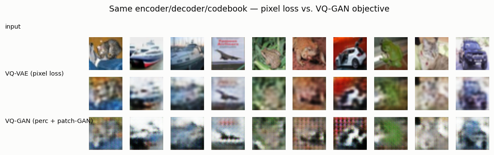

# VQ-GAN

## ELI5 (Explain Like I'm 5)

- **The Big Idea:** A plain VQ-VAE rebuilds images by minimizing pixel error,
  and the safest way to be "not too wrong" on every pixel is to smear everything
  into a blur. VQ-GAN adds two picky critics: one that compares *textures* (not
  exact pixels) using a pretrained vision network, and one that checks whether
  each little patch *looks real*. To satisfy them, the decoder must stop
  hedging and commit to sharp, specific detail.
- **Analogy:** Imagine grading a sketch only on "average correctness" — the
  student learns to draw a gray smudge that's a little bit right everywhere.
  Now add an art teacher who says "that looks fake, add real texture" (the
  discriminator) and a critic who compares the *feel* of the drawing to real
  photos (the perceptual loss). Suddenly the student draws crisp lines.
- **Example:** We train the *same* autoencoder two ways on CIFAR. With pixel
  loss only, reconstructions are soft blurs. Add the perceptual loss and patch
  discriminator and the same model produces grainy, detailed images — its
  sharpness jumps from 0.17 back up to 0.24, matching the real photos (0.24).

## Key Insight

A plain [VQ-VAE](/shared/glossary/#vq-vae) trained only to match pixels produces blurry reconstructions, because averaging over many plausible details is the safest way to lower a pixel-by-pixel error. [VQ-GAN](/shared/glossary/#vq-gan) fixes this by adding two extra training signals: a [perceptual loss](/shared/glossary/#perceptual-loss-lpips) that compares images in the feature space of a pretrained network (so it cares about textures and shapes, not exact pixels), and a patch discriminator — a small critic borrowed from [GANs](/shared/glossary/#gans) that judges whether each local region of the image looks real or fake. Together they push the decoder to commit to sharp, specific details instead of hedging. This project adds both to your VQ-VAE and watches reconstructions go from soft to crisp — the same recipe that [Stable Diffusion](/shared/glossary/#stable-diffusion)'s VAE descends from.

## What's in this directory

| File | Role |
|------|------|
| `vqgan.py` | Trains the same autoencoder with pixel loss (`--config plain`) and with the full VQ-GAN objective (`--config vqgan`), then `--plot` compares them |

```bash
python vqgan.py --data-dir data --config plain    # ~2 min
python vqgan.py --data-dir data --config vqgan    # ~4 min (perceptual + discriminator)
python vqgan.py --plot
```

Reuses the encoder/decoder/quantizer from [project 12](../12-vq-vae-on-cifar-10/README.md).

## The two extra losses

Everything is identical to the VQ-VAE except the generator's objective:

- **Perceptual loss** — push `x` and `x̂` close in the feature space of a
  pretrained VGG (a lightweight [LPIPS](/shared/glossary/#perceptual-loss-lpips)
  stand-in). Two images with the same *textures* score close even if individual
  pixels differ, so the decoder is rewarded for detail rather than for averaging.
- **Patch discriminator** — a small PatchGAN critic outputs a real/fake score
  for every local patch; the generator is trained to fool it (hinge GAN loss).
  A blurry patch is trivially "fake," so blur is directly penalized. (We let the
  autoencoder warm up for a quarter of training before switching the critic on,
  for stability.)

## Results

**Same model, two objectives.** Top: inputs. Middle: pixel-loss VQ-VAE — soft,
averaged, blurry. Bottom: VQ-GAN — grainy, textured, committed to detail:



**Sharpness, measured** (mean gradient magnitude — blur lowers it). The pixel-loss
model sits well below the real images; VQ-GAN climbs back to match them:

```
model,sharpness_grad
input,0.236
VQ-VAE (pixel),0.171
VQ-GAN,0.239
```

The VQ-GAN reconstructions are not "prettier" by every measure — a tiny
CPU-trained discriminator adds some noise — but they *commit to high-frequency
detail* instead of hedging, which is exactly what "sharp, not blurry" means and
exactly what a downstream generator needs from its tokenizer.

## Why this recipe is everywhere

The blur of a pixel-loss autoencoder is the ceiling on everything built on top
of it: if the tokenizer can only reconstruct blurry images, no generator working
in its latent can ever be sharp. VQ-GAN's perceptual + adversarial recipe is the
fix, and it is the direct ancestor of the autoencoder inside Stable Diffusion
(and most latent-diffusion models): they are VQ-GAN-style VAEs trained with LPIPS
+ a patch discriminator. The lessons of the GAN era (Phase 4) — perceptual
losses beat pixel MSE, and a discriminator is the cure for blur — live on here
inside a *tokenizer*, not a generator.

## Things to try

- Turn off the perceptual loss (keep only the discriminator) and vice versa to
  see which contributes more of the sharpening.
- Raise the discriminator weight and watch detail increase — then overshoot and
  watch it inject artifacts, the classic GAN knife-edge.
- Feed the two tokenizers into the transformer of [project 16](../16-tiny-image-transformer/README.md)
  and compare generated-image quality — a sharper tokenizer raises the ceiling.
