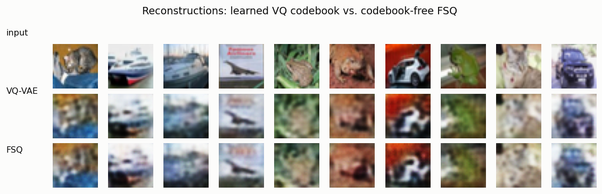
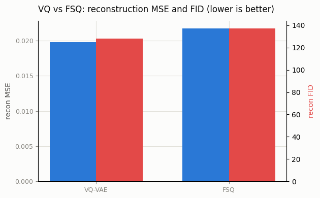

# FSQ Tokenizer

## ELI5 (Explain Like I'm 5)

- **The Big Idea:** VQ-VAE learns a whole dictionary of "code vectors" and has to
  fight to keep it healthy (that's the collapse problem). FSQ throws the
  dictionary away entirely. It just takes each number the encoder produces and
  *rounds it to the nearest notch on a ruler*. The set of possible rounded
  combinations *is* the vocabulary — no training, no collapse, almost no code.
- **Analogy:** VQ is like inventing a custom set of 256 paint colors and
  constantly re-mixing them so none go to waste. FSQ is like saying "every
  measurement snaps to the nearest centimeter mark" — the tick marks are fixed
  forever, you never have to design or maintain them, and yet a handful of
  rulers still lets you describe a huge number of distinct points.
- **Example:** We give FSQ three channels rounded to 8, 8, and 4 levels — that's
  8×8×4 = 256 possible "codes," matched to the VQ-VAE's 256-entry codebook. Head
  to head, the learned VQ is a *little* better (FID 128 vs 137), but the dead-
  simple FSQ lands right behind it — with nothing that can ever collapse.

## Key Insight

[FSQ](/shared/glossary/#fsq) (Finite Scalar Quantization) is a surprisingly simple way to make image [tokens](/shared/glossary/#token-visualaudio) without learning a [codebook](/shared/glossary/#codebook) at all. Instead of looking up the nearest entry in a trained table, it just rounds each number in the latent to the nearest value on a fixed grid — like snapping every measurement to the nearest tick on a ruler. Because there is no codebook to train, FSQ sidesteps [codebook collapse](/shared/glossary/#codebook-collapse) entirely and is far easier to get working. This project implements FSQ and compares it to a learned [VQ-VAE](/shared/glossary/#vq-vae) on reconstruction [FID](/shared/glossary/#fid): the learned VQ-VAE is usually a little better, but in many settings the much simpler FSQ matches it closely — that is what "holds its own" means here.

## What's in this directory

| File | Role |
|------|------|
| `fsq.py` | Trains a VQ-VAE (`--config vq`) and an FSQ auto-encoder (`--config fsq`) with equal 256-code budgets, then `--plot` compares reconstruction MSE and Inception FID |

```bash
python fsq.py --data-dir data --config vq
python fsq.py --data-dir data --config fsq
python fsq.py --data-dir data --plot        # reconstruction FID (Inception)
```

Reuses the encoder/decoder + VQ from [project 12](../12-vq-vae-on-cifar-10/README.md)
and the FID from [project 04](../04-fid-from-scratch/README.md).

## How FSQ quantizes — the whole method

That's it, per latent channel `d` with `L_d` levels:

```
z_bounded = tanh(z) · (L_d − 1)/2      # squash into [−(L−1)/2, (L−1)/2]
z_quant   = round(z_bounded)           # snap to one of L integer levels
# straight-through: z_bounded + (z_quant − z_bounded).detach()
```

The implicit vocabulary is `∏ L_d = 8·8·4 = 256`. There is no codebook tensor, no
nearest-neighbour search, no commitment/EMA machinery, and — crucially — nothing
that can collapse. Compare that to the anti-collapse gymnastics of
[project 13](../13-codebook-collapse-hunt/README.md).

## Results

**Reconstructions are nearly indistinguishable.** Learned VQ codebook (middle) vs.
codebook-free FSQ (bottom) — same encoder/decoder, same 256-code budget:



**The scoreboard.** VQ wins by a hair on both metrics; FSQ trails closely despite
using no learned codebook (and only 147 of its 256 grid cells even show up in the
data — FSQ doesn't need every cell populated):



```
tokenizer,recon_mse,recon_fid,codes_used,vocab
VQ-VAE,0.0198,127.99,256,256
FSQ,0.0217,137.24,147,256
```

## Why "simple but competitive" is a big deal

The whole apparatus of [project 13](../13-codebook-collapse-hunt/README.md) —
EMA updates, dead-code re-init, commitment losses, careful tuning — exists to
keep a learned codebook alive. FSQ deletes that entire failure mode for a small,
often-negligible quality cost, which is why it (and lookup-free quantization,
its binary cousin behind MagViT-v2) has become popular for modern tokenizers,
especially at the large codebooks where VQ is hardest to keep healthy. The
lesson generalizes: sometimes the right move isn't a better fix for a fragile
mechanism, but a different mechanism with no fragility to fix.

## Things to try

- Change the levels to `[8,6,5]` (240 codes) or `[7,5,5,5]` (875 codes) and watch
  reconstruction improve with the larger vocabulary — FSQ scales by *adding
  channels/levels*, never by growing a table that might collapse.
- Give VQ a *1024*-entry codebook and FSQ an equivalent grid and re-compare; the
  gap often narrows further exactly where VQ starts struggling to stay healthy.
- Plug either tokenizer into the transformer of [project 16](../16-tiny-image-transformer/README.md)
  and confirm the generator doesn't care which quantizer produced the tokens.
