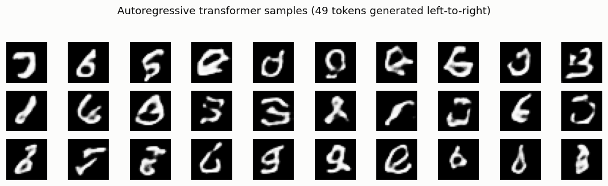

# Tiny Image Transformer

## ELI5 (Explain Like I'm 5)

- **The Big Idea:** Once a tokenizer turns a picture into a short list of symbols
  (49 code-numbers for a digit), a *picture is just a sentence*. And we already
  have brilliant machines for writing sentences one word at a time: language
  models. So we point a small GPT at image-tokens and let it "write" a new
  picture token by token, left to right, top to bottom — then decode the finished
  list back into pixels.
- **Analogy:** It's autocomplete for images. A language model predicts the next
  *word* from the words so far; this model predicts the next *code* from the
  codes so far. Feed it a "start" symbol and let it ramble, and it composes a
  brand-new digit the same way autocomplete composes a sentence.
- **Example:** We tokenize MNIST into 49-token grids and train a small
  transformer to predict the next token. Sampling 49 tokens in order and decoding
  gives fresh, recognizably digit-like images — proof that "image generation =
  language modeling" really works.

## Key Insight

Once a [VQ-GAN](/shared/glossary/#vq-gan) has turned an image into a grid of discrete [tokens](/shared/glossary/#token-visualaudio), a picture becomes "just another sentence" — a sequence of symbols from a fixed vocabulary — and the same machinery used for language applies directly. This project trains a small [transformer](/shared/glossary/#transformer) to predict those image tokens one after another in raster (row-by-row) order, exactly how an [autoregressive](/shared/glossary/#autoregressive-model) language model writes text word by word. To generate a new image you sample tokens one at a time and then decode the finished grid back into pixels with the VQ-GAN decoder. It is slow because each token must wait for the previous one, but it shows clearly why "image generation as language modeling" is such a powerful idea.

## What's in this directory

| File | Role |
|------|------|
| `mnist_tok.py` | A small MNIST VQ tokenizer (28×28 → 7×7 = 49 tokens, 128-entry codebook), shared with [project 17](../17-masked-token-model/README.md) |
| `transformer.py` | A minimal pre-norm transformer block (shared by 16 and 17) |
| `imagegpt.py` | Trains the causal GPT over token sequences, samples autoregressively, decodes |

```bash
python imagegpt.py --data-dir data      # ~6 min on CPU (tokenizer + GPT)
```

We use **MNIST** here (not CIFAR) purely for legibility — a tiny transformer on
a CPU can make *recognizable* digits, so the mechanism is easy to see. The recipe
is identical for CIFAR VQ-GAN tokens.

## How generation-as-language-modeling works

1. **Tokenize.** The VQ tokenizer maps each 28×28 image to a `7×7 = 49` grid of
   code indices from a 128-word vocabulary — a short "sentence."
2. **Train a GPT.** A causal transformer predicts token *i* from tokens *1…i−1*
   (a start-of-sequence symbol seeds position 0). The loss is plain cross-entropy
   over the vocabulary — *identical* to language-model training.
3. **Sample.** Start from the seed symbol and draw tokens one at a time, each
   conditioned on all the tokens drawn so far, until the 49-grid is full. Decode
   it back to pixels.

## Results

**Autoregressive samples.** Each image was written token-by-token in raster
order, then decoded. They are rough (a small model on a CPU) but clearly
digit-shaped — the transformer learned the *grammar* of MNIST token sequences:



```
metric,value
vocab,128
tokens_per_image,49
sampling_steps_per_image,49        ← 49 sequential network calls per image
```

**The catch — sequential sampling.** Generation needs **one network call per
token**: 49 for a 28×28 digit here, but `32×32÷scale²` for a real image — hundreds
to thousands, each waiting for the last. At MNIST scale it's instant; at real
resolution it's the bottleneck that motivates the parallel decoder of
[project 17](../17-masked-token-model/README.md).

## Why "images are just another language" matters

This is the bet behind a whole family of image models — the original DALL·E,
Parti, LlamaGen, and the token-generating half of native-multimodal systems like
GPT-4o. Once images are token sequences, *everything* from the language-model
toolbox transfers for free: scaling laws, sampling tricks, instruction tuning,
and — crucially — a *single* transformer that can model text and image tokens in
one stream. The price, visible here, is slow raster-order sampling. Fixing that
(without giving up the language-model framing) is exactly what MaskGIT does next.

## Things to try

- Lower the sampling `temperature` toward 0.7 for cleaner (less diverse) digits,
  or raise it for wilder ones — the same knob as text generation.
- Train longer; the samples sharpen steadily, just like a language model's does
  with more steps.
- Prime the model with the top few rows of a real image's tokens and let it
  complete the rest — autoregressive image *inpainting* for free.
