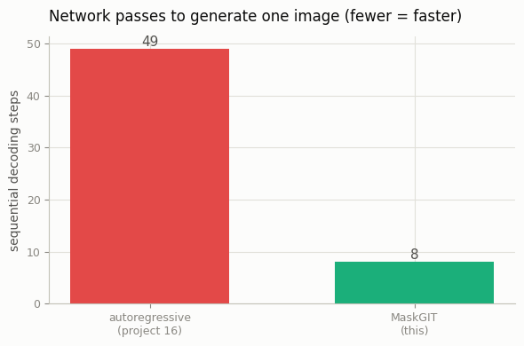
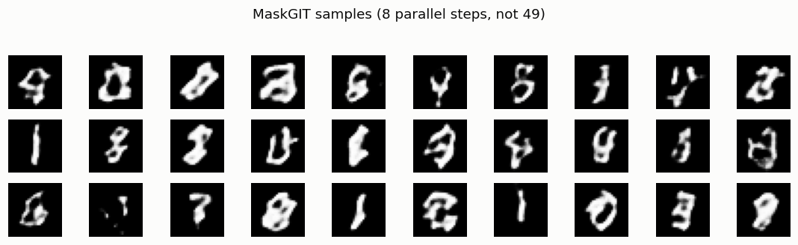

# Masked-Token Model

## ELI5 (Explain Like I'm 5)

- **The Big Idea:** The autoregressive transformer (project 16) writes an image
  token by token, left to right — 49 turns for one little digit. A MaskGIT model
  is smarter about *order*: it starts with a grid where everything is hidden,
  guesses *all* the tokens at once, keeps only the few guesses it's most sure
  about, hides the rest, and repeats. In about 8 rounds the whole image is done —
  6× fewer network calls.
- **Analogy:** It's how you solve a crossword. You don't fill it strictly left-
  to-right; you write in the answers you're *confident* about first, and those
  make the neighboring blanks easy. MaskGIT fills in its most-confident pixels
  first, and each round makes the next easier.
- **Example:** On the *same* tokens as project 16, the masked model generates a
  digit in **8 parallel steps instead of 49 sequential ones**, and — with the
  right dash of randomness — the results are just as varied.

## Key Insight

Generating image [tokens](/shared/glossary/#token-visualaudio) strictly one at a time is slow. A [MaskGIT](/shared/glossary/#maskgit)-style masked-token model speeds this up by predicting *many* tokens at once: it starts from a grid where most tokens are hidden, fills in the ones it is most confident about, then repeats — refining the whole image in a handful of passes instead of hundreds. The analogy is solving a crossword by first writing in the answers you are sure of, which then make the remaining blanks easier to guess. This project implements such a parallel decoder over the same [VQ-GAN](/shared/glossary/#vq-gan) tokens and compares its sampling speed and quality against the row-by-row [transformer](/shared/glossary/#transformer) from the previous project.

## What's in this directory

| File | Role |
|------|------|
| `maskgit.py` | A bidirectional transformer trained by masked-token prediction, sampled with MaskGIT's confidence-based parallel decoding |

Reuses the MNIST tokenizer and transformer block from [project 16](../16-tiny-image-transformer/README.md).

```bash
python maskgit.py --data-dir data      # ~6 min on CPU (tokenizer + model)
```

## Two differences from the autoregressive GPT

1. **Bidirectional, not causal.** There is no "future mask" — every token can see
   every other token. The model is trained by hiding a random fraction of tokens
   (a cosine schedule of mask ratios) and predicting *only the hidden ones*, like
   BERT for images.
2. **Confidence-based parallel decoding.** To sample: start all-masked; predict
   every token at once; keep the most-confident predictions (a cosine schedule
   decides how many), re-mask the rest, and repeat for ~8 rounds. One subtlety
   that matters a lot: add **annealed Gumbel noise** to the confidence scores, so
   early rounds don't greedily commit to the single most-likely token everywhere
   — without it, every sample collapses to the same "average" digit.

## Results

**Same tokens, 6× fewer steps.** MaskGIT fills the 49-token grid in 8 parallel
passes instead of 49 sequential ones:



```
metric,value
autoregressive_steps,49
maskgit_steps,8
speedup,6.1x
```

**And the samples stay varied** (with the Gumbel-noise trick) — diverse
digit-shaped images from a handful of parallel refinement rounds, comparable to
the autoregressive model's output but far cheaper to produce:



(Both models are tiny and CPU-trained, so individual digits are rough — the
point is the *decoding strategy*, not the fidelity.)

## Why parallel decoding matters

Autoregression's one-call-per-token cost is the tax on "images as language":
fine for a 49-token MNIST digit, ruinous for a real image's hundreds or
thousands of tokens. MaskGIT (and its descendants — Muse, MAGVIT, and the
parallel-decoding tricks in modern token-based image models) keeps the
tokens-as-language framing and its whole toolbox, but recovers most of the speed
by decoding in a fixed small number of rounds regardless of image size. It is the
token-world's answer to the same "sampling is too slow" problem that few-step
distillation solves for diffusion — a recurring theme: strong models are made
*practical* by making sampling cheap.

## Things to try

- Sweep `--decode-steps` from 4 to 16 and watch quality trade against speed — the
  knob MaskGIT exposes that autoregression cannot.
- Set the sampling `temp` to 0 (no Gumbel noise) and watch every sample collapse
  to the same digit — the clearest demonstration of why the noise is essential.
- Compare wall-clock sampling time head-to-head with [project 16](../16-tiny-image-transformer/README.md)
  at a larger token grid, where the 6× step gap turns into a real speed gap.
