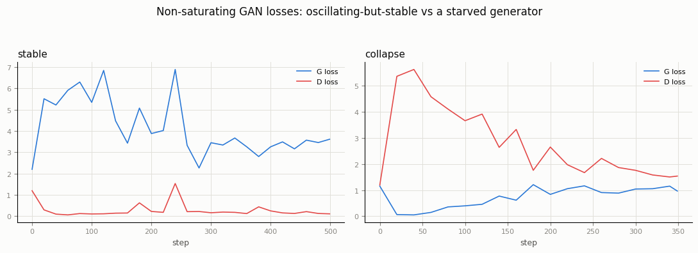
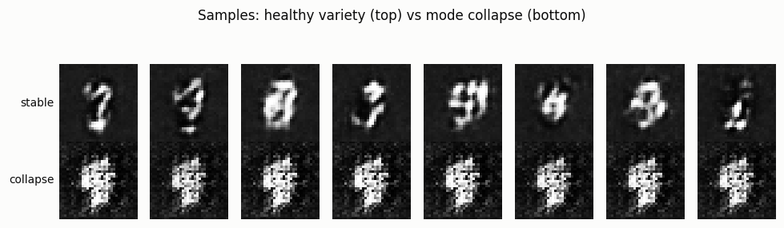
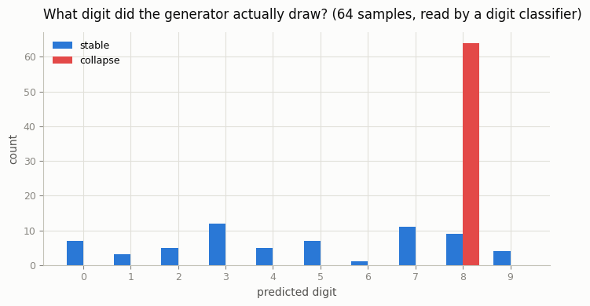

# Vanilla GAN on MNIST

## ELI5 (Explain Like I'm 5)

- **The Big Idea:** A GAN (Generative Adversarial Network) is a game played between two computer brains: a **Generator** (the counterfeiter) who tries to make fake pictures, and a **Discriminator** (the detective) who tries to catch the fakes. They train by competing against each other. If the generator gets too far ahead, it takes a shortcut called **mode collapse** — it gets lazy and keeps drawing the exact same, single fake picture that it knows can fool the detective, rather than learning to draw many different things.
- **Analogy:** Think of a painter learning to paint fake Mona Lisas, and an art critic trying to spot them. If the painter finds one specific smiley face that the critic is bad at identifying as a fake, the painter might just paint that exact same face over and over. Without a tough critic pushing them to paint other parts of the portrait, the painter stops trying to learn anything else.
- **Example:** We train a GAN to draw handwritten numbers. In the `stable` version where they are evenly matched, the generator draws 10 different digit classes (0 through 9). In the `collapse` version, the generator gets too powerful too fast, stops trying, and outputs the digit "8" on **all 64 of 64** tries.

## Key Insight

A [GAN](/shared/glossary/#gans) trains two networks in a contest: a [generator](/shared/glossary/#generator) that turns a vector of random noise into a fake image, and a [discriminator](/shared/glossary/#discriminator) that looks at an image and guesses whether it is real or generated. They improve by competing — the generator keeps trying to fool the critic while the critic keeps getting better at catching it — like a counterfeiter and a detective who each sharpen the other. This project builds [DCGAN](/shared/glossary/#dcgan), the first convolutional GAN recipe that trained reliably, on [MNIST](/shared/glossary/#mnist) digits, where you will watch the two losses oscillate instead of settling and learn to spot [mode collapse](/shared/glossary/#mode-collapse) — when the generator gives up on variety and keeps emitting the same one or two digits that happen to fool the critic.

## What's in this directory

| File | Role |
|------|------|
| `dcgan.py` | Shared DCGAN `Generator`/`Discriminator` (32×32, MNIST zero-padded from 28×28), plus a `ProjectionDiscriminator` for conditioning. Reused by every project in this phase (19, 20, 22, 23). |
| `train.py` | Trains the non-saturating GAN twice — `stable` and `collapse` — then `--plot` builds the figures below. |

```bash
python train.py --config stable    --data-dir data   # ~3 min on CPU
python train.py --config collapse  --data-dir data   # ~1.5 min on CPU
python train.py --plot                                # seconds
```

Both configs use the exact same architecture and loss — only the Adam learning rates for G and D differ. `stable` uses the DCGAN-paper recipe (`lr_g = lr_d = 2e-4`). `collapse` gives G a 40x higher learning rate than D (`2e-3` vs `5e-5`): D can't keep up, so instead of being pushed toward covering the whole data distribution, G finds the handful of fakes that already fool a lagging critic and stops exploring.

To measure collapse rather than just eyeball it, 64 samples are read by the small MNIST classifier from [project 58](../58-caption-ablation/README.md) (via `sys.path`, trained fresh here in ~15s the first time and cached at `58-caption-ablation/mnist_clf.pt`). The predicted-digit histogram gives an objective collapse signal — no unique digits left means every sample is being read as the same class.

## Results

**Losses**: `stable` oscillates in a wide but bounded band (textbook non-equilibrium GAN training — D wins locally, G recovers, repeat). `collapse` shows the tell: D's loss shoots up early (it's suddenly seeing much worse fakes than before) and G's loss keeps dropping — G found something that reliably fools D and is no longer being pushed to do anything else.



**Samples**: the `stable` row is eight different draws that decode into eight different rough digit shapes. The `collapse` row is eight different `z` vectors decoding into what is visibly the *same* blob — the generator has thrown away the input noise almost entirely.



**The classifier makes it quantitative.** Feed 64 fresh samples from each model through the digit classifier:



```
config,wall_time_s,unique_digit_classes,normalized_entropy,counts
stable,192.9,10,0.937,"[7, 3, 5, 12, 5, 7, 1, 11, 9, 4]"
collapse,86.1,1,-0.000,"[0, 0, 0, 0, 0, 0, 0, 0, 64, 0]"
```

`stable` uses all 10 digit classes with high entropy (0.94, close to the 1.0 ceiling for a uniform 10-way split). `collapse` reads as digit "8" on **all 64 of 64** samples — entropy 0, one mode, total collapse. This is the failure mode every later fix in this phase (WGAN-GP's smoother loss, the conditioning in project 20, and every stabilization trick in modern GANs) is designed to prevent.

## Why this happens

The non-saturating loss trains G to move fakes toward wherever D currently draws its decision boundary — it has no term that rewards *covering* the data distribution, only fooling the current critic. If D is too weak or too slow relative to G, G can satisfy that objective completely by producing one convincing fake repeatedly, since there is no mechanism pushing it to also produce a different one. A well-matched D (this project's `stable` config) keeps moving its boundary fast enough that no single fake stays convincing for long, forcing G to keep spreading its mass across the data manifold. This is precisely the fragility that motivated the Wasserstein loss in [project 19](../19-wgan-gp/README.md).

## Things to try

- Push the learning-rate ratio further (`lr_g=5e-3`) and see collapse happen even faster.
- Increase `d_steps` instead of the LR ratio — a stronger D per G-step is the other classic way to prevent collapse (used by WGAN-style training).
- Interpolate between two `z` vectors in the `stable` model and watch the digit morph smoothly — evidence the generator learned a continuous, meaningful latent space rather than memorizing discrete images.
