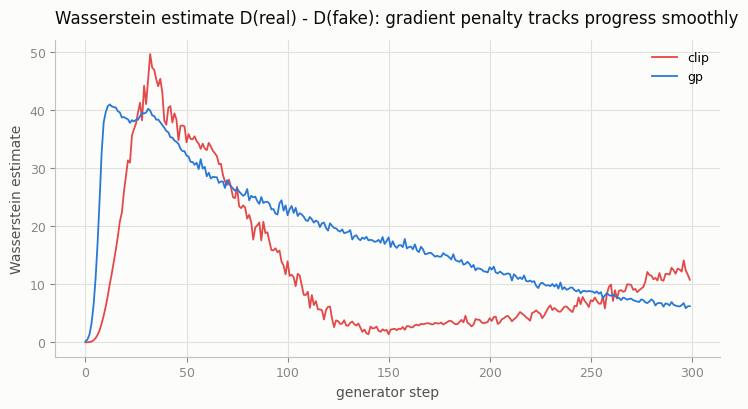
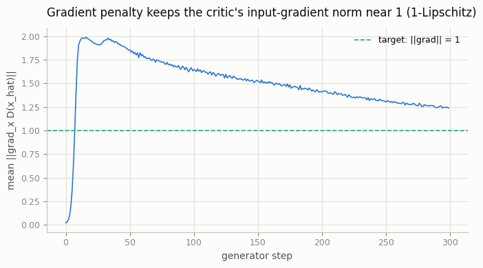
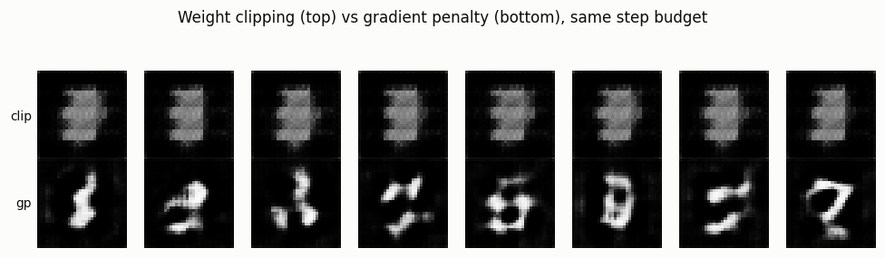

# WGAN-GP

## Key Insight

The original GAN loss can stall: once the [discriminator](/shared/glossary/#discriminator) gets too good, it hands back almost no useful gradient, so the [generator](/shared/glossary/#generator) stops learning. [Wasserstein GAN (WGAN)](/shared/glossary/#wasserstein-gan-wgan) swaps that loss for the [Earth Mover's Distance](/shared/glossary/#earth-movers-distance) — the amount of "work" needed to reshape the pile of generated images into the pile of real ones — which gives a smooth, always-informative signal even when the two distributions barely overlap. For that distance to be valid the critic must be 1-[Lipschitz](/shared/glossary/#lipschitz-constraint) (its output cannot change faster than its input), and this project enforces it with a [gradient penalty](/shared/glossary/#gradient-penalty): an extra loss term that pushes the size of the critic's input gradient toward 1, replacing the cruder weight-clipping of the original WGAN. The payoff you will see is far steadier training and much less fiddling with hyperparameters.

## What's in this directory

| File | Role |
|------|------|
| `train.py` | Trains the same DCGAN architecture (imported from [project 18](../18-vanilla-gan-on-mnist/README.md)) with the Wasserstein critic loss, comparing `--config clip` (original weight-clipping WGAN) against `--config gp` (gradient penalty), then `--plot` builds the figures. |

```bash
python train.py --config clip --data-dir data   # ~2 min on CPU
python train.py --config gp   --data-dir data    # ~3.5 min on CPU
python train.py --plot
```

Both configs: no sigmoid on the critic, loss `D(fake) - D(real)` (critic) / `-D(fake)` (generator), 5 critic steps per generator step, Adam(lr=1e-4, β=(0.5, 0.9)) — the WGAN-GP paper's recipe. `clip` clamps every critic weight to `[-0.01, 0.01]` after each step; `gp` instead adds `10 · (‖∇ₓD(x̂)‖ − 1)²` at points `x̂` interpolated between real and fake batches. The critic uses no batchnorm in either config (`Discriminator(norm="none")` from `dcgan.py`) — batchnorm would couple the gradient-penalty computation across samples in a batch, which breaks the *per-sample* norm the penalty is supposed to constrain.

## Results

**The Wasserstein estimate `D(real) − D(fake)`** is meant to *track* actual sample quality, unlike the vanilla GAN's BCE loss (see [project 18](../18-vanilla-gan-on-mnist/README.md), where G and D loss oscillate with no clear read on progress). Both configs show it falling as training proceeds, but `clip`'s curve is visibly rougher — a symptom of the critic wasting capacity fighting the clip boundary instead of fitting a clean 1-Lipschitz function:



**The gradient penalty is directly checkable**: plot the mean input-gradient norm the penalty is computed on. It should sit near 1 if the constraint is doing its job — and it does, holding in the 1.2–2.0 band throughout training (weight clipping has no equivalent quantity to check; it just clamps regardless of what the actual Lipschitz constant needs to be):



**Samples make the practical gap obvious.** At the same step budget, weight clipping has driven the critic (and by extension the generator) into degenerate territory — every sample is nearly the same low-contrast blob. Gradient penalty produces genuinely varied, recognizable digit shapes:



```
config,wall_time_s,final_wasserstein_estimate,mean_grad_norm_last_50
clip,123.5,10.781,n/a
gp,197.1,6.234,1.274
```

This reproduces the WGAN-GP paper's central complaint about clipping in miniature: forcing every weight into a small box is a blunt way to bound a Lipschitz constant, and it visibly costs the generator's sample quality even in a network this small, over a run this short.

## Why gradient penalty wins

Weight clipping bounds the Lipschitz constant indirectly and crudely — it has no idea what value of `c` actually keeps the network 1-Lipschitz for the current weights, so it either clips too aggressively (collapsing the critic to near-linear functions, wasting most of its capacity) or too loosely (violating the constraint the whole theory depends on). The gradient penalty instead measures the one quantity that actually matters — the gradient norm at the exact points where it's evaluated — and penalizes it directly. That's a more direct implementation of "1-Lipschitz" than any weight constraint can be, which is why it became the default in essentially every Wasserstein-loss model after this paper (and why R1/R2 regularization, used by StyleGAN2 in [project 21](../21-stylegan-tour/README.md), is a close cousin of the same idea).

## Things to try

- Push `CLIP` smaller (e.g. `0.001`) and watch the clip-config critic collapse toward a near-constant function — the failure mode gets worse, not better.
- Increase `LAMBDA_GP` and watch the gradient norm plot tighten around 1 even more; decrease it and watch the constraint loosen.
- Compare wall-clock: gradient penalty costs a double-backward per critic step, so it's meaningfully slower per step than clipping for the same sample quality — a real trade-off, not a free lunch.
