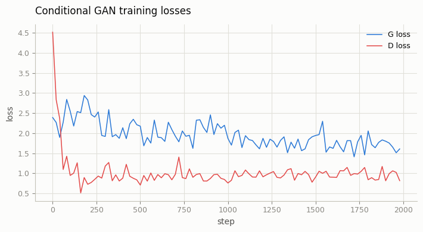
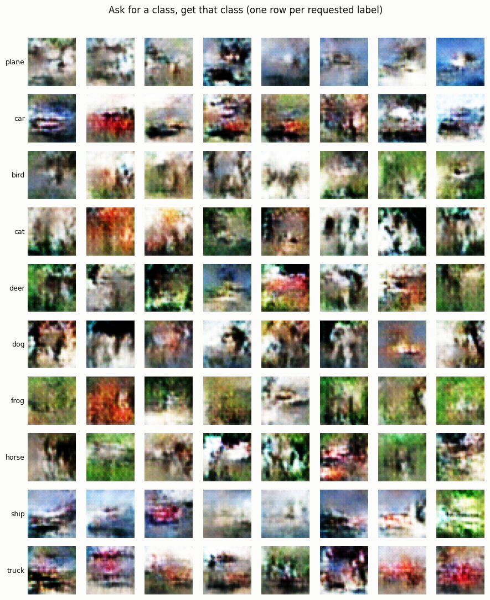
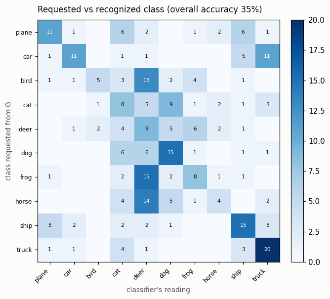

# Conditional GAN

## ELI5 (Explain Like I'm 5)

- **The Big Idea:** A standard GAN is like a painter who paints random things. A **Conditional GAN (cGAN)** is like a painter you can give orders to, like "paint a car" or "paint a frog." We do this by sending the label ("car", "frog", etc.) to both the painter (generator) and the critic (discriminator). We use a trick called **projection** to blend the label smoothly into the critic's checklist, making the training much more effective than just sticking the label on as extra text.
- **Analogy:** Imagine ordering food at a restaurant. Instead of the chef bringing you a completely random dish, you specify "pasta." The chef uses that order to cook, and the waiter uses that order to verify they brought you the right plate. By using projection, the waiter doesn't just check the name of the dish; they actively match the dish's features (smell, ingredients) against the essence of "pasta."
- **Example:** We train a conditional GAN on the CIFAR-10 dataset (which contains objects like planes, cars, and frogs). Even after a short training run on CPU, when we ask for a "ship" or a "plane," the generator outputs whites and blues (sky and water). An independent AI judge guesses the correct class for **35.3%** of these rough pictures — 3.5 times better than a random 10% guess.

## Key Insight

A plain GAN samples a random image from everything it learned, with no way to ask for a specific kind. A [conditional GAN (cGAN)](/shared/glossary/#conditional-gan-cgan) fixes this by feeding the class label to *both* the [generator](/shared/glossary/#generator) and the [discriminator](/shared/glossary/#discriminator), turning generation into [class conditioning](/shared/glossary/#class-conditioning) — you can request "a 7" or "a cat" on demand. This project injects the label through a [projection discriminator](/shared/glossary/#projection-discriminator), which blends the label into the critic's score with a [dot product](/shared/glossary/#dot-product) against a learned per-class vector instead of just stapling the label on as an extra input channel — a trick that conditions more strongly for little extra cost. Training on [CIFAR-10](/shared/glossary/#cifar-10) with labels lets you verify the control works: ask for a class, and that class is what comes out.

## What's in this directory

| File | Role |
|------|------|
| `train.py` | Trains the conditional DCGAN (`Generator`/`ProjectionDiscriminator` from [project 18](../18-vanilla-gan-on-mnist/README.md)'s `dcgan.py`) on CIFAR-10, then `--eval` asks it for each class and checks what came out, then `--plot` builds the figures. |
| `cifar_clf.py` | A small independent CIFAR-10 classifier — the automatic judge for "does this generated image actually look like the requested class?" (~73% test accuracy, trained in ~1.5 min). |

```bash
python train.py --data-dir data          # ~8 min on CPU (2000 steps)
python train.py --eval --data-dir data   # ~1.5 min (trains the judge, then reads 300 samples)
python train.py --plot
```

The generator gets its label as a one-hot vector concatenated to `z` before the first transposed conv. The discriminator uses a **projection** head: `score = ψ(features(x)) + embed(y) · features(x)` — the label enters as a learned direction in feature space that the critic's score is dotted against, rather than as an extra input channel. Both nets otherwise match [project 18](../18-vanilla-gan-on-mnist/README.md)'s architecture, trained with the same non-saturating loss.

## Results

CIFAR-10 is a much harder target than MNIST for a DCGAN this small trained this briefly (2000 steps, CPU) — full photorealism needs far more compute than a 10-minute budget allows. But **the class signal is measurably there well before the shapes are: color and texture statistics per class emerge first.**

**Loss curves** — the projection discriminator keeps a healthy, non-degenerate balance with G throughout (no collapse, no vanishing D loss):



**Samples, one row per requested class** — objects aren't crisp yet, but the *palette* clearly tracks the label: `plane`/`ship` rows lean toward sky/water blues and whites, `frog`/`bird` rows lean green, `car`/`truck` rows show hard-edged reddish blobs against neutral backgrounds:



**The independent classifier confirms it's not just an impression.** Feed 30 fresh samples per requested class through `cifar_clf.py` and read the confusion matrix:



```
class,adherence_accuracy
plane,0.367   car,0.367    bird,0.167   cat,0.267   deer,0.300
dog,0.500     frog,0.267   horse,0.133  ship,0.500  truck,0.667
overall,0.353
```

**35.3% overall** — 3.5x the 10% random-guess floor, with every one of the 10 classes landing above chance. Vehicles and background-defined classes (`truck`, `ship`, `car`, `plane`) read most reliably, because color and hard-edge cues are the first thing this small a model learns; texture-heavy animal classes (`bird`, `horse`, `cat`) are still mostly confused with the visually similar `deer`/`dog` buckets. That ordering is itself informative: it's the same easy-cues-first curriculum every CIFAR generator goes through, just caught partway.

## Why projection over concatenation

Simply concatenating a one-hot label to the discriminator's input (or to an intermediate feature map) gives the critic *some* signal, but the label has to fight for representational capacity alongside the pixel features from layer one. A projection discriminator instead lets the network learn realism (`ψ(features(x))`) and class-consistency (`embed(y)·features(x)`) as separate, additive terms — the label only ever interacts with the *finished* feature vector as a direction to align with, which is a far easier function to learn and is what makes conditioning "stick" earlier in training than naive concatenation would. This is the same discriminator used at ImageNet scale in BigGAN.

## Things to try

- Train longer (the loss curves are still healthy and falling at 2000 steps — this model is undertrained, not stuck) and watch `overall` accuracy keep climbing.
- Try naive label-concatenation on the discriminator instead of projection at the same step budget, and compare `overall` accuracy — the gap is the point of this project.
- Interpolate the *label* embedding between two classes at fixed `z` and watch the output blend (e.g. cat ↔ dog) — evidence the projection term learned a meaningful embedding space, not just 10 disconnected lookup slots.
