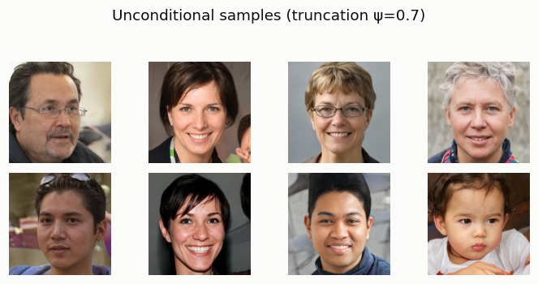
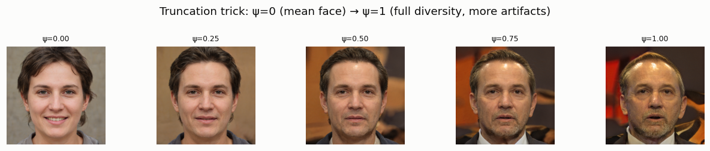
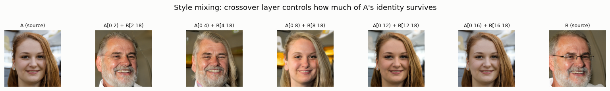

# StyleGAN Tour

## ELI5 (Explain Like I'm 5)

- **The Big Idea:** Instead of feeding random noise into the start of a network and hoping for the best, **StyleGAN** translates the noise into a master code (the **W space**). It then injects this code into *every single layer* of the network using a technique called AdaIN. This gives the model a set of "knobs" that control different details: early layers control the big picture (head pose, face shape), middle layers control features (eyes, nose), and late layers control micro-details (hair color, skin texture).
- **Analogy:** Imagine a theater lighting board. Instead of having a single master switch that turns all the lights on randomly, you have a board of sliders. One slider controls the brightness of the stage left lights, another controls the color of the spotlight, and another controls the background haze. You can slide each one independently to design a custom scene.
- **Example:** We load a professional, pretrained StyleGAN2 model that makes fake human faces. By swapping the codes of two different faces at layer 8, we mix them: the face takes the shape, age, and identity from face A, but copies the lighting, skin tone, and color details from face B.

## Key Insight

Standard GANs feed the noise vector in only at the input and let the layers do the rest. [StyleGAN](/shared/glossary/#stylegan) instead first maps the noise into an intermediate [W latent space](/shared/glossary/#w-and-w-latent-spaces) and then injects that code into *every* layer through [adaptive instance normalization (AdaIN)](/shared/glossary/#adaptive-instance-normalization-adain) — a step that rescales each layer's feature maps using shift-and-scale numbers derived from the style code, so the one code steers features at every scale from pose down to skin texture. Because of this design the [latent space](/shared/glossary/#latent-space) becomes "disentangled": moving along one direction tends to change a single attribute (hair, smile, lighting) while leaving the rest alone. This project runs inference on a pretrained [StyleGAN2](/shared/glossary/#stylegan2) face model — the kind behind sites like `thispersondoesnotexist.com` — and compares editing in the shared W code versus the roomier W+ space, which gives each layer its own code for finer, more local control.

## What's in this directory

| File | Role |
|------|------|
| `sg2_model.py`, `sg2_ops.py` | A CPU-only StyleGAN2 generator, vendored from [rosinality/stylegan2-pytorch](https://github.com/rosinality/stylegan2-pytorch) (MIT License) with the custom CUDA kernels stripped down to their pure-PyTorch fallback paths, so it runs with no compiler and no GPU. |
| `stylegan_tour.py` | Loads the pretrained FFHQ config-f checkpoint (auto-downloaded to `checkpoints/`, ~130MB, gitignored) and runs three inference experiments. |
| `plot.py` | Builds the figures below from the saved arrays. |

```bash
python stylegan_tour.py   # ~35s on CPU (24 forward passes at 1024x1024)
python plot.py
```

The checkpoint is the community "rosinality-format" FFHQ config-f weights (the same file used by JoJoGAN, StyleGAN-NADA, and other downstream projects) — a real ~30M-parameter model NVIDIA trained on 8 GPUs for weeks. Nothing here is trained; the entire point is to see what a production-scale StyleGAN2 actually does at inference time.

## Experiment 1: unconditional samples (the W space)

Each image uses a single `w` vector broadcast to all 18 layers (the standard "W" usage): a noise `z` maps through the 8-layer style MLP to `w`, and `w` drives every AdaIN in the synthesis network. At truncation ψ=0.7 (interpolating each `w` 70% of the way from the dataset-average face toward its own value):



## Experiment 2: the truncation trick

Truncation interpolates `w` toward `latent_avg` (the mean `w` over many random samples) before synthesis: `w' = latent_avg + ψ·(w - latent_avg)`. ψ=0 always produces the same "average face"; ψ=1 is the untruncated, full-diversity model:



Lower ψ trades diversity for reliability — it pulls every sample toward the region of W space the network saw the most training data for, which is also the region it renders most cleanly. Higher ψ reaches more unusual, individually distinctive faces, at the cost of occasional artifacts (compare the crisp ψ=0 face to the slightly odd lighting/color at ψ=1). This is exactly the quality/diversity knob every StyleGAN demo uses, and the direct ancestor of the guidance-scale trade-off you'll see again with classifier-free guidance in diffusion models.

## Experiment 3: style mixing (the W+ space)

W+ means giving each of the 18 synthesis layers *its own* code instead of one shared `w`. The cheapest way to get a genuine W+ code without solving an inversion problem is **style mixing**: run two different seeds A and B through the mapping network to get `w_A` and `w_B`, then feed layers `[0, k)` from `w_A` and layers `[k, 18)` from `w_B`. Sweeping the crossover point `k` shows exactly which layers control what:



At **low crossover** (`k=2` or `4`, only the coarsest layers come from A), the result is almost entirely B's face — A only contributes rough pose. At **high crossover** (`k=8` and beyond), A's identity (age, gender, hair, face shape) has taken over completely, and only the finest details near the end still trace to B. This is the concrete meaning of "coarse-to-fine": StyleGAN's early layers (4×4–8×8 resolution) encode pose and large-scale identity, middle layers (16×16–64×64) encode finer facial structure, and the last layers (128×128–1024×1024) encode color scheme and micro-texture — and because each layer gets an independently-settable code, W+ can combine attributes from different faces in a way a single shared `w` (the plain W space) never could.

## Why this matters beyond faces

Every practical StyleGAN application — GAN inversion ([project 22](../22-gan-inversion/README.md)), latent-space editing (finding a "smile" or "age" direction and adding it to `w`), and style transfer — operates on W or W+, not on the original `z`. The reason is disentanglement: because `w` has already been reshaped by the 8-layer mapping network away from `z`'s Gaussian prior toward the actual geometry of face-space, moving along a single direction in W tends to change one semantic attribute while leaving others alone, which is essentially never true of moves in raw `z` space. That property — a well-behaved space where interpolation and arithmetic mean something — is the entire reason StyleGAN became the reference architecture for GAN-based editing.

## Things to try

- Sweep more crossover points (every layer, `k=1..17`) for a smoother coarse-to-fine animation.
- Truncate the mixed codes too (`truncation<1` in the mixing call) and see the identity swap become less extreme, since both `w_A` and `w_B` get pulled toward the same mean face.
- Pick three seeds and mix three-way (`A` for layers 0–5, `B` for 6–11, `C` for 12–17) to combine pose, structure, and color from three different faces at once.
