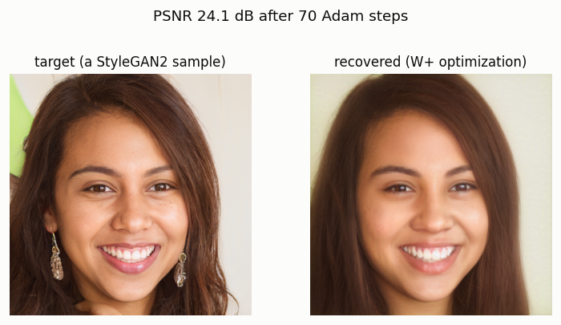
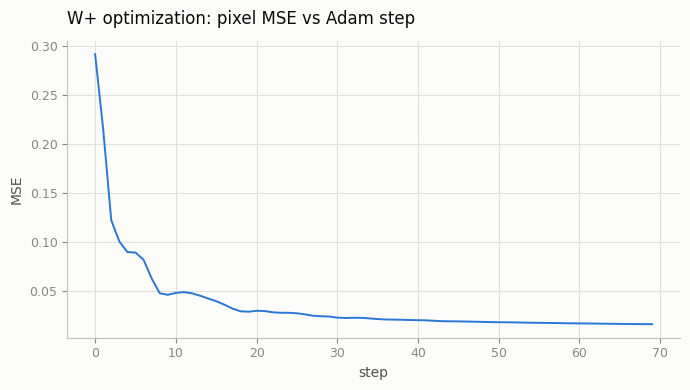
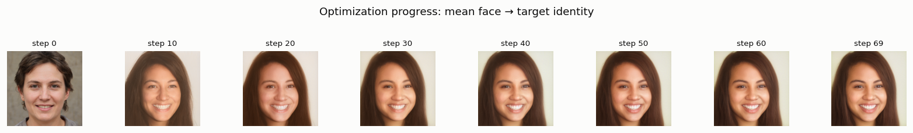
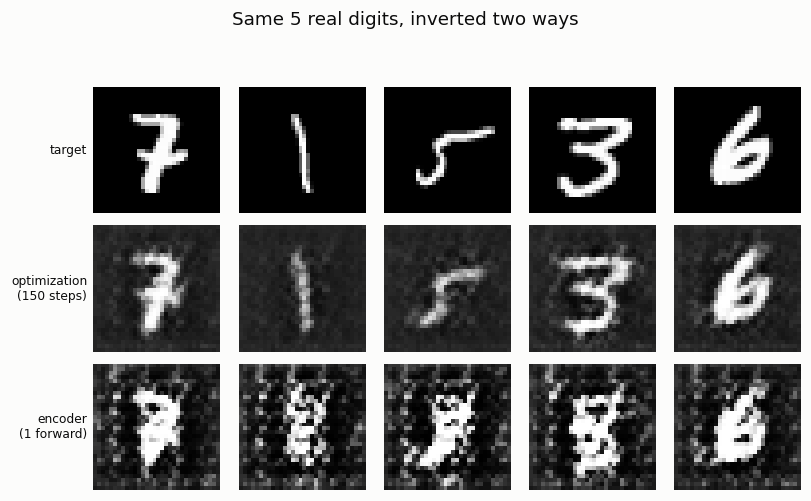
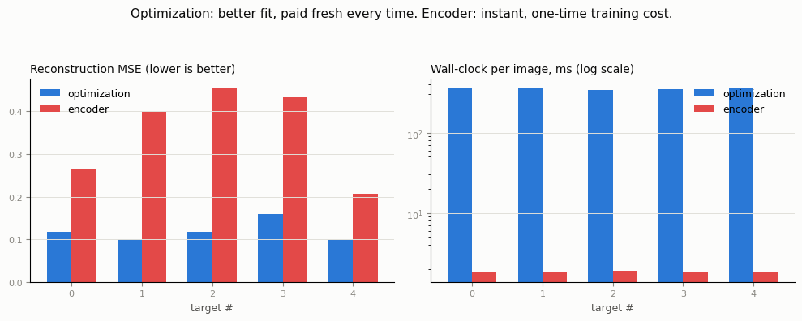

# GAN Inversion

## ELI5 (Explain Like I'm 5)

- **The Big Idea:** Generative networks are usually one-way streets: you feed in a secret code, and out comes a picture. **GAN Inversion** is the art of going backward: given a real picture, we want to find the exact secret code that makes the generator recreate it. Once we have this code, we can edit the photo (like adding a smile or changing the hair color) by making tiny tweaks to the code. We can find the code in two ways: by carefully searching for it (slow but accurate) or by training a second network to guess it instantly (fast but rough).
- **Analogy:** Imagine a locksmith trying to make a key for an existing lock. The "optimizer" approach is like sitting at the door with a file, making tiny adjustments to a blank key, testing it, and repeating until it opens perfectly. The "encoder" approach is like taking a quick photo of the keyhole and using a machine to instantly stamp out a rough guess.
- **Example:** We test both methods on MNIST digits. The optimizer takes **350 milliseconds** to find a very clean code (error score of 0.10). The encoder guesses the code in just **1.8 milliseconds** (190x faster!) but the resulting image is slightly noisier (error score of 0.30).

## Key Insight

A trained GAN only runs one direction: noise in, image out. [GAN inversion](/shared/glossary/#gan-inversion) solves the reverse problem — given a real photo, find the [latent](/shared/glossary/#latent-space) code that makes the [generator](/shared/glossary/#generator) reproduce it. Once you have that code you can edit the real image by nudging it in latent space, which is why inversion is the bridge between "generate random faces" and "edit *this particular* face." This project finds the code two ways and compares the trade-off: first by directly optimizing the latent to minimize reconstruction error (slow but accurate), then by training an encoder that predicts it in a single forward pass (fast but approximate) — often inverting into the more expressive [W+ space](/shared/glossary/#w-and-w-latent-spaces) because its per-layer codes can match a real photo more closely.

## What's in this directory

| File | Role |
|------|------|
| `stylegan_invert.py` | Optimization-based inversion into **W+** on the real pretrained StyleGAN2 from [project 21](../21-stylegan-tour/README.md) — production scale, one target image. |
| `plot_stylegan.py` | Figures for the StyleGAN2 run. |
| `toy_invert.py` | The controlled head-to-head: optimization **vs.** a trained encoder, on the fast toy DCGAN from [project 18](../18-vanilla-gan-on-mnist/README.md) — same generator, same targets, both methods timed. |
| `plot_toy.py` | Figures for the toy comparison. |

```bash
python stylegan_invert.py && python plot_stylegan.py   # ~5 min on CPU (70 Adam steps @ 1024x1024)
python toy_invert.py --data-dir data && python plot_toy.py   # ~2.5 min on CPU
```

**Why two separate scripts at two different scales.** A real StyleGAN2 forward+backward pass costs ~4.5s on this CPU, so training an *encoder* for it — which needs thousands of (image, latent) pairs generated by running the frozen generator over and over — would take far longer than this guide's time budget. That gap is not an implementation detail to work around; it's the actual industry trade-off inversion research lives with (production pixel2style2pixel-style encoders are trained for days on many GPUs). So: the expensive, single-target optimization runs at real scale to show what production inversion looks like, and the optimization-vs-encoder comparison runs at toy scale, where both strategies are cheap enough to run several times and time honestly.

## Part 1 — optimization into W+ (StyleGAN2, real scale)

The "real photo" here is itself a StyleGAN2 sample from a known seed (no licensed face photo was available to embed) — a standard sanity check in the inversion literature: if a method can't even re-find its own generator's outputs, it has no chance on genuinely out-of-distribution photos. The target uses a single shared `w` (plain W); we invert into the strictly more expressive **W+** (an independent 512-d code for each of the 18 layers), initialized at the dataset-average face and optimized with 70 steps of Adam directly against pixel MSE (no perceptual loss — one more concession to the CPU budget; production pipelines add LPIPS and get sharper, more faithful results).



**The optimization trajectory** — MSE drops fast in the first ~15 steps (finding the right region of W+) then refines slowly (fitting fine detail):



**Watching it happen** makes the two-phase behavior concrete — coarse identity locks in almost immediately, then the model spends the rest of the budget sharpening:



Final pixel MSE 0.0156 (PSNR 24.1dB) after only 70 steps. Even inverting into W+ — which has 18x more free parameters than the single `w` that actually generated the target — the optimizer didn't recover the *exact* originating code (`w+` vs. the true broadcast `w` differ, MSE 0.23): there are many W+ codes that render to nearly the same image, so pixel-space convergence doesn't imply latent-space convergence. That non-uniqueness is exactly why inversion quality is normally judged by how the image looks, not by how close the recovered code is to any "true" latent.

## Part 2 — optimization vs. a learned encoder (toy scale, controlled)

Same generator, same 5 target images (real MNIST test digits, padded to 32×32), two inversion strategies:

- **Optimization**: 150 Adam steps directly on `z`, from scratch, per image.
- **Encoder**: a small CNN trained *once* on 600 batches of synthetic `(G(z), z)` pairs (never sees a real digit during training), then a single forward pass per image at test time.



```
target,optimization_mse,optimization_time_s,encoder_mse,encoder_time_s
0,0.1183,0.353,0.2640,0.0018
1,0.1004,0.358,0.3989,0.0018
2,0.1184,0.343,0.4536,0.0019
3,0.1599,0.349,0.4338,0.0019
4,0.0988,0.354,0.2074,0.0018
```



**The trade-off is exactly as advertised.** Optimization wins on quality (MSE 0.10–0.16, visibly recognizable digits) because it searches specifically for *this* image every time. The encoder is worse (MSE 0.21–0.45, noisier reconstructions) because it was only trained for 600 steps on an indirect z-regression loss — but it inverts in **~1.8ms vs ~350ms, roughly 190x faster**, because all its work happened once, ahead of time, during training. Give the encoder more training steps or switch it to an image-space reconstruction loss (regress against `‖G(E(x)) - x‖` instead of `‖E(x) - z‖`, the way pixel2style2pixel actually does it) and the quality gap narrows — but the fundamental shape of the trade-off (pay once vs. pay every time) doesn't change.

## Why this matters

Every real-time face-editing app (filters, avatar generators) needs the encoder side of this trade-off — nobody will wait even one second, let alone StyleGAN2's multi-minute optimization, per photo. Every offline, quality-critical editing pipeline (a single hero image for a professional edit) can afford the optimization side. Most production systems actually use both in sequence: an encoder gets you into the right neighborhood of latent space in one shot, and a short optimization refines from there — cheaper than optimizing from scratch, better than the encoder alone.

## Things to try

- Initialize the StyleGAN2 optimization from an encoder's prediction (train a toy-scale encoder for it, accepting the pair-generation cost) instead of the mean face, and see how many fewer Adam steps are needed to reach the same MSE.
- Add a perceptual loss (VGG features, as used in [project 14](../14-vq-gan/README.md)'s VQ-GAN) to the StyleGAN2 optimization and compare sharpness at the same 70-step budget.
- Retrain the toy encoder with the image-space loss mentioned above and see how much of the quality gap to optimization closes.
