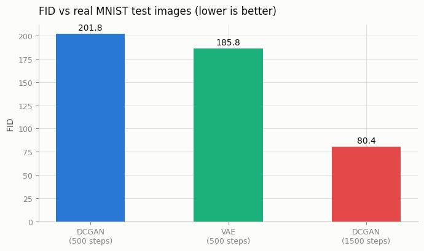
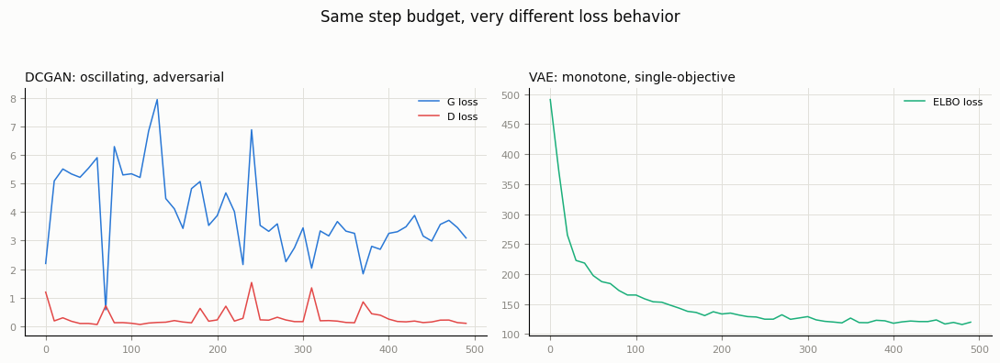
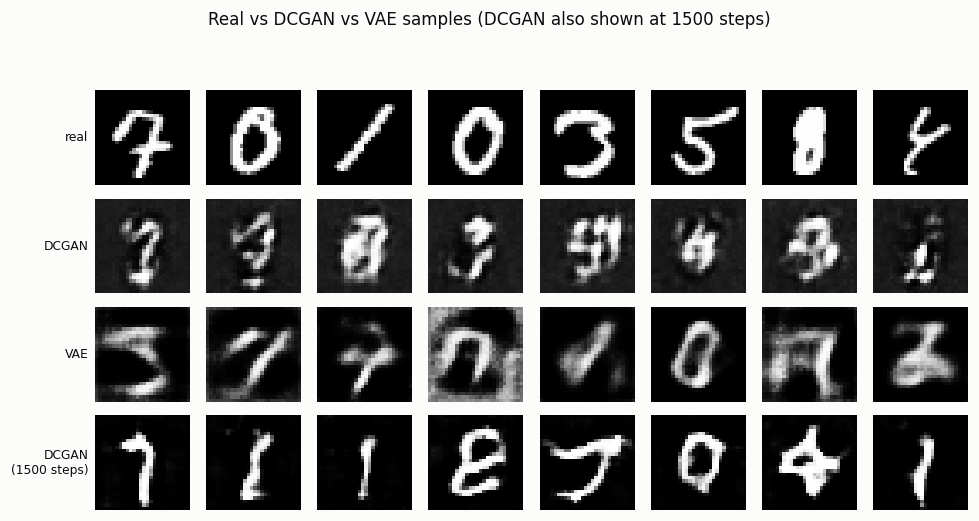

# FID Head-to-Head

## ELI5 (Explain Like I'm 5)

- **The Big Idea:** How do we objectively score how "real" a fake picture looks? We use **FID (Fréchet Inception Distance)**, a math test that compares a batch of fake images to real ones using a smart vision network — lower score is better. In this project, we put a **VAE** (which learns to reconstruct images smoothly) and a **GAN** (which learns by playing a game of catch-me-if-you-can) in a head-to-head race to see which one learns faster and gets a better FID score.
- **Analogy:** Think of a race between a runner who is slow but steady (the VAE) and a runner who is fast but clumsy and needs a long time to warm up (the GAN). For a short sprint, the steady runner wins. But for a long marathon, the fast runner eventually hits their stride and leaves the other far behind.
- **Example:** At 500 training steps, the VAE gets a better FID score (**185.77**) than the GAN (**201.80**) because VAE steps are 10 times faster to compute. But the VAE quickly hits a quality ceiling where its images remain blurry. By running the GAN for 1500 steps, it overcomes its slow start and wins with an excellent score of **80.42**, producing much sharper numbers.

## Key Insight

[FID (Fréchet Inception Distance)](/shared/glossary/#fid) scores how close a model's images are to real ones by comparing the two sets in the feature space of a pretrained classifier — lower means more realistic. This project trains a [DCGAN](/shared/glossary/#dcgan) and a small [VAE](/shared/glossary/#vae) on the same dataset and puts them head-to-head on FID, training time, and stability. The usual lesson is a clean illustration of the era's central trade-off: the GAN reaches a lower (better) FID with sharper samples but is fiddly to train and can fall into [mode collapse](/shared/glossary/#mode-collapse), while the VAE trains smoothly and reliably yet produces blurrier images.

## What's in this directory

| File | Role |
|------|------|
| `train.py` | Trains the DCGAN (from [project 18](../18-vanilla-gan-on-mnist/README.md)) and the VAE (from [project 06](../06-tiny-ae-on-mnist/README.md)) at a matched step count, plus a second DCGAN at 3x the steps; `--eval` scores all three with FID (reusing [project 04](../04-fid-from-scratch/README.md)'s from-scratch implementation); `--plot` builds the figures. |

```bash
python train.py --data-dir data              # ~2.7 min on CPU (500-step DCGAN + 500-step VAE)
python train.py --long-gan --data-dir data    # ~6.7 min on CPU (1500-step DCGAN)
python train.py --eval --data-dir data        # ~1 min (Inception feature extraction + FID)
python train.py --plot
```

Both the "matched" DCGAN and the VAE get exactly 500 gradient steps on MNIST; FID is computed against 300 held-out real test images using the same Inception-feature pipeline as project 04.

## Results: the twist

At matched step count, **the VAE wins on FID** — the opposite of the "usual lesson" the Key Insight above describes:

```
model,fid,wall_time_s,late_training_loss_variance
DCGAN,201.80,145.4,0.2246
VAE,185.77,13.9,6.7366
DCGAN (1500 steps),80.42,399.4,0.6197
```



The reason is sitting right there in the `wall_time_s` column. A DCGAN training step means one discriminator update *and* one generator update — two backward passes through two networks in an adversarial loop. A VAE step is one forward-backward through a single, non-adversarial objective. **The VAE is 10.4x faster per step**, so "500 steps each" is not actually a matched compute budget — it hands the VAE roughly 10x more effective optimization for the same step count. Give the DCGAN 3x the steps instead (still less wall-clock than a coffee break) and the "usual lesson" reappears with a vengeance: **FID 80.4, more than 2x better than the VAE ever reaches at this scale**, because the GAN's ceiling is simply higher once it's had enough iterations to win its internal minimax game.

## Loss behavior: the other half of "stability"

Even while losing on FID, the DCGAN's loss curves already show the textbook adversarial signature — an oscillating fight between two networks with no fixed point — versus the VAE's textbook single-objective descent:



This is the "stability" the Key Insight refers to, and it's visible immediately: the VAE's loss is a rope pulled taut in a straight line, no adversary pushing back. The DCGAN's loss variance in the last third of training (0.22) actually reads *lower* than the VAE's (6.7) in this run — but that's an artifact of the VAE's loss still being on a steep global descent (large numbers, still shrinking) rather than oscillating around a converged value; eyeball the curves, not just the variance number, for what "stability" actually means here.

## Samples: watch the DCGAN catch up



At 500 steps the DCGAN's digits are noisy and structurally uncertain — consistent with its worse FID. The VAE's digits are blurry but shape-coherent, the classic AE-family signature. By 1500 steps, the DCGAN has pulled ahead of both: sharper edges *and* better global structure than the VAE ever produces, because the VAE's blur is a ceiling imposed by its pixel-wise reconstruction loss (see [project 07](../07-vanilla-vae/README.md)), not a training-budget problem it can spend its way out of.

## Why this ordering, and why it flips

FID (and sample sharpness) reward exactly reproducing the sharp, high-frequency statistics of real data — precisely what an adversarial loss is built to chase (fool a critic that's looking for artifacts) and precisely what a per-pixel reconstruction loss is built to *not* chase (minimizing squared error is a blur-seeking objective, since blur is what minimizes expected error under uncertainty about the exact pixel values). Early in training, before the adversarial game has had time to sharpen anything, the VAE's stable-if-blurry objective is simply further along. This is the real shape of the GAN-vs-VAE trade-off: not "GAN always wins on quality," but "GAN has a higher ceiling and a slower, less reliable path to it; VAE has a lower ceiling reached quickly and reliably." Whether that trade is worth it depends entirely on how much compute and training patience you can afford — which is exactly why diffusion models (Phase 5), which get both a high ceiling *and* a stable, non-adversarial training objective, made both of these families largely obsolete for state-of-the-art image generation.

## Things to try

- Push the DCGAN further still (5000+ steps) and see where its FID plateaus.
- Give the VAE 10x the steps too (cheap, since it's already fast) — its FID improves but hits a blur ceiling that no amount of extra training removes, unlike the GAN.
- Swap in the WGAN-GP critic from [project 19](../19-wgan-gp/README.md) at the same step budgets and see whether steadier training also means a steadier FID-vs-steps curve, not just better final samples.
