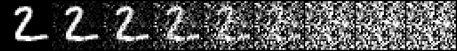
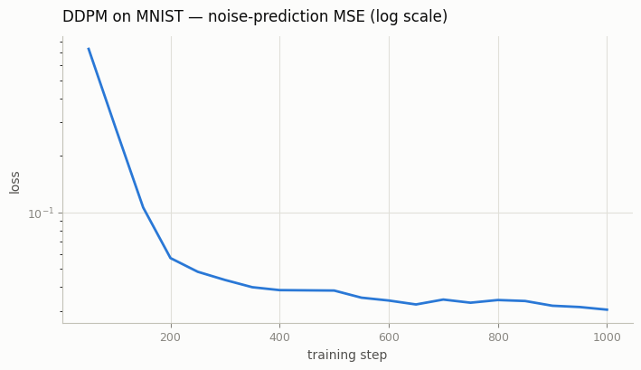
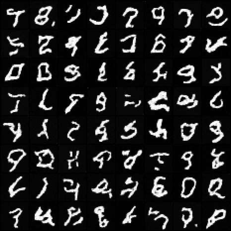
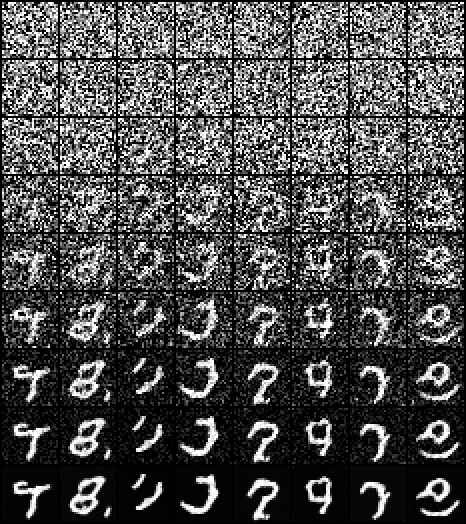

# DDPM on MNIST

## Key Insight

A [DDPM (Denoising Diffusion Probabilistic Model)](/shared/glossary/#ddpm) learns to generate images by mastering one almost trivial skill: look at a noisy image and predict the noise that was added to it. Training has two halves — a *forward process* that takes a clean [MNIST](/shared/glossary/#mnist) digit and stirs in a controlled amount of random (Gaussian) noise (you can jump straight to any noise level in a single step, so generating training pairs is essentially free), and a learned *reverse process* in which a small [U-Net](/shared/glossary/#u-net) — an encoder-decoder with skip connections that let it keep fine pixel detail while still reasoning about the whole image — guesses that noise so it can be subtracted away. The [loss](/shared/glossary/#loss-function) is just [mean squared error](/shared/glossary/#mse-mean-squared-error) between the predicted and the true noise, which is why diffusion training is so stable compared with a [GAN](/shared/glossary/#gans)'s two-player tug-of-war. This project builds the whole pipeline at toy scale and samples by starting from pure static and running the reverse step `T` times (often 1000), watching a recognizable digit slowly emerge from the noise.

## What's in this directory

| File | Role |
|------|------|
| `diffusion.py` | The math: noise schedules, the closed-form forward jump `q_sample`, the MSE loss, and the T-step reverse sampling loop |
| `unet.py` | The network: a ~300k-parameter U-Net that predicts the noise in `x_t` given `t` |
| `train.py` | Training loop with an EMA (exponential moving average) copy of the weights for sampling |
| `sample.py` | Draws a sample grid and a denoising-trajectory strip from a trained checkpoint |
| `make_figures.py` | Builds the forward-process strip and the loss curve for this README |
| `plot_style.py` | Shared matplotlib styling used by all Phase 5 project figures |

The other Phase 5 projects import `diffusion.py` and `unet.py` from here — everything after this project is a variation on these two files.

## How the implementation maps to the math

**The forward process is three lines** (`diffusion.py`, `q_sample`). Because a
sum of Gaussians is Gaussian, noising an image for `t` steps collapses into a
single closed-form jump:

```
x_t = sqrt(a_bar_t) * x0 + sqrt(1 - a_bar_t) * eps,   eps ~ N(0, I)
```

`a_bar_t` (the cumulative product of `1 - beta_t`) is precomputed once for all
`T` steps in the constructor. This is why diffusion training is cheap per
example: a training pair at any noise level costs one multiply-add, not a
`T`-step simulation.

One efficiency detail worth knowing: the canonical DDPM uses `T = 1000` with
`beta` from 1e-4 to 0.02. This project defaults to `T = 300` and scales the
`beta` endpoints by `1000/T`, which keeps the *total* noise budget identical —
`a_bar_T` still lands at effectively zero, so sampling can still start from
pure Gaussian noise, but every sampling loop costs 3.3x fewer network calls.
Pass `--T 1000` for the paper setting.

**The loss is one `randint` and one MSE** (`diffusion.py`, `loss`). Sample a
random timestep per image, noise the batch with `q_sample`, and regress the
U-Net's output onto the exact noise tensor you just added. There is no
adversary and no likelihood bound in sight — the ELBO derivation collapses to
this simple objective (Ho et al.'s "L_simple").

**The U-Net predicts the noise, not the image** (`unet.py`). Layout at a
glance: 28×28 → 14×14 → 7×7 and back up, with skip connections across each
resolution. Three details matter more than size here:

- **Time conditioning.** The timestep is embedded with sinusoidal features
  (same trick as transformer positions), pushed through a small MLP, and
  injected into *every* residual block as a learned scale-and-shift of its
  GroupNorm — FiLM, a.k.a. AdaGN. One network serves all `T` noise levels
  because every block gets told which level it is working at.
- **Self-attention only at 7×7.** Attention is quadratic in pixel count, so it
  runs where it is cheap; convolutions handle the higher resolutions.
- **Zero-initialized output conv.** The model starts by predicting zero noise
  for every input, so the first gradient steps are well-behaved.

**Sampling walks the schedule backwards** (`diffusion.py`, `p_sample_loop`).
Start from pure Gaussian noise `x_T`, and for `t = T-1 ... 0` compute the
posterior mean from the predicted noise, then add a shot of fresh noise scaled
by the posterior variance (except at `t = 0`, where you keep the mean):

```
x_{t-1} = ( x_t - beta_t / sqrt(1 - a_bar_t) * eps_theta(x_t, t) ) / sqrt(alpha_t)
        + sqrt(beta_tilde_t) * z
```

That fresh noise is not optional — it is what makes the reverse walk match the
forward process's statistics; drop it and samples turn blurry and gray.

One practical safeguard the equation above hides (`posterior_mean` in the
code): instead of applying the eps-form update directly, reconstruct the
implied clean image `x0`, clamp it to `[-1, 1]`, and re-derive the mean from
that. The two are algebraically identical for a perfect prediction, but the
clamp stops prediction errors from compounding when `beta_t` is large — with
a cosine schedule, skipping it makes sampling visibly explode into saturated
noise. Every serious diffusion codebase clips here.

**EMA weights are what you sample from** (`train.py`). A shadow copy of the
model is updated as `shadow = 0.995 * shadow + 0.005 * model` every step.
Diffusion sample quality is noticeably smoother from the averaged weights,
especially on short runs like this one.

## Run it

```bash
python train.py                         # ~3 min on a multicore CPU
python sample.py                        # 8x8 grid + trajectory strip, ~30 s
python make_figures.py                  # forward-process strip + loss curve
```

Defaults are tuned so the whole project runs in a coffee break: `T = 300`
(scaled-linear `beta`), a ~300k-param U-Net, batch 64, 1000 steps, AdamW at
3e-4, EMA decay 0.995. Quality scales with budget — `--T 1000 --steps 4000`
(ideally with `--device cuda`) reproduces the classic setting with visibly
cleaner samples.

## Results

The run recorded below is the checked-in default: 1000 steps (about one
epoch), `T = 300`, a few minutes on CPU.

**The forward process** — one real digit pushed through `q_sample` at nine
points spanning the schedule, from `t = 0` (clean) to `t = 299` (the last
step). By mid-schedule the digit is barely visible; at the end it is
statistically indistinguishable from pure noise. This strip is the entire
"data generation" story for training:



**The loss curve** — noise-prediction MSE falls fast in the first few hundred
steps and then grinds slowly; that long tail is where sample quality comes
from. Note the log scale:



**Samples** — 64 digits drawn with the full T-step loop from the EMA
weights. Not every sample is a clean digit at this budget (a converged run
takes 10x the steps), but stroke structure, thickness variety, and class
coverage are all clearly present:



**The denoising trajectory** — the same 8 samples photographed at eight
decreasing noise levels plus the final image (top row pure noise, bottom row
the result). Global layout appears first, edges sharpen late — the
coarse-to-fine character of diffusion sampling is visible in every column:



## Things to try

- Drop the fresh noise term in `p_sample` (keep only the mean) and look at the
  samples — you have just discovered why the stochasticity matters.
- Train with `--schedule cosine` and compare — that is
  the [Cosine vs linear schedule](../26-cosine-vs-linear-schedule/README.md) project.
- Move along the quality-compute curve: `--T 1000 --steps 4000` in one
  direction, `--T 100` in the other. Quality degrades gracefully on MNIST —
  then reason about why large `T` matters more for natural images.
- Predict `x0` instead of `eps` (change the regression target in
  `diffusion.loss` and the mean computation to match) and compare training
  stability at high `t`.
