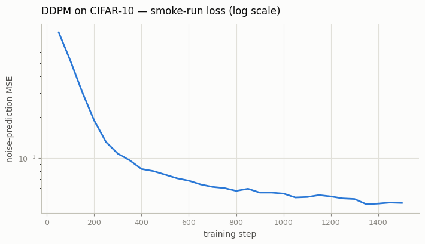
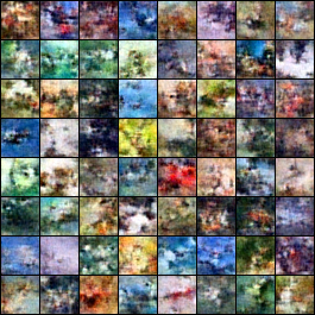

# DDPM on CIFAR-10

## Key Insight

Moving a [DDPM (Denoising Diffusion Probabilistic Model)](/shared/glossary/#ddpm) from grayscale [MNIST](/shared/glossary/#mnist) digits to 32×32 color [CIFAR-10](/shared/glossary/#cifar-10) photos is the jump from "it works on a toy" to "I actually understand this," because natural images carry texture, color, and structure that a too-small [U-Net](/shared/glossary/#u-net) simply cannot capture. The standard bar is a [FID (Fréchet Inception Distance)](/shared/glossary/#fid) below 20 — FID scores how close your generated images are to real ones by comparing them in the feature space of a pretrained image classifier, where lower means more realistic — and clearing it forces you to get the [noise schedule](/shared/glossary/#noise-schedule), model capacity, and training length all right at once. The payoff is a model whose samples are recognizable objects rather than colorful blobs, plus the confidence that the core recipe scales beyond toy data.

## What's in this directory

| File | Role |
|------|------|
| `train_cifar.py` | Training on CIFAR-10; reuses project 24's `unet.py` and `diffusion.py` unchanged. Default flags give a small CPU "smoke run"; `--full` selects the paper-scale model |
| `sample_cifar.py` | Sample grid from a checkpoint (the model config is stored in the checkpoint) |
| `fid.py` | FID from InceptionV3 pool features, with the matrix square root done by eigendecomposition — no scipy needed |
| `plot_loss.py` | Loss curve figure from the training log |

The point of this project is what *doesn't* change from project 24: the loss,
the schedule, and the sampling loop are imported as-is. Scaling up is a data
loader (RGB, random horizontal flips — the one augmentation DDPM uses), an
input-channel count, and model width.

## Two configurations, one script

```bash
# Smoke run (default): ~0.3M-param U-Net, T = 300, verifies the pipeline in minutes on CPU
python train_cifar.py

# The milestone recipe (GPU): ~35M params, T = 1000, hundreds of thousands of steps
python train_cifar.py --full --device cuda --T 1000 --steps 300000 --batch-size 128
```

| | smoke run | `--full` (Ho et al. 2020 scale) |
|---|---|---|
| base channels | 16 | 128 |
| channel mults | 1, 2, 2 | 1, 2, 2, 2 |
| res blocks / level | 1 | 2 |
| attention at | 8×8 | 16×16 |
| parameters | ~0.3M | ~35M |
| diffusion steps T | 300 (scaled betas) | 1000 |
| training steps | 1 500 | ~300k–800k |
| hardware | CPU, ~6 min | GPU, ~1–4 days |
| expected FID | triple digits (blobs) | under 20; ~3 with all paper tricks |

## Results of the checked-in smoke run

Be clear about what a 1 500-step, 0.3M-parameter run can and cannot show.
The loss curve behaves exactly like MNIST's — a fast drop, then a grind:



The samples are the "colorful blobs" stage the Key Insight warns about —
low-frequency color fields with the global statistics of natural images but no
objects yet. This is what *every* CIFAR diffusion run looks like early on;
recognizable objects emerge orders of magnitude later in training:



Running `fid.py --n 256` against this checkpoint (a few extra minutes on CPU,
plus a one-time InceptionV3 weight download) prints a triple-digit FID — far
above the milestone, exactly as expected at this budget. The value of the
smoke run is that the entire pipeline — data, training, EMA, sampling,
evaluation — is verified before you spend GPU-days on the full recipe.

## The FID implementation (`fid.py`)

FID fits a Gaussian to InceptionV3 pool features of real and generated sets
and computes the Fréchet distance between them:

```
FID = ||mu_r - mu_g||^2 + Tr( C_r + C_g - 2 (C_r C_g)^{1/2} )
```

Implementation notes worth internalizing:

- Images are mapped from `[-1, 1]` to ImageNet-normalized 299×299 before the
  Inception forward pass — FID numbers are only comparable when this
  preprocessing is identical.
- `(C_r C_g)^{1/2}` is computed as `(C_r^{1/2} C_g C_r^{1/2})^{1/2}`, which
  keeps every matrix symmetric PSD so a plain eigendecomposition works.
- FID is biased upward at small sample counts. Published numbers use 50k
  samples; whatever you use, compare runs only at the same count.

## Reaching the milestone (the full recipe)

What separates FID-below-20 from blobs, in rough order of importance:

1. **Training length.** The original DDPM trained for 800k steps. Nothing
   substitutes for this.
2. **Model capacity.** 128 base channels and 2 res blocks per level
   (`--full`). At 32×32 the model is still only ~35M params.
3. **EMA over a long horizon** (decay 0.9999 for long runs — the code's
   0.995 default suits short runs).
4. **Horizontal flips** — already in the loader.
5. **Sampling with the posterior variance** (`beta_tilde`) — already in
   project 24's `p_sample`.

With those, a linear-schedule DDPM lands around FID 10–15 at ~400k steps on
one modern GPU; the paper's 3.17 adds dropout and longer training. Verify
with `python fid.py --ckpt checkpoints/cifar_full.pt --n 10000` or more.
