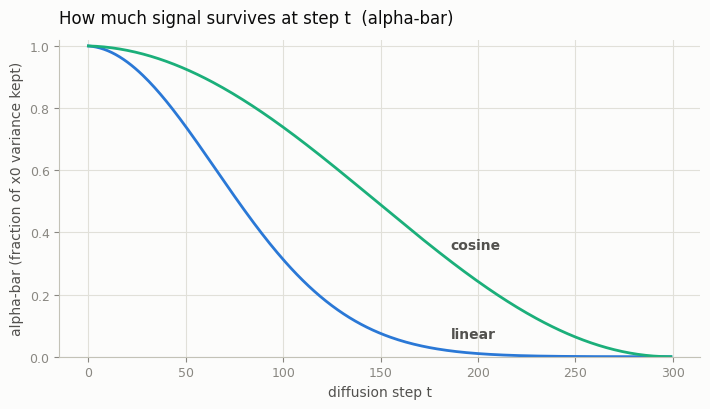
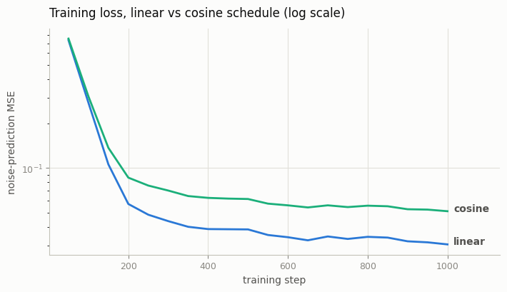
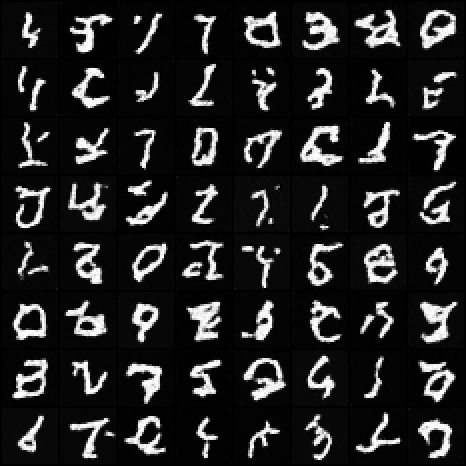
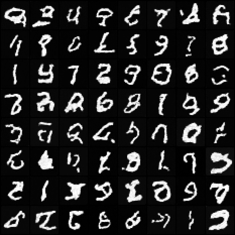

# Cosine vs Linear Schedule

## Key Insight

The [noise schedule](/shared/glossary/#noise-schedule) decides how fast a [DDPM](/shared/glossary/#ddpm) destroys an image as it walks from clean data to pure static — and that single choice quietly controls how well the model trains. A *linear* schedule adds noise at a constant rate, which turns out to wipe out almost all image structure too early, so the model wastes many of its later steps learning from inputs that are already nearly pure static. A *cosine* schedule (Nichol & Dhariwal) instead follows the gentle shoulder of a cosine curve, keeping more signal alive through the middle of the process so every step carries useful information. This project trains two otherwise-identical models and compares their [FID (Fréchet Inception Distance)](/shared/glossary/#fid) and samples, making the schedule's impact concrete rather than theoretical.

## What's in this directory

| File | Role |
|------|------|
| `compare.py` | The whole study: schedule curves, loss curves, sample grids from both checkpoints, and a Fréchet distance for each in classifier feature space |
| `feature_net.py` | A small MNIST classifier trained once and used only as a feature extractor for the metric |

There is deliberately no training script here: the two models are the [DDPM on MNIST](../24-ddpm-on-mnist/README.md) project's
`train.py` run twice, changing **only** `--schedule`. Same architecture, same
seed, same step budget, same optimizer — a few minutes each on CPU:

```bash
# arm 1 — the DDPM on MNIST project's checkpoint is the linear arm (train it there)
python ../24-ddpm-on-mnist/train.py --schedule linear

# arm 2 — the cosine twin, saved into this project
python ../24-ddpm-on-mnist/train.py --schedule cosine \
    --out checkpoints/mnist_cosine.pt --log outputs/train_log_cosine.csv

# the comparison
python compare.py
```

## The only line that differs

Both schedules live in the [DDPM on MNIST](../24-ddpm-on-mnist/README.md) project's `diffusion.py` (`make_beta_schedule`).
Linear specifies the per-step noise `beta_t` directly; cosine goes the other
way around — it specifies how much *signal* should survive at every step
(`a_bar_t`, a squared-cosine curve) and derives each `beta_t` from the ratio
of consecutive `a_bar` values.

That inversion is the insight: `beta_t` is an implementation detail, but
`a_bar_t` is what the model experiences — it *is* the signal-to-noise ratio of
the training examples at step `t`.

## Results

**What each schedule does to the signal.** The linear schedule crushes
`a_bar` to nearly zero by mid-schedule — roughly the last third of all
training examples are almost pure static, and the model can learn nothing
from them. The cosine schedule spends its steps far more evenly:



**Training loss is NOT comparable across schedules** — and that is a lesson
in itself. The two models regress noise at different signal-to-noise ratios,
so their MSE values live on different scales. Never conclude "cosine is
better" from a lower loss curve; that is what the sample-space metric below
is for:



**Samples, same seed, same step count.** First grid linear, second cosine —
the checked-in grids below are 64 digits each drawn with the full T-step
loop:





**The metric.** True FID uses InceptionV3, which is meaningless on 28×28
grayscale digits — so `compare.py` computes the same Fréchet distance in the
feature space of a small MNIST classifier (`feature_net.py`, 64-d features,
against 2 048 held-out real digits). The recorded run (256 samples per model,
identical sampling seed) gives:

| schedule | feature-space Fréchet distance (lower is better) |
|----------|--------------------------------------------------|
| linear | 41.4 |
| cosine | 70.9 |

## What to take away

- On MNIST at this scale the *linear* schedule actually wins — cosine's
  advantage is about not wasting capacity on high-resolution natural images,
  and MNIST digits at 28×28 are neither. Cosine also spends far more of its
  steps at high signal (see the `a_bar` plot), so at a very short training
  budget the model sees fewer hard, high-noise examples per step of the
  sampler it must run at generation time. The mechanism (the `a_bar` plot) is
  what to internalize here, not the ranking; on ImageNet-scale data the
  ranking flips, which is exactly why Nichol & Dhariwal proposed cosine.
- A war story this project reproduced by accident: with cosine's near-1 final
  betas, the textbook eps-form reverse update explodes into saturated noise.
  The fix — clamp the implied `x0` to `[-1, 1]` inside each reverse step
  (`posterior_mean` in the [DDPM on MNIST](../24-ddpm-on-mnist/README.md) project's `diffusion.py`) — is standard in every
  real diffusion codebase and the difference it makes is dramatic: the
  cosine model's Fréchet distance drops from ~1800 (pure static) to 70.9.
- The cosine schedule's late steps still carry visible structure, so the
  denoising trajectory sharpens more gradually — compare trajectory strips if
  you rerun the [DDPM on MNIST](../24-ddpm-on-mnist/README.md) project's `sample.py` against the cosine checkpoint.
- Try other `--T` values: the linear schedule's "wasted tail" fraction stays
  fixed under the scaled-beta convention, but the cosine curve's shape does
  not depend on `T` at all — verify both claims against the `a_bar` plot.
