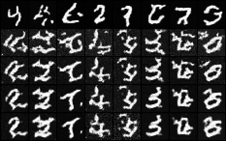
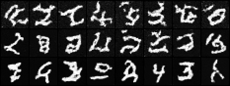

# DDIM Sampler

## Key Insight

A plain [DDPM](/shared/glossary/#ddpm) samples by reversing its noising process one tiny *stochastic* step at a time, which can mean up to 1000 network calls to make a single image — accurate but painfully slow. [DDIM (Denoising Diffusion Implicit Models)](/shared/glossary/#ddim) rewrites that reverse process as a *deterministic* path: given the same starting noise it always lands on the same image, and because the path is smooth you can take big strides along it, skipping most of the steps. The headline result you will reproduce is that ~50 DDIM steps match the quality of a 1000-step DDPM — roughly a 20× speedup for almost no loss in quality — and the same trained model is reused unchanged, since DDIM only changes how you *sample*, not how you *train*.

## What's in this directory

| File | Role |
|------|------|
| `ddim.py` | The sampler: ~30 lines implementing the DDIM update over an arbitrary timestep subsequence, with the `eta` knob |
| `compare_samplers.py` | Runs the full T-step DDPM and 10/20/50/100-step DDIM from the **same starting noise**, plus an `eta` study and wall-clock timings |

No training happens here — the checkpoint is project 24's. That is the whole
point: the DDPM objective trains a noise predictor `eps(x_t, t)`, and any
sampler that can use a noise predictor can drive it.

## The DDIM update, annotated

Each step first reconstructs the model's current best guess of the clean
image, then re-noises it *down* to the previous (smaller) noise level:

```
x0_pred = ( x_t - sqrt(1 - a_bar_t) * eps ) / sqrt(a_bar_t)     # implied clean image

x_prev  = sqrt(a_bar_prev) * x0_pred                            # keep the signal
        + sqrt(1 - a_bar_prev - sigma^2) * eps                  # deterministic direction
        + sigma * z                                             # optional fresh noise

sigma   = eta * sqrt((1 - a_bar_prev)/(1 - a_bar_t)) * sqrt(1 - a_bar_t/a_bar_prev)
```

Because the update is written entirely in terms of `a_bar` at the two
endpoints — never the 1-step `beta_t` — the "previous step" can be 20 steps
away just as legally as 1 step away. That is what unlocks striding.

The `eta` parameter interpolates between two worlds:

- `eta = 0` — no fresh noise, fully deterministic. Same `x_T` in, same image
  out, at any step count. This also makes `x_T` a meaningful latent code
  (interpolations, inversion — see the later editing projects).
- `eta = 1` — recovers DDPM-style stochasticity on the subsequence.

One practical detail in `ddim.py`: `x0_pred` is clamped to `[-1, 1]`. At
large strides the implied clean image can momentarily overshoot the valid
pixel range, and clamping keeps big first steps from derailing.

## Run it

```bash
python compare_samplers.py     # needs project 24's checkpoint; under a minute on CPU
```

## Results

**Same starting noise, five samplers.** Rows top to bottom: the full T-step
DDPM (T = 300 for the recorded checkpoint; the paper's classic comparison
uses 1000), then DDIM with 100, 50, 20, 10 steps (`eta = 0`). The headline
observation is the *stability of identity*: all four DDIM rows land on the
same digit column by column — the deterministic path reaches the same
destination whether it is traced in 100 strides or 10. On this
minutes-of-CPU checkpoint the DDIM rows are visibly grainier than the DDPM
row (a under-trained model's errors show up more when steps are large); on a
fully-trained model the 50-step row becomes essentially indistinguishable
from the full loop, which is the paper's headline result:



**Wall-clock time** scales exactly with network calls — sampler overhead is
nothing, the U-Net forward passes are everything. The recorded run
(`outputs/timing.csv`): 12.7 s for the 300-step DDPM vs 2.1 s for DDIM-50
(6×) and 0.4 s for DDIM-10 (32×), tracking the step ratio almost perfectly.
Against a T = 1000 model the classic 50-step DDIM is the famous ~20×.

**The eta study.** Same 50-step subsequence, `eta = 0, 0.5, 1` (top to
bottom), same starting noise. Watch identity drift as fresh noise re-enters
the loop: at `eta = 0` the digits match the deterministic row above; at
`eta = 1` some columns land on a different digit entirely:



## Why this mattered

DDIM was *the* production sampler for years (Stable Diffusion shipped with
it), and its deterministic path is the conceptual bridge to everything in
Phase 6: it is the discrete ancestor of the probability-flow ODE, and
"DDIM inversion" (running the deterministic path backwards to recover the
`x_T` of a real image) powers a whole family of editing techniques you will
meet in project 55.
