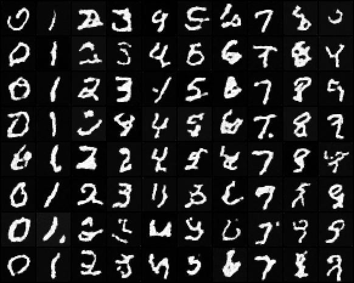

# Class-Conditional DDPM

## ELI5 (Explain Like I'm 5)

- **The Big Idea:** A normal diffusion model is like a wild artist who paints whatever they feel like when you turn them on—you might get a cat, a car, or a plane, but you can't choose. Class conditioning is like giving the artist a command. We feed the category label (like "frog" or "ship") into the model during training, using special layers that adjust the model's inner settings based on the class, so we can tell it exactly what type of image to paint.
- **Analogy:** Imagine a jukebox that plays random songs. Class conditioning is like adding a button panel so you can select "Jazz" or "Rock" instead of just hoping for a song you like.
- **Example:** When you ask the model for class `6` (frog), it adjusts its internal settings and guides the random noise to form a green frog sitting on a leaf, instead of a random truck or plane.


## Key Insight

By default a [DDPM](/shared/glossary/#ddpm) draws a random sample from everything it learned — you cannot ask it for a specific digit or object. [Class conditioning](/shared/glossary/#class-conditioning) fixes that by feeding the desired label into the network alongside the noisy image, so the same model can be steered to generate exactly the class you want. This project injects the label through the network's [normalization](/shared/glossary/#normalization) layers — a learned, per-class [scale-and-shift](/shared/glossary/#scale-and-shift) applied to the [activations](/shared/glossary/#activations), an approach often called [AdaGN (adaptive group normalization)](/shared/glossary/#adagn-adaptive-group-normalization) — training on labeled [CIFAR-10](/shared/glossary/#cifar-10) and then verifying you can summon any of the ten classes on demand. It is the smallest possible step toward the conditioning that, once scaled up to text prompts, becomes modern text-to-image generation.

## What's in this directory

| File | Role |
|------|------|
| `unet_conditional.py` | The conditional model — a subclass of the [DDPM on MNIST](../24-ddpm-on-mnist/README.md) project's U-Net that adds exactly one layer |
| `train_conditional.py` | Training with labels; `--dataset mnist` (CPU-friendly demo, the checked-in run) or `--dataset cifar10` (the guide's target — use a GPU) |
| `sample_classes.py` | Samples a grid with one column per requested class |

## The entire change, in full

The [DDPM on MNIST](../24-ddpm-on-mnist/README.md) project's ResBlocks already modulate their GroupNorm with a scale-and-shift
computed from the conditioning vector — that *is* AdaGN. So class conditioning
does not touch the U-Net body at all; the label simply joins the time
embedding before it fans out to every block:

```python
class ConditionalUNet(UNet):
    def __init__(self, num_classes=10, **unet_kwargs):
        super().__init__(**unet_kwargs)
        self.label_emb = nn.Embedding(num_classes, self.temb_dim)

    def forward(self, x, t, y):
        cond = self.time_embedding(t) + self.label_emb(y)
        return self.forward_with_temb(x, cond)
```

That is the whole diff against the unconditional model. Each class learns a
128-d embedding; adding it to the time embedding means every ResBlock's
scale-and-shift now depends on *both* "how noisy is this" and "what class
should this be." The training loop changes by one argument — the loss call
passes `model_kwargs={"y": labels}` and the [DDPM on MNIST](../24-ddpm-on-mnist/README.md) project's `diffusion.loss` forwards
it to the model. Nothing about the diffusion math changes.

Compare this with the two heavier conditioning mechanisms you will meet later:
cross-attention (the [Run SD inference](../36-run-sd-inference/README.md) project onward: per-*token* conditioning for text, where a
single global vector is too coarse) and classifier guidance (the [Classifier guidance](../29-classifier-guidance/README.md) project:
steering an *unconditional* model at sampling time). AdaGN-style label
injection is the lightest of the three and is exactly how Dhariwal & Nichol's
ImageNet models consumed their class labels.

## Run it

```bash
python train_conditional.py                       # MNIST demo, ~3 min on CPU
python sample_classes.py                          # 8 rows x 10 labeled columns

# the guide's original target (GPU):
python train_conditional.py --dataset cifar10 --device cuda --T 1000 --steps 200000
```

The checked-in run is the MNIST demo — same budget as the [DDPM on MNIST](../24-ddpm-on-mnist/README.md) project so the two
are directly comparable. CIFAR-10 uses the identical code path (RGB channels
and 8×8 attention are picked up from the dataset flag) but needs GPU-scale
training before classes are recognizable, per the [DDPM on CIFAR-10](../25-ddpm-on-cifar-10/README.md) project.

## Results

Every row asks for classes 0–9 left to right; rows differ only in noise seed.
Two things to check, in order of importance:

1. **Controllability** — column `c` reliably contains the digit `c`. Compare
   the [DDPM on MNIST](../24-ddpm-on-mnist/README.md) project's unconditional grid, where classes land wherever they please.
2. **Per-class style diversity within a column** — conditioning constrains
   *what*, not *how*: stroke weight and slant still vary down each column.



The training loss curve is indistinguishable from the unconditional run's —
conditioning adds information, not difficulty. If anything the conditional
loss dips slightly lower at equal steps, since knowing the class makes the
noise slightly more predictable.

## Things to try

- Sample the *conditional* model with a label the embedding never saw scaled
  oddly — e.g. feed `y=3` but swap its embedding for the average of all ten.
  You get generic "digit-ness": evidence the embedding carries class identity
  and the rest of the network carries digit-ness in general.
- Drop the label for 10% of training batches (replace with a learned "null"
  embedding). You have just trained a model that supports classifier-free
  guidance — that is the [Classifier-free guidance](../32-classifier-free-guidance/README.md) project.
- Count parameters added by conditioning (`python unet_conditional.py`): ten
  embeddings of 128 numbers, well under 1% of the model.
