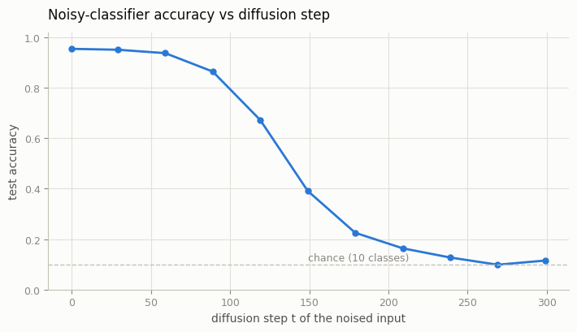
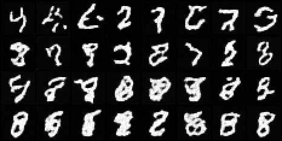
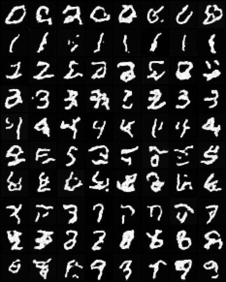

# Classifier Guidance

## Key Insight

[Classifier guidance](/shared/glossary/#classifier-guidance) was the first trick that made conditional [DDPM](/shared/glossary/#ddpm) samples both sharp and on-target: you train a separate image classifier *on noisy images*, then during sampling nudge each denoising step in the direction its [gradient](/shared/glossary/#gradients) says will make the chosen class more likely. Intuitively the classifier whispers "a little more cat-ness, this way" at every step, and that push — a [score](/shared/glossary/#score)-like signal, the gradient of a log-probability with respect to the image — sharpens the output toward the requested class. The catch is that it needs an extra, specially-trained noisy classifier, exactly the cost that [classifier-free guidance (CFG)](/shared/glossary/#cfg-classifier-free-guidance) later removed by folding the same effect into the diffusion model itself. This project builds the original: train the noisy classifier on [CIFAR-10](/shared/glossary/#cifar-10) and use its gradients to steer the samples.

## What's in this directory

| File | Role |
|------|------|
| `noisy_classifier.py` | Trains a small time-conditioned CNN on *noised* digits and measures its accuracy at every noise level |
| `guided_sampling.py` | The guided reverse loop: project 24's **unconditional** DDPM steered by the classifier's gradients, with a guidance-scale sweep |

The checked-in demo runs on MNIST so it completes on a CPU alongside project
24's checkpoint; the CIFAR-10 version from the guide is the same two scripts
pointed at project 25's model and loader — nothing in the method changes.

## Part 1: a classifier that works at every noise level

An off-the-shelf classifier is useless here: during sampling it will be shown
images that are 10% signal and 90% static, a distribution it has never seen.
So `noisy_classifier.py` trains exactly the way the diffusion model trains —
sample a random `t`, noise the image with project 24's `q_sample`, and demand
the label anyway. The timestep enters through FiLM on each conv block, so one
classifier serves all noise levels, just like the U-Net does.

After training, the script measures test accuracy as a function of `t`:



This curve is the guidance budget. Where accuracy is high (low `t`, nearly
clean images) the classifier's gradients are informative; as accuracy decays
toward the 10% chance line, its opinions fade into noise. Guidance works
because *early* reverse steps decide the global layout while the classifier
still gets a vote through the accumulated denoising — but the strongest,
most reliable steering happens in the second half of sampling.

## Part 2: steering the unconditional model

The unconditional DDPM proposes a denoising mean; guidance shifts that mean
along the classifier's gradient before the noise is re-added
(`guided_sampling.py`):

```
grad  = grad_{x_t} log p(y | x_t, t)          # backprop through the classifier
mean <- mean + s * Sigma_t * grad             # Sigma_t = the step's posterior variance
```

Two implementation details that are easy to get wrong:

- The gradient is taken **with respect to the input image**, not the weights —
  `x_t` is detached, marked `requires_grad`, and `autograd.grad` pulls the
  sensitivity of the selected class's log-probability back through the frozen
  classifier. Scaling by `Sigma_t` automatically fades guidance as steps get
  small and confident.
- Sampling runs under `no_grad` for the U-Net but must re-enter
  `enable_grad` for the classifier call — see the `with torch.enable_grad():`
  block.

Note what is and is not conditioned: the diffusion model never sees the label
at all, at training or sampling time. The label enters *only* through the
classifier's gradient. Class control is bolted onto a finished unconditional
model — the exact opposite trade-off from project 28, where conditioning is
baked into training.

## Run it

```bash
python noisy_classifier.py                  # ~2 min on CPU, incl. the accuracy sweep
python guided_sampling.py                   # needs project 24's checkpoint, ~3 min
```

## Results

**The guidance-scale sweep.** Rows top to bottom: `s = 0, 1, 5, 20`, all
asking for the digit 8, all starting from the same noise. At `s = 0` you get
unconditional samples (whatever the noise wanted to be); as `s` grows the
samples snap to the target class; push far enough and diversity collapses —
the classic guidance trade-off of fidelity-to-condition against variety. In
the recorded run the classifier scores the rows at 0%, 62%, 88%, and 100%
"eights" respectively:



`guided_sampling.py` also scores each row with the classifier itself
(fraction of samples it labels as the target at `t = 0` — a self-judging
metric, but a useful sanity check; see `outputs/purity.csv`).

**All ten classes at a moderate scale** (`s = 5`), one row per requested
class, from a model that was never trained on labels:



## Things to try

- Overdrive it: `--target 1 ` at `s = 50`. Saturation artifacts and near-
  duplicate samples show why the scale knob cannot buy unlimited fidelity.
- Guide with a *clean-image* classifier (train with `--T 1` so it never sees
  real noise) and watch guidance fail at high `t` — the reason "trained on
  noisy images" is in this project's title.
- Compare against project 28's grid at equal compute. Conditional training
  wins on purity-per-FLOP; guidance wins on not having to retrain the
  generator. Holding both trade-offs in your head is the setup for
  classifier-free guidance (project 32), which gets the best of each.
