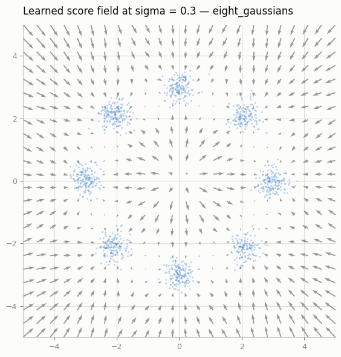
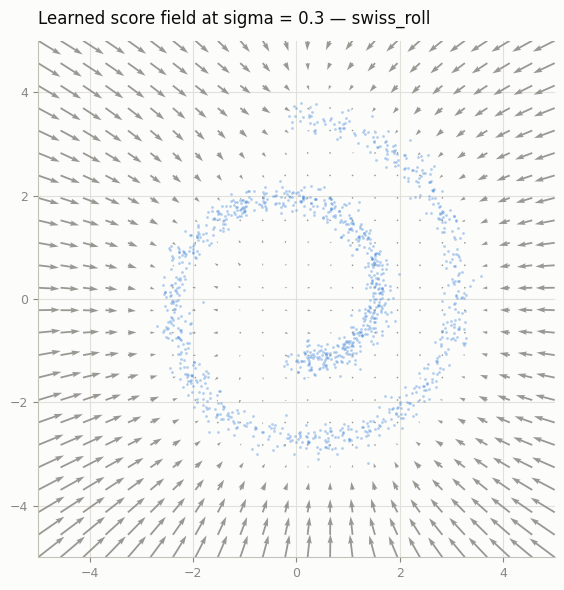
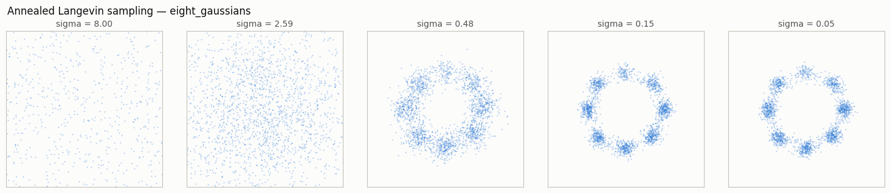
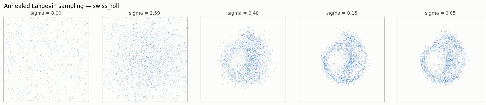
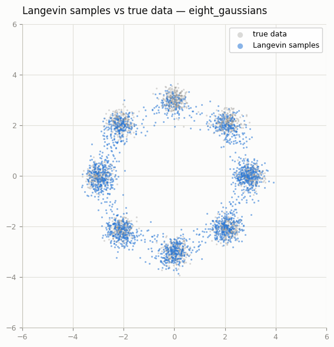
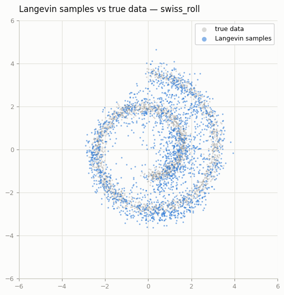

# Score Matching from Scratch

## Key Insight

Instead of learning the data density `p(x)` directly — which requires an intractable normalizing constant — [score matching](/shared/glossary/#score-matching) learns its [score](/shared/glossary/#score), the [gradient](/shared/glossary/#gradients) of log-density `∇_x log p(x)` that tells you which way to nudge a point to make it more likely. The practical trick is *denoising score matching*: add a known amount of Gaussian noise to each sample and train the network to point back toward the clean point, which provably equals the score of the noised distribution — so you never need the true density. Once you have the score, you generate with [Langevin dynamics](/shared/glossary/#langevin-dynamics): repeatedly step in the score direction plus a little random jitter, like a ball rolling into high-probability valleys while being shaken so it doesn't get stuck in one spot. This project builds the whole loop on 2D toy data (8-Gaussians, swiss roll) — small enough that you can plot the learned vector field and watch the sampled points line up with the true distribution.

## What's in this directory

| File | Role |
|------|------|
| `toy_data.py` | The two 2D datasets: eight Gaussians on a circle, and a spiral |
| `score_net.py` | A 3-layer MLP `s(x, sigma)` with a Fourier embedding of `log(sigma)` |
| `train_score.py` | Denoising score matching — the objective is three lines |
| `sample_and_plot.py` | Annealed Langevin dynamics plus every figure below |

Everything runs on CPU in about a minute. The [Probability flow ODE](../34-probability-flow-ode/README.md) project reuses the checkpoints
trained here to build the probability-flow ODE and exact likelihoods.

## The objective, in full

```python
u = torch.rand(B)
sigma = SIGMA_MIN * (SIGMA_MAX / SIGMA_MIN) ** u        # log-uniform noise scale
x_noisy = x0 + sigma[:, None] * torch.randn_like(x0)
loss = ((sigma[:, None] * model(x_noisy, sigma) + eps) ** 2).mean()
```

Three details carry all the theory:

- **The regression target is `-eps / sigma`** — "point back at the clean
  sample, scaled by how far you were pushed." Vincent (2011) proved this
  equals `∇_x log p_sigma(x)`, the score of the *noised* data distribution.
  No density, no partition function, no sampling from the model during
  training.
- **The `sigma *` inside the loss** makes every noise scale contribute a
  comparable gradient — otherwise small sigmas (with huge scores, `~1/sigma`)
  would drown out everything else. This is the seed of the idea that EDM
  (the [EDM reparameterization](../33-edm-reparameterization/README.md) project) later turns into full preconditioning.
- **A whole ladder of sigmas is trained at once**, from 0.05 (barely blurred)
  to 8.0 (the data is one featureless cloud). The high end is not waste: a
  score field only defined near the data would give a sampler started from
  random noise no signal at all. Multi-scale training is what makes
  generation *from scratch* possible.

## Sampling: annealed Langevin dynamics

```
x <- x + (alpha/2) * s(x, sigma) + sqrt(alpha) * z,     alpha = 0.1 * sigma^2
```

run for 80 steps at each rung of a decreasing sigma ladder. The step size
must shrink with sigma — the score's magnitude grows like `1/sigma^2`, so
`alpha ∝ sigma^2` keeps each move a fixed fraction of the local structure.
Get this wrong in the too-large direction and the chain explodes off the
plane (we know because the first version of this script did exactly that);
too small and the chain never mixes between modes.

## Results

**The learned score field.** Arrows at every grid point, true data in blue.
Far from the modes the arrows all point inward toward the data; close in,
each mode becomes its own attractor with the field vanishing at the center —
exactly what `∇ log p` should look like:





**Annealing in action.** The same 2 000 particles photographed at five rungs
of the ladder: a diffuse cloud contracts to a ring, then condenses into eight
crisp modes. This is "coarse structure first, detail later" — the same
schedule story as the image-space DDPM in the [DDPM on MNIST](../24-ddpm-on-mnist/README.md) project, drawn in 2D:





**Final samples vs the truth.** All eight modes are populated (no mode
collapse — compare a GAN's habit on this dataset), and the spiral's arms are
traced end to end. Samples sit slightly fatter than the data because the
chain stops at `sigma = 0.05`: what you sample is the *smoothed* density
`p_0.05`, not `p_0`. One extra denoising hop `x + sigma^2 s(x, sigma)` would
sharpen it (that hop is called Tweedie's formula — remember it, EDM is built
on it):





## Things to try

- Drop the noise term from Langevin (keep only the score step). Every
  particle falls to a mode *center* — you sample the modes, not the
  distribution.
- Train with a single small sigma instead of the ladder, then sample from
  far-away noise. Watch the chain wander: the score field is unlearned out
  there.
- Increase the mode separation in `toy_data.py`. At some spacing Langevin
  stops crossing between modes at low sigma — the annealing ladder is the
  only thing saving ergodicity.
