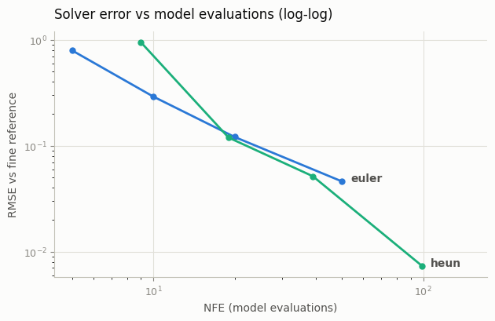
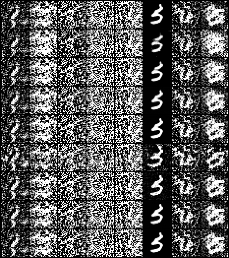

# Higher-Order Sampler

## ELI5 (Explain Like I'm 5)

- **The Big Idea:** When generating an image, the model is solving a math puzzle: drawing a smooth curve from random noise to a clean image. A simple solver (Euler) assumes the curve is made of straight lines, so it makes errors and drifts off-course unless it takes hundreds of tiny steps. Higher-order samplers (like Heun or DPM-Solver++) look ahead and average their steps, allowing them to bend their path smoothly and reach the target in very few steps.
- **Analogy:** Imagine driving a car around a sharp curve. A simple driver (Euler) only looks at the road right in front of the hood, driving in a series of jerky straight lines and constantly oversteering. A professional driver (Heun) looks ahead at the curve, smoothly turning the wheel to match the bend, using far fewer adjustments to stay in the lane.
- **Example:** If a standard Euler sampler needs 100 steps to make a crisp image, the DPM-Solver++ sampler can make an equally crisp image in just 12 steps by calculating the mathematical curves of the noise flow.


## Key Insight

A trained [diffusion model](/shared/glossary/#diffusion-model) defines a smooth [ODE](/shared/glossary/#ode) whose solution carries pure noise to a clean image, so *sampling* is just numerically solving that ODE — and how many steps you need depends entirely on how accurate your solver is. The simplest solver, the [Euler method](/shared/glossary/#euler-method), takes a straight-line step using the slope where it currently sits and accumulates error fast, so it needs many steps. Higher-order solvers cut the error per step: [Heun's method](/shared/glossary/#heuns-method) is a predict-then-correct step that averages the slope at the start and end of each interval, and [DPM-Solver++](/shared/glossary/#dpm-solver) is a multistep method tailored to the exact mathematical shape of the diffusion ODE — so 10–20 steps match what Euler needs 100+ for. This project swaps the slow many-step sampler of an existing [DDPM](/shared/glossary/#ddpm) for these and measures the quality-versus-steps trade-off.

## What's in this directory

| File | Role |
|------|------|
| `solvers.py` | The DDPM-to-sigma-space bridge, the Karras step grid, and Euler/Heun integration with an honest NFE counter |
| `compare_solvers.py` | Same starting noise through every (solver, step count) pair; RMSE against a fine reference; the convergence-order plot |

The model is an ordinary DDPM trained with the [DDPM on MNIST](../24-ddpm-on-mnist/README.md) project's script — nothing
about training changes:

```bash
python ../24-ddpm-on-mnist/train.py --out checkpoints/mnist_ddpm.pt \
    --log outputs/train_log.csv                     # ~3 min on CPU
python compare_solvers.py                           # ~1 min
```

## The bridge: a DDPM is secretly a sigma-space denoiser

The whole file `solvers.py` rests on one change of variables. Divide the
DDPM state by `sqrt(a_bar_t)`:

```
x_t = sqrt(a_bar_t) x0 + sqrt(1 - a_bar_t) eps
x_hat = x_t / sqrt(a_bar_t) = x0 + sigma eps,     sigma(t) = sqrt((1-a_bar_t)/a_bar_t)
```

In `x_hat` coordinates the model is exactly the VE-form denoiser that EDM
and every modern solver paper work with, and the probability-flow ODE
becomes almost comically simple:

```
dx_hat / dsigma = eps_hat(x_hat, sigma)
```

The predicted noise *is* the slope. `DDPMDenoiser.eps` handles the two-line
coordinate conversion (scale the input by `sqrt(a_bar_t)`, look up the
nearest trained `t` for a requested sigma); the solvers never know a
discrete-time DDPM is underneath.

Two solvers, one honest cost metric:

- **Euler**: `x += (sigma_next - sigma) * eps_hat(x, sigma)` — one model
  evaluation (NFE) per step, error per step `O(h^2)`, total error `O(h)`.
- **Heun**: take the Euler step, re-evaluate the slope at the landing point,
  redo the step with the *average* slope — two NFE per step, total error
  `O(h^2)`. This is EDM's default sampler.

Comparing at equal *steps* flatters Heun (it does twice the work), so every
plot and table here uses **NFE** — network evaluations — as the x-axis.
Steps are placed on the Karras grid (`rho = 7`, dense at low sigma) rather
than uniformly; that grid choice matters as much as the solver order at
very low step counts.

## Results

**Convergence order, measured.** Same starting noise, RMSE of each endpoint
against a 200-step Heun reference, log-log. In the recorded run Euler's
slope is ~1.1 (textbook order 1); Heun's is ~1.7, pulling one decade ahead
by 100 NFE (RMSE 0.0073 vs Euler-50's 0.0460). Two honest wrinkles the
clean theory hides, both visible in the plot:

- **At very low NFE the corrector can *hurt*.** Heun-5 (9 NFE) is worse
  than Euler-5 — its second slope is evaluated at the Euler proposal, and
  when the step is enormous that proposal lands somewhere so wrong the
  "correction" corrupts more than it fixes.
- **The crossover sits near 20–40 NFE here**, not at 10. Order-2 behavior
  needs the slope field itself to be smooth, and a 3-minute model's eps
  field is noisy. On a fully-trained model the crossover moves left — which
  is why EDM ships Heun at 18–35 NFE.



One more measured detail worth internalizing: an early version of this
project snapped each requested sigma to the *nearest* trained timestep,
which makes the slope field piecewise-constant — and silently capped Heun
at Euler-like accuracy. The fix (`DDPMDenoiser.t_of_sigma`) interpolates a
fractional t and feeds it to the U-Net's continuous sinusoidal embedding.
Solver order is a property of the whole pipeline; any staircase in it
becomes the bottleneck.

**What the numbers look like as images.** Rows top to bottom: the fine
reference, Euler at 5/10/20/50 steps, Heun at 5/10/20/50 steps — same
starting noise everywhere (`outputs/solver_errors.csv` has the exact RMSE
values). Every column keeps its identity across rows — all rows trace the
same ODE trajectory, just at different accuracy — and the RMSE ranking is
directly visible as stroke cleanliness:



## Where DPM-Solver++ fits

Heun buys its second order by paying a second NFE inside each step.
DPM-Solver++(2M) gets comparable accuracy at **one NFE per step** by being
*multistep*: it reuses the slope from the previous step instead of
re-evaluating, and it integrates the semi-linear structure of the diffusion
ODE exactly (only the neural part is approximated). That is the entire
practical pitch of the DPM-Solver family, and why it became the default in
production UIs. It drops into `solvers.py` as a third ~15-line function with
a memory of one previous slope — a good exercise on this codebase.

## Things to try

- Replace the Karras grid with uniform-in-sigma steps and rerun. At low NFE
  the grid choice can cost more than the solver order.
- Push Heun to 2–3 steps. Second order does not save you when the step is
  enormous — watch where the breakdown happens.
- Wire these solvers to the [EDM reparameterization](../33-edm-reparameterization/README.md) project's natively-EDM model (no bridge needed)
  and verify the picture is unchanged: the solver math never cared how the
  denoiser was trained.
