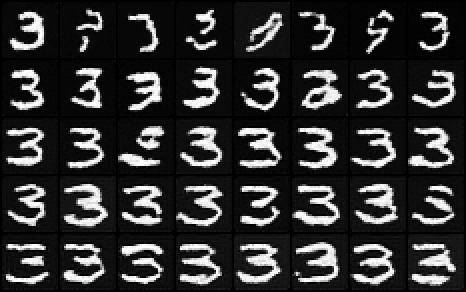
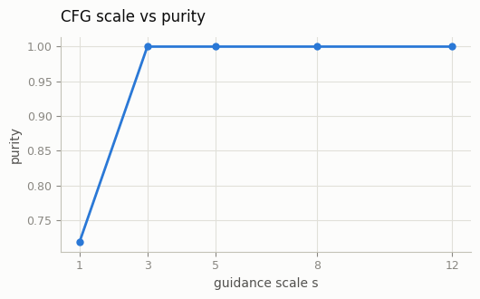
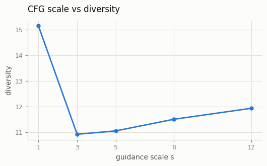
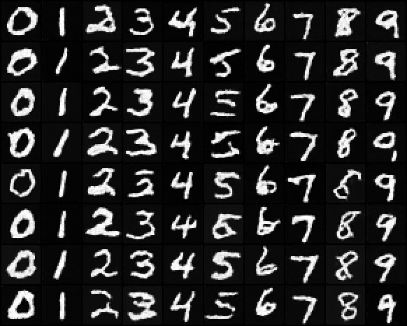

# Classifier-Free Guidance

## ELI5 (Explain Like I'm 5)

- **The Big Idea:** While Classifier Guidance used a separate model to steer images, Classifier-Free Guidance (CFG) does it within a single model. During training, we randomly hide the class label (like "dog") 10% of the time, so the model learns to paint both with a prompt and without one. At generation time, we run the model twice: once asking for a "dog" and once asking for "nothing." We then amplify the difference, pushing the image hard away from "nothing" and toward "dog."
- **Analogy:** Imagine asking a kid to draw "a dog." First they draw a generic animal shape. Then you say, "No, make it look *extra* like a dog!" They look at their generic shape, think about what makes a dog unique (like floppy ears and a wagging tail), and draw those features extra large and clear.
- **Example:** With a guidance scale of `1.0`, the model generates a somewhat blurry dog that blends into the background. When you turn the guidance scale up to `7.5`, the model strongly emphasizes the dog's features, making it pop out with crisp fur and clear eyes.


## Key Insight

[Classifier-free guidance (CFG)](/shared/glossary/#cfg-classifier-free-guidance) is the single biggest practical trick in modern text-to-image generation: it makes samples follow the prompt far more closely, and unlike the earlier [classifier guidance](/shared/glossary/#classifier-guidance) it needs no separate classifier at all. The recipe is to train *one* model that sometimes sees the real condition and sometimes a "null" (empty) condition — done by randomly dropping the condition about 10% of the time during training — so the same network learns both the conditional and unconditional prediction. At sampling time you run it twice and extrapolate: start from the unconditional prediction and push *away* from it and *toward* the conditional one, with a "guidance scale" controlling how hard you push. This sharpens the output toward modes the prompt strongly implies, but turn the scale too high and you get oversaturated, less diverse images — the trade-off this project maps by sweeping the scale from 1.0 to 12.0.

## FAQ

**Is the "real condition" something you supply directly?**
Yes. The real condition is whatever you feed in as the prompt (e.g., `"a cat"`). At sampling the model runs twice — once on your prompt and once on the "null" condition — but you only supply the prompt. The null is a learned empty token (an empty string or a fixed null embedding), so the unconditional pass is produced automatically by the same network. The guidance formula `pred = uncond + scale * (cond - uncond)` uses both, but only `cond` is your input. In practice the two passes are usually batched into a single forward pass (*CFG fusion*) rather than run separately.

**Why drop the condition ~10% of the time, not 50/50?**
The two passes are not equally important. The conditional prediction is the actual product and must be precise; the unconditional prediction only serves as a baseline to extrapolate away from. A 50/50 split would spend half the model's capacity on the less-important unconditional signal, weakening prompt adherence. Because both share one network, the unconditional pass reaches "good-enough baseline" quality with far less exposure. Empirically (Ho & Salimans, 2022), drop rates around 0.1–0.2 gave the best FID/IS, while 0.5 was worse and very low rates leave the baseline too inaccurate — making ~10% the sweet spot.

**For a complex scene, must I input every attribute separately?**
No. You write one natural sentence (e.g., `"A Golden Retriever wearing an apron and seriously making latte art in front of an espresso machine, fluffy fur, warm lighting, high-quality photo"`). The text encoder turns the whole sentence into a single conditioning embedding, so the conditional pass looks the same whether the prompt is one word or a long phrase — complexity does not require extra passes or split inputs. Unspecified details (background, lighting, exact pose) are sampled from the learned distribution; more detail simply narrows the output. The real limitation is *attribute binding* — colors or traits attaching to the wrong object when several are described — which is a model/text-encoder limit, not something fixed by splitting the prompt. When text alone is insufficient, extra condition channels like ControlNet (pose/edge/depth maps) or IP-Adapter (reference image) are added.

**How is training on diverse images automated?**
The automation lives almost entirely in the data pipeline, not the model code. The core idea is generating each image's condition (caption) without manual labeling:

1. **Collect** (image, text) pairs by scraping the web, using existing `alt`-text as the first-pass caption (e.g., LAION-5B).
2. **Auto-filter** with quality gates — [CLIP](/shared/glossary/#clip) score for image–text match, aesthetic score, plus resolution/NSFW/watermark filters and deduplication.
3. **Recaption** with a VLM (BLIP-2, CogVLM, LLaVA) to replace sparse alt-text with dense synthetic captions (the DALL·E 3 / SD3 approach), usually mixing synthetic and original text. This is the step that most improves condition quality.
4. **Precompute and cache** — aspect-ratio bucketing, [VAE](/shared/glossary/#vae) latents, and frozen text embeddings, so they aren't recomputed every epoch.
5. **Stream** from sharded `.tar` archives via [WebDataset](/shared/glossary/#webdataset) to avoid per-file I/O at billion-sample scale.
6. **Automate the training loop** — condition dropout (~10% null) is handled in the DataLoader collate step, alongside AMP, gradient checkpointing, FSDP/ZeRO sharding, periodic checkpointing, logging, and automatic FID evaluation.

The "alt-text → filter → VLM recaption" stages are what remove manual labeling; the rest (latent caching, WebDataset, distributed training) is infrastructure for running it at scale.

## What's in this directory

| File | Role |
|------|------|
| `train_cfg.py` | The [Class-conditional DDPM](../28-class-conditional-ddpm/README.md) project's conditional training plus the one line that matters: 10% of labels are replaced by a reserved NULL class |
| `sample_cfg.py` | CFG at inference, a scale sweep scored for purity and diversity, and a full class grid |

The demo conditions on MNIST digit labels — a label plays the role the text
prompt plays in a T2I model, with class index 10 as the learned null.

```bash
python train_cfg.py                # ~3 min on CPU
python sample_cfg.py               # sweep + grid + metrics, ~2 min
```

## Implementation notes

**Training** (`train_cfg.py`) is the [Class-conditional DDPM](../28-class-conditional-ddpm/README.md) project's loop with one added line:

```python
drop = torch.rand(y.shape) < 0.1
y = torch.where(drop, torch.full_like(y, NULL_CLASS), y)
```

The embedding table simply has 11 rows instead of 10. Nothing else changes —
not the loss, not the architecture, not the sampler.

**Inference** (`sample_cfg.py`) wraps the trained model so the [DDPM on MNIST](../24-ddpm-on-mnist/README.md) project's
sampling loop can drive it unchanged:

```python
eps_cfg = eps_uncond + scale * (eps_cond - eps_uncond)
```

`scale = 1` collapses to plain conditional sampling and `scale = 0` to
unconditional — both sanity checks fall out of the same code path. One
implementation trick worth stealing: the whole sweep runs as a *single
batch*, with a per-sample scale vector broadcast against the model outputs,
so five scales cost one sampling loop (each loop still calls the model
twice per step — that doubled cost is CFG's price everywhere it is used).

## Results

**The sweep.** Rows top to bottom: `s = 1, 3, 5, 8, 12`, all asking for the
digit 3, all rows starting from the same noise. Purity is the fraction an
independent classifier labels as a 3; diversity is the mean pairwise
distance in that classifier's feature space (`outputs/sweep_metrics.csv`
has the numbers):







Read the two curves together and you get CFG's whole story: in the recorded
run purity jumps from 72% at `s = 1` to 100% by `s = 3` and stays there,
while diversity drops sharply over the same interval (15.2 to 10.9) and then
plateaus — fidelity to the condition is *bought with* variety, and the
purchase happens almost entirely at low scales. (On a 10-class toy the
diversity floor is reached quickly; in text-to-image models the collapse
keeps deepening with scale, which is why production defaults sit near
`s = 7.5` rather than 30.) On MNIST the visual "oversaturation" of extreme
CFG shows up as strokes pushed hard to the pixel-range limits.

**All ten classes at `s = 3`** — a working conditional generator from one
model and one dropout line, no classifier anywhere in sight (contrast
the [Classifier guidance](../29-classifier-guidance/README.md) project, which needed a second network and its gradients):



## Things to try

- Set the null row's usage to zero (train with `--p-uncond 0`) and sample
  with CFG anyway. The "unconditional" branch is now an untrained embedding
  — watch guidance turn into noise amplification.
- Compare `s = 5` here against the [Classifier guidance](../29-classifier-guidance/README.md) project at its best
  scale, at equal sampling cost. Same steering goal, opposite plumbing.
- Guide with a *mismatched* pair: condition on 3 but use class 8's
  prediction as the "unconditional" branch. You have reinvented negative
  prompts (the [Negative prompts study](../40-negative-prompts-study/README.md) project).
