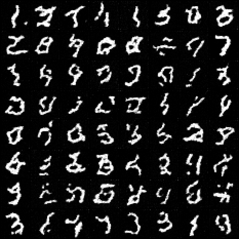
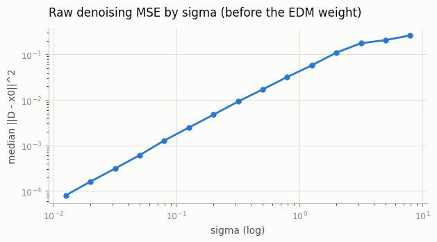
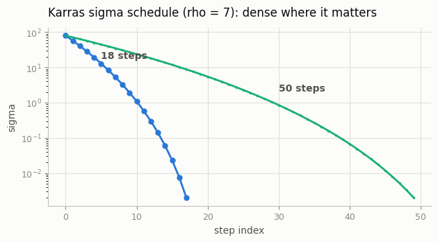

# EDM Reparameterization

## Key Insight

[EDM](/shared/glossary/#edm) (Karras et al. 2022) doesn't change what a [diffusion model](/shared/glossary/#diffusion-model) *is* — it changes the bookkeeping so training and sampling stop fighting you. Instead of indexing noise by a discrete timestep `t`, it uses the noise standard deviation σ directly (the [σ-schedule](/shared/glossary/#σ-schedule-karras)), and it adds *preconditioning*: the network's input, output, and per-σ loss weight are each rescaled so the network always sees roughly unit-variance signals no matter how much noise is present. Without this, the network wastes capacity learning to rescale wildly different magnitudes across noise levels; with it, the hyperparameter surface becomes flat and forgiving, so good results stop depending on lucky tuning. This project re-derives your [CIFAR-10](/shared/glossary/#cifar-10) model in σ-space and lets you observe the cleaner training and sampling behavior firsthand.

## What's in this directory

| File | Role |
|------|------|
| `edm.py` | The four preconditioning coefficients, the log-normal training loss, the Karras sigma schedule, and the Heun sampler — EDM's whole Table 1 in ~90 lines |
| `train_edm.py` | Training on MNIST (the recorded demo; the guide's CIFAR-10 target is the same code with the [DDPM on CIFAR-10](../25-ddpm-on-cifar-10/README.md) project's loader) |
| `sample_and_plots.py` | 18-step Heun samples and the diagnostic figures |

```bash
python train_edm.py                # ~3 min on CPU
python sample_and_plots.py
```

## The reparameterization, piece by piece

**No more timesteps.** Training draws a noise level directly:
`sigma ~ exp(N(-1.2, 1.2^2))` — most of the effort goes to the mid-range
sigmas where denoising is genuinely hard, little to the trivial extremes.
Compare the DDPM's uniform-over-t sampling, which (through the schedule)
commits you to a fixed, hand-designed distribution over noise levels. Here
that distribution is just… a parameter you can see.

**Preconditioning.** The denoiser the outside world calls is

```
D(x, sigma) = c_skip * x + c_out * F( c_in * x, c_noise )

c_in    = 1 / sqrt(sigma^2 + sigma_data^2)        input has unit variance
c_skip  = sigma_data^2 / (sigma^2 + sigma_data^2)  how much to trust x as-is
c_out   = sigma * sigma_data / sqrt(sigma^2 + sigma_data^2)   target has unit variance
c_noise = log(sigma) / 4                           well-scaled conditioning
```

`F` is the [DDPM on MNIST](../24-ddpm-on-mnist/README.md) project's U-Net, byte-for-byte — its sinusoidal "time" embedding
happily accepts the continuous `c_noise`. The two limits explain why this
works: at tiny sigma, `c_skip -> 1` and `F` only predicts a small residual
correction; at huge sigma, `c_skip -> 0` and `F` predicts the image from
scratch (its input `c_in * x` is then just unit-variance noise). The
network never spends capacity learning to rescale its own inputs and
outputs across four orders of magnitude of sigma — the wrapper does it in
closed form. Note this smoothly interpolates between "predict x0" and
"predict eps": the eternal DDPM question of which target to regress
dissolves.

**The weighted loss.**

```
sigma ~ LogNormal;  loss = lambda(sigma) * || D(x0 + sigma*n, sigma) - x0 ||^2
lambda(sigma) = (sigma^2 + sigma_data^2) / (sigma * sigma_data)^2
```

`lambda` is exactly `1 / c_out^2` — it converts every sigma's error into
the same "units of F's output," so no noise level dominates the gradient.

**Sampling** uses the Karras sigma grid (`rho = 7`) and Heun — the same
solver machinery as the [Higher-order sampler](../31-higher-order-sampler/README.md) project, but with no DDPM-to-sigma bridge needed:
the model is native to sigma-space.

## Results

**Samples with 18 Heun steps** (35 model evaluations — compare the 300-step
ancestral loop the DDPM projects used). Same U-Net, same data, same 3-minute
CPU budget as the [DDPM on MNIST](../24-ddpm-on-mnist/README.md) project; the sampler is 8x cheaper and the digits are
comparable:



**Raw denoising error by sigma** — the quantity `lambda` is designed to
balance. The recorded run's raw MSE spans four orders of magnitude: near
zero at tiny sigma (where `c_skip ~ 1` lets D return the input) and rising
to a plateau at the data variance for large sigma (where the best possible
D is the dataset mean). Multiply by `lambda = 1/c_out^2` and every level
contributes O(1) to the gradient — check it against the two limits of
`c_out` yourself. That balance is the "cleaner hyperparameter surface" the
Key Insight promises: no schedule tuning can silently starve a noise band
of training signal:



**The Karras schedule** — step positions in sigma, log scale. Dense where
images sharpen (low sigma), sparse where one step of a nearly-linear ODE
covers a lot of ground (high sigma):



## Why this is "the cleanest formulation"

Restated in EDM language, the earlier projects collapse into special cases:
the [DDPM on MNIST](../24-ddpm-on-mnist/README.md) project's DDPM is this model with a particular (worse) weighting and a
particular discrete sigma grid; the [Cosine vs linear schedule](../26-cosine-vs-linear-schedule/README.md) project's schedule debate becomes a
choice of sampling grid, decoupled from training; the [Higher-order sampler](../31-higher-order-sampler/README.md) project's solver
bridge becomes unnecessary. That collapse — many historical knobs becoming
one legible parameterization — is the actual content of the EDM paper, and
why the guide says to read it multiple times.

## Things to try

- Retrain with `lambda = 1` (delete the weight). Watch mid-sigma quality
  degrade while the loss *number* looks better — the classic trap.
- Move the log-normal (`p_mean = 0`): more effort at high sigma, worse
  fine detail at equal steps.
- Sample with 5 Heun steps. EDM at 5 steps on MNIST is still legible —
  then read about [consistency distillation](../60-consistency-distillation/README.md), which chases 1.
