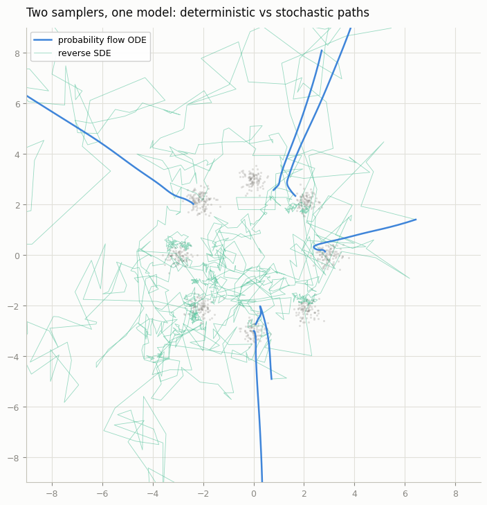
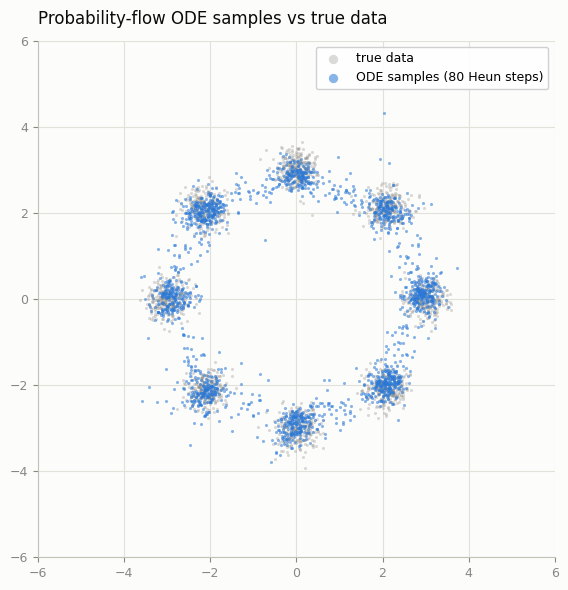
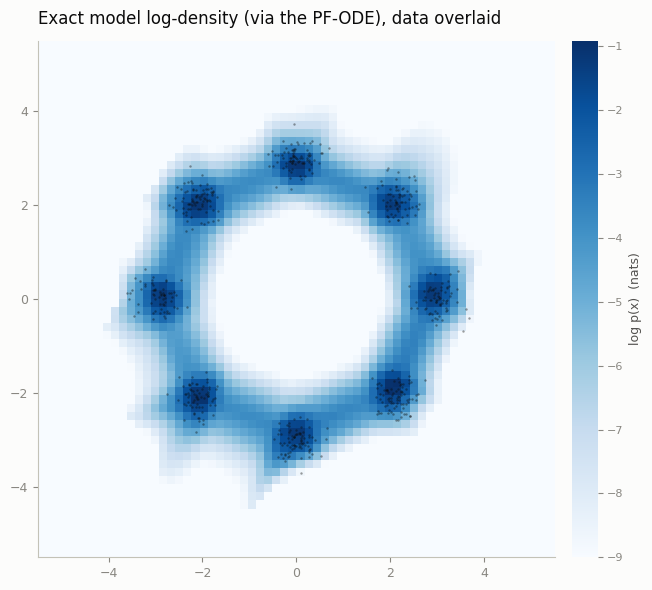

# Probability Flow ODE

## ELI5 (Explain Like I'm 5)

- **The Big Idea:** Diffusion sampling is usually random—like a particle bouncing around in a breeze. But we can convert it into a deterministic path where there is no wind at all, only a steady current. This is the Probability Flow ODE. Because the path is completely predictable, if you start with a specific noise pattern, you will always get the exact same image. This also lets us calculate exactly how "common" or "rare" the model thinks an image is (its likelihood).
- **Analogy:** Imagine a slide filled with water. A drop of water sliding down will bounce around randomly due to turbulence (SDE). But if we freeze the water into a smooth ice slide, any sled let go at the top will slide down the exact same path every single time (ODE).
- **Example:** You take a photo of a cat, run the model backward to find its exact "noise fingerprint," change one pixel in that noise, and run it forward. The output is the exact same cat but with slightly different lighting, demonstrating perfect control over the generation.


## Key Insight

Every [diffusion model](/shared/glossary/#diffusion-model) can be sampled two equivalent ways: as a noisy stochastic process — an [SDE](/shared/glossary/#sde-stochastic-differential-equation) that injects fresh randomness at every step — or as a single deterministic trajectory, the [probability flow ODE](/shared/glossary/#probability-flow-ode), which shares the *exact same* distribution at every noise level. Determinism buys two things the stochastic sampler can't: the same starting noise always maps to the same image (so you can smoothly interpolate between samples and invert a real image back to its noise), and because an ODE has a well-defined change-of-variables, you can compute the model's exact log-likelihood — how probable it thinks any given image is. This project converts an SDE sampler to its ODE form, checks the samples still look right, and computes those exact likelihoods.

## What's in this directory

| File | Role |
|------|------|
| `pf_ode.py` | The PF-ODE and reverse-SDE samplers for the [Score matching from scratch](../30-score-matching-from-scratch/README.md) project's score model, and exact log-likelihood via the change-of-variables integral |
| `make_figures.py` | Trajectory comparison, sample check, the log-density heatmap, and the likelihood table |

The model is the [Score matching from scratch](../30-score-matching-from-scratch/README.md) project's 2D score network, reused unchanged — run that
project's `train_score.py` first. Working in 2D is the point: the
divergence in the likelihood formula can be computed *exactly* (two
Jacobian rows via autograd), where an image model needs a stochastic trace
estimator. Every claim in the SDE/ODE story becomes a picture you can check
by eye.

```bash
python make_figures.py            # ~2 min on CPU
```

## From SDE to ODE

The [Score matching from scratch](../30-score-matching-from-scratch/README.md) project sampled with (annealed) Langevin dynamics — a stochastic
process. Song et al.'s result: for the VE forward process `x_sigma = x0 +
sigma * eps`, the deterministic ODE

```
dx / dsigma = -sigma * s(x, sigma)
```

has the same marginal distribution at every sigma as the stochastic
reverse SDE. `pf_ode.py` implements both from the same score network:
`ode_sample` (Heun integration, the same solver as the [Higher-order sampler](../31-higher-order-sampler/README.md) and [EDM reparameterization](../33-edm-reparameterization/README.md) projects) and
`sde_sample` (Euler–Maruyama with fresh noise each step).

**The picture worth the whole project** — a handful of trajectories from
each sampler, same model, drawn over the data. The SDE paths jitter and
explore; the ODE paths are smooth streamlines that commit to a mode and
flow into it. Both end distributed the same way:



**Samples still match the data** after the determinism swap (80 Heun steps):



## Exact likelihood

Because the ODE is a continuous change of variables, tracking how much the
flow compresses or expands space gives an exact density — the continuous
normalizing flow identity:

```
log p(x_data) = log N(x(sigma_max); 0, sigma_max^2 I)
              + integral_{sigma_min}^{sigma_max}  div_x f(x(sigma), sigma)  dsigma
```

`log_likelihood()` integrates the data point *up* to noise with Heun,
accumulating the divergence along the way. In 2D the divergence is two
autograd vector-Jacobian products — exact, no Hutchinson trace estimator —
so the numbers below have no estimation noise in them.

**The model's belief, drawn.** Evaluating `log_likelihood` on a grid gives
the model's entire density function (data overlaid as dots). Eight sharp
modes, faint bridges between them, near-zero mass elsewhere:



**The numbers** (`outputs/nll.csv`), recorded run:

| points | mean NLL (nats) |
|--------|-----------------|
| held-out data | 2.39 |
| same points rotated 22.5° (exactly between modes) | 4.99 |

Two checks worth internalizing. First, 2.39 nats is essentially the true
entropy of this dataset (`ln 8` for the mode choice ≈ 2.08, plus a little
for the within-mode spread) — the model's density is calibrated, not just
shaped right. Second, the rotated points sit at the same radius and scale
and differ *only* in angle, yet cost ~2.6 nats more — the model is `e^2.6 ≈
13x` more surprised by them. A likelihood that sharp about "right structure,
wrong place" is what "exact log-likelihood" buys over eyeballing samples.

One honest caveat: points far outside the trained region (deep corners of
the plane) get garbage likelihoods — the score field was never trained
there, and the ODE integral inherits whatever the network extrapolates.
Exact likelihood is exact *for the model*, not for the world.

## Where this shows up at scale

- Swap sigma-space for the DDPM bridge of the [Higher-order sampler](../31-higher-order-sampler/README.md) project and the same ODE gives
  deterministic sampling for image models — that is DDIM's continuous limit
  (the [DDIM sampler](../27-ddim-sampler/README.md) project found it in discrete form).
- Integrating a *real image* up the ODE is DDIM inversion (the [DDIM inversion + edit](../55-ddim-inversion-edit/README.md) project), the
  backbone of a family of editing methods.
- The likelihood integral with a Hutchinson trace estimator is how diffusion
  papers report bits-per-dim on images — the [Bits-per-dim baseline](../02-bits-per-dim-baseline/README.md) project's metric, now computable
  for diffusion models.

## Things to try

- Interpolate two starting noises along a great circle and sample each
  point: smooth morphs between modes — impossible with the SDE sampler.
- Halve the ODE steps until samples visibly degrade; compare where the
  likelihood integral (which uses the same integrator) starts drifting.
- Add a Hutchinson estimator next to the exact divergence and measure its
  variance vs number of probe vectors — calibrating your trust in reported
  image-model likelihoods.
