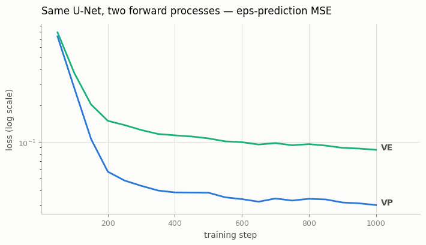
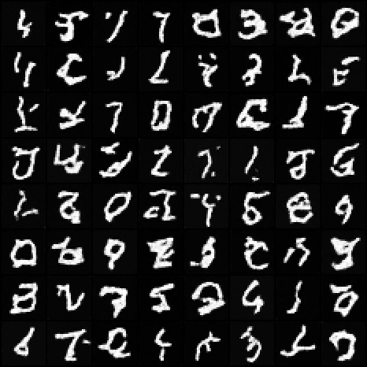
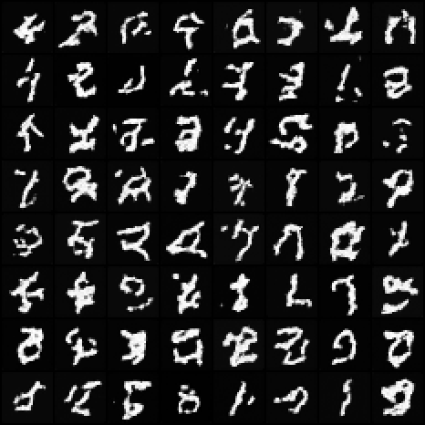

# VP vs VE Comparison

## ELI5 (Explain Like I'm 5)

- **The Big Idea:** When we add noise to an image, we have two classic choices: do we keep the overall brightness/volume constant (Variance-Preserving or VP), or do we let the noise explode to infinity (Variance-Exploding or VE)? VP (used in DDPM) shrinks the original image as it adds noise, while VE (used in early score matching) keeps the image size constant and just stacks noise on top.
- **Analogy:** Imagine painting over a drawing. VP is like watering down your paint so that no matter how many layers you add, the thickness of the paint on the canvas stays the same. VE is like squeezing thick paint directly from the tube onto the canvas, building a giant mountain of paint.
- **Example:** VP models work great for natural photos because the numbers stay bounded between -1 and 1. VE models are useful when you want to handle arbitrary noise scales without scaling the image down, though they require careful numerical handling so the numbers don't blow up.


## Key Insight

[VP and VE](/shared/glossary/#vp--ve-sde) are the two classic ways to define the forward noising process of a diffusion model. Variance-Preserving (VP) — the family [DDPM](/shared/glossary/#ddpm) belongs to — shrinks the original signal as it adds noise so the total variance stays around 1 the whole way; Variance-Exploding (VE) — used by the original [score](/shared/glossary/#score)-based papers — leaves the signal untouched and just piles on ever-larger noise, so the variance grows without bound. The two are mathematically interconvertible and reach similar [FID](/shared/glossary/#fid), but they differ in numerical conditioning and in which samplers behave well, which is exactly what makes the comparison instructive. This project trains the same model under both [SDE](/shared/glossary/#sde-stochastic-differential-equation) families and compares quality, training stability, and sampler behavior side by side.

## What's in this directory

| File | Role |
|------|------|
| `sde.py` | VP and VE behind one interface: `perturb` for training, `ancestral_step` for sampling. VP delegates to the [DDPM on MNIST](../24-ddpm-on-mnist/README.md) project's DDPM math (DDPM *is* discrete VP); VE is a geometric sigma ladder with the NCSN reverse step |
| `train_sde.py` | One training loop for both — run it twice, changing only `--family` |
| `compare.py` | Grids, loss curves, and Fréchet distance in MNIST-classifier feature space |

```bash
python train_sde.py --family vp     # ~3 min on CPU
python train_sde.py --family ve     # same budget, same U-Net, same seed
python compare.py
```

The controlled-experiment discipline is the project: identical U-Net,
optimizer, seed, batch size, step count, and eps-prediction objective. The
*only* difference is the forward process the network must invert:

```
VP:  x_t = sqrt(a_bar_t) * x0 + sqrt(1 - a_bar_t) * eps     variance stays ~1
VE:  x_t = x0 + sigma_t * eps,   sigma: 0.01 -> 30           variance explodes
```

## What the comparison shows

**Training stability.** Same objective, wildly different loss surfaces. The
VE loss sits well above VP's and stays noisier throughout. The reason is
input conditioning: the VP network always sees inputs of variance ~1, while
the VE network must handle raw magnitudes from 0.01 to 30 across ladder
rungs — precisely the burden EDM's `c_in` preconditioning (the [EDM reparameterization](../33-edm-reparameterization/README.md) project) was
invented to remove. At this budget, VE's eps-prediction at large sigma is
the hardest regression in either family:



**Sample quality at equal budget.** VP produces the cleaner digits; VE's
are visibly rougher. In feature-space Fréchet distance (same protocol as
the [Cosine vs linear schedule](../26-cosine-vs-linear-schedule/README.md) project), the recorded run gives:

| family | Fréchet distance (lower is better) |
|--------|-------------------------------------|
| VP | 41.4 |
| VE | 56.6 |

A satisfying cross-check: VP's 41.4 is essentially identical to project
24's DDPM score under the same metric — as it must be, since discrete VP
*is* DDPM. The VP-over-VE ranking at *small scale without preconditioning*
is the expected result, and the literature's fix list is exactly the modern
stack: input scaling (EDM), score-space parameterization, better samplers:





**Sampler behavior.** The two families need different reverse steps, and
`sde.py` shows how little they share. VP's ancestral step divides by
`sqrt(alpha_t)` — it must *undo the signal shrinkage* at every step. VE's
step never rescales the signal at all; it only subtracts noise:

```
VE reverse:  mean = x + (sigma_t^2 - sigma_prev^2) * score
```

Both use the clamped implied-`x0` safeguard from the [DDPM on MNIST](../24-ddpm-on-mnist/README.md) project — VE needs it
even more, because at `sigma = 30` a small relative error in eps is an
absolute error of magnitude ~30 in the implied clean image.

**Prior samples differ too**: VP sampling starts from `N(0, I)`; VE must
start from `N(0, sigma_max^2 I)` — forget that and the sampler receives
inputs from a distribution it has never seen.

## The punchline

Neither family is "wrong" — Song et al. proved both are discretizations of
SDEs whose reverse processes the same score fully determines, and project
33's sigma-space view contains them both (VE is EDM with no input scaling;
VP is a particular time-dependent rescaling of it). What this experiment
adds is the *practical* asymmetry: at small scale, plain eps-prediction
under VE is numerically brutal, and every trick that later fixed it
(preconditioning, `sigma`-aware weighting, Karras grids) is something you
have already built in this phase.

## Things to try

- Drop VE's `sigma_max` from 30 to 5: training stabilizes noticeably —
  and coverage of large-scale structure degrades. That tension is why NCSN
  needed big sigmas, and why preconditioning mattered so much.
- Wrap the VE model in the [EDM reparameterization](../33-edm-reparameterization/README.md) project's `c_in`-style input scaling (divide the
  network input by `sqrt(sigma^2 + sigma_data^2)`, retrain) and watch the
  gap to VP close — the cleanest demonstration that the gap was
  conditioning, not the SDE family itself.
- Sample the VP model with the VE reverse step via the sigma bridge from
  the [Higher-order sampler](../31-higher-order-sampler/README.md) project — interconvertibility, verified in code.
