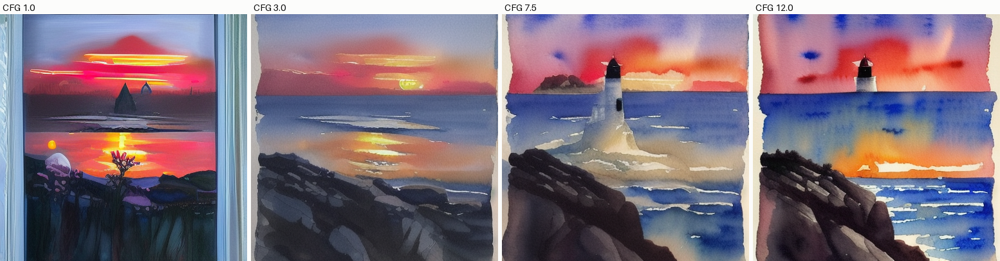
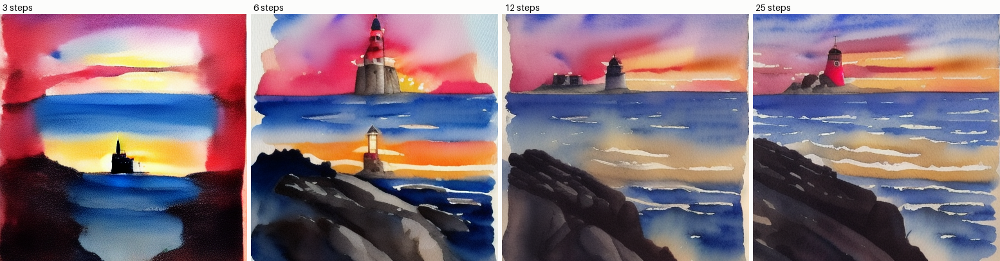
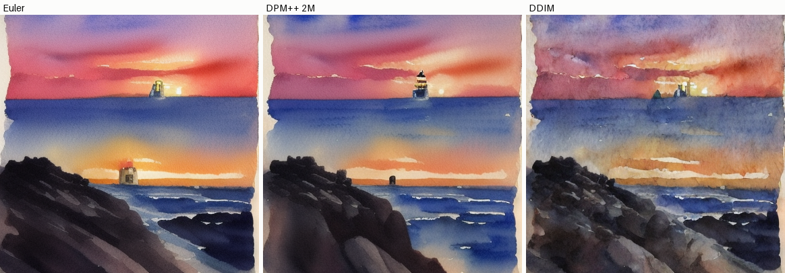

# Run SD Inference

## Key Insight

[Stable Diffusion](/shared/glossary/#stable-diffusion) 1.5 turned text-to-image generation into something you can run on a single consumer GPU, and the `diffusers` library wraps the whole pipeline — text encoder, [U-Net](/shared/glossary/#u-net), and [VAE](/shared/glossary/#vae) decoder — behind a few lines of code. This project builds intuition for the three knobs that matter most at inference: the [classifier-free guidance (CFG)](/shared/glossary/#cfg-classifier-free-guidance) scale (how hard the model is pushed toward your prompt), the sampler (the [ODE/SDE](/shared/glossary/#ode) solver that takes each denoising step, e.g. [DDIM](/shared/glossary/#ddim) or [DPM-Solver++](/shared/glossary/#dpm-solver)), and the number of steps (more steps = slower but usually cleaner). Sweeping each one while holding the others fixed exposes the trade-offs — high CFG sharpens prompt adherence but oversaturates, while a [higher-order sampler](/shared/glossary/#higher-order-sampler) reaches good quality in far fewer steps — all without touching the model weights.

## What's in this directory

| File | Role |
|------|------|
| `run_sd_inference.py` | Loads the pipeline and runs the three sweeps, one contact sheet each |
| `contact.py` | Small helper that pastes labeled images into one sheet (reused by projects 37 and 40–42) |

**About the model.** The recorded run uses `segmind/tiny-sd` — a
knowledge-distilled Stable Diffusion 1.5 with the identical architecture,
latent space, text encoder, and `diffusers` API, at roughly half the U-Net —
generated at 384×384 so all eleven images finish in about six minutes on a
CPU. On a GPU, set `MODEL_ID` to SD 1.5 proper and `SIZE = 512`; not one
other line changes. Every observation below transfers, because the knobs
being swept belong to the *sampling machinery*, not to any particular
checkpoint.

```bash
python run_sd_inference.py       # ~6 min on a multicore CPU
```

Note what the three sweeps really are: everything in this pipeline is
machinery you have already built by hand — the CFG extrapolation is project
32, the samplers are project 31's solvers on project 34's ODE, and the VAE
encode/decode bracket is projects 38/39. This project is where those pieces
meet a 900M-parameter production model.

## Results

**CFG sweep** (DPM++ 2M, 15 steps, same seed). At `CFG 1` — no guidance —
the image is muddy and only loosely on-prompt; `3` is coherent but soft;
`7.5` (the community default) is crisp and saturated; `12` pushes contrast
and color to the edge of poster-like:



**Step-count sweep** (DPM++ 2M, CFG 7.5). Three steps is recognizably the
right scene with smeared detail, and the gap from 12 to 25 is subtle — the
higher-order-solver lesson from project 31 operating at full scale:



**Sampler comparison at 8 steps** (CFG 7.5). At generous step counts all
good samplers agree; starving them to 8 steps is where they differentiate.
DPM++ 2M holds together best at this budget, DDIM is the softest, Euler
in between — same ranking the solver-error curves of project 31 predict:



## Things to try

- Fix everything and vary only the seed: same knobs, wildly different
  compositions — the noise is the composition.
- Sweep CFG at 3 steps. Guidance and step count interact: high CFG needs
  enough steps to absorb the push it applies.
- Print `pipe.unet.config.cross_attention_dim` and trace where the text
  embeddings enter — then look at project 46's MMDiT block for how the
  same wiring looks in current-generation models.
