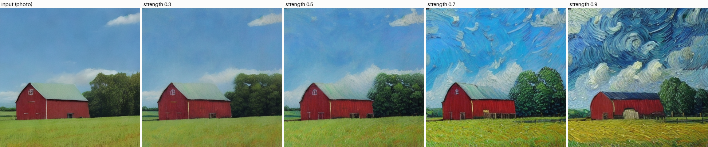
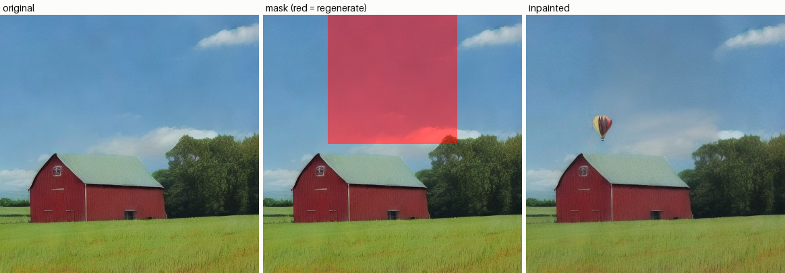

# img2img and Inpainting

## Key Insight

[img2img](/shared/glossary/#img2img) and [inpainting](/shared/glossary/#inpainting) show that the same trained [diffusion model](/shared/glossary/#diffusion-model) does far more than generate from scratch — both fall out of the [Stable Diffusion](/shared/glossary/#stable-diffusion) sampling loop almost for free. The key control is the *noise strength* (also called denoising strength): instead of starting from pure noise, you partially noise an existing image and denoise from there, so a low strength keeps the original almost intact while a high strength redraws it freely. Inpainting adds a mask so only the selected region is regenerated while the known pixels are pasted back on every step — exactly how you erase an object or swap a face without disturbing the rest of the picture.

## What's in this directory

| File | Role |
|------|------|
| `diy_pipeline.py` | The four raw SD components wired by hand: a vanilla `txt2img` loop, then `img2img` and `inpaint` as small modifications of it |
| `run_demo.py` | Generates a base image, sweeps img2img strength, and inpaints a masked region |

No `StableDiffusionImg2ImgPipeline`, no special inpainting checkpoint. The
deliberate constraint of this project is to build both features from the
*vanilla* loop, because that is where the understanding lives.

```bash
python run_demo.py       # ~5 min on a multicore CPU
```

## The two modifications, in full

**The vanilla loop** (`txt2img`): embed the prompt (twice — empty string for
CFG's unconditional branch), start from Gaussian noise in latent space, step
the scheduler down to zero, decode once at the end.

**img2img is a late entry point.** Encode the init image with the VAE,
noise it *directly* to an intermediate level with the closed-form forward
jump (project 24's `q_sample`, wearing its `scheduler.add_noise` name), and
run only the remaining portion of the loop:

```python
start = int(steps * strength)          # how much of the loop to run
timesteps = timesteps[steps - start:]  # skip the high-noise steps
z = scheduler.add_noise(encode(init_image), noise, timesteps[:1])
```

`strength` is nothing but "what fraction of the schedule to traverse."
At 1.0 the init image is noised beyond recognition (pure txt2img); at 0.0
the loop never runs. Everything in between trades faithfulness for freedom.

**Inpainting is a per-step constraint.** Run the normal full loop, but after
every scheduler step, overwrite the known region with the original latents
re-noised to the *current* step's level, so known and generated content
always sit at the same noise level:

```python
z = scheduler.step(eps, t, z).prev_sample
z_known_t = scheduler.add_noise(z_known, noise, t_next)
z = mask * z + (1 - mask) * z_known_t    # mask = 1 where we generate
```

The U-Net fills the hole with content consistent with its surroundings
because on every step its receptive field sees the (noised) real context.
Note the mask lives at latent resolution (48×48 for a 384px image) — an
8-pixel fuzziness at region edges that dedicated inpainting models fix by
also feeding the mask to the U-Net as extra input channels.

## Results

**Strength sweep.** A generated "photo" of a barn re-rendered toward
*"a van gogh style oil painting…"* at strengths 0.3 → 0.9. Composition
survives at 0.3–0.5 while the medium changes; by 0.9 the model keeps only a
loose memory of the layout. This one image row is the whole strength
parameter:



**Inpainting.** The masked sky region (shown red) is regenerated to ask for
a hot-air balloon; the barn and field outside the mask are byte-identical
latents to the original:



## Things to try

- Set strength 0.5 but leave the prompt identical to the base image's —
  img2img becomes a "re-roll the details" button.
- Feed the inpainting loop a mask of all ones. You have proven inpainting
  strictly generalizes txt2img.
- Reverse the mask sense: keep the hole, regenerate the *surroundings* —
  that is exactly project 42 (outpainting), which imports this file.
