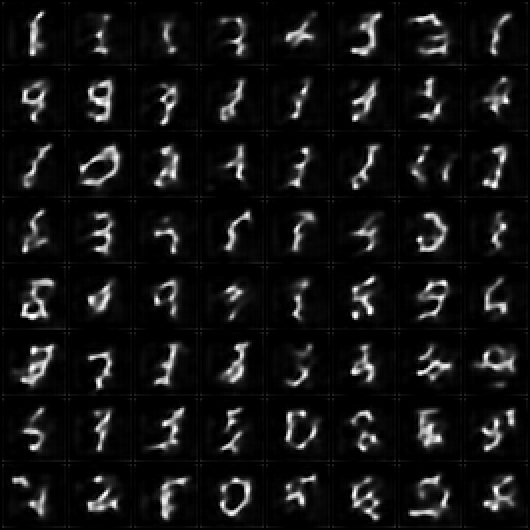

# Train a Latent DDPM

## Key Insight

This project is a miniature of how [Stable Diffusion](/shared/glossary/#stable-diffusion) actually works: instead of running [DDPM](/shared/glossary/#ddpm) directly on pixels, you first compress each [CIFAR-10](/shared/glossary/#cifar-10) image with an 8× [VAE](/shared/glossary/#vae) into a tiny 4×4 [latent](/shared/glossary/#latent-space), then train a small [U-Net](/shared/glossary/#u-net) to denoise in that latent grid — the core idea of [latent diffusion (LDM)](/shared/glossary/#ldm). Because the latent has roughly 48× fewer numbers than the pixels, every training and sampling step is dramatically cheaper, and you decode back to pixels only at the very end. Comparing it to a pixel-space DDPM on the same data makes the central lesson concrete: most of diffusion's cost is spent on pixel detail the VAE can reconstruct anyway.

## What's in this directory

| File | Role |
|------|------|
| `train_latent_ddpm.py` | Freeze project 39's VAE, cache the whole dataset as latents, train project 24's U-Net on them |
| `sample_latent.py` | Sample in latent space, decode once at the end; measure the latent-vs-pixel cost head-to-head |

The recorded demo diffuses MNIST in project 39's 8×8×4 latent space (the
guide's CIFAR-10 framing needs only a different dataset and VAE — the loop
is identical). Note what does NOT appear anywhere in the training script:
images. After the one-time encoding pass, diffusion never touches a pixel.

```bash
python train_latent_ddpm.py     # ~1 min of training on CPU
python sample_latent.py
```

## The recipe, step by step

1. **Freeze the VAE.** Loaded from project 39's checkpoint, gradients off.
   The frozen-VAE recipe is what makes LDM modular: the compressor and the
   generator never train together.
2. **Encode the dataset once, cache to disk.** 60k images become a
   `(60000, 4, 8, 8)` tensor. Production LDM training does exactly this —
   latent caching is why SD trains without paying VAE-encoder cost per step.
3. **Multiply by the scale factor** measured in project 39 — the `0.18215`
   move. The diffusion schedule assumes unit-variance data; this line is
   where that assumption is made true. (Delete it and retrain to see the
   failure mode the guide warns fine-tuners about.)
4. **Train the same U-Net class as project 24**, unchanged except for its
   constructor arguments: 4 input channels, 8×8 resolution. The diffusion
   math (project 24's `GaussianDiffusion`) is imported as-is — latent
   diffusion is *ordinary diffusion pointed at different tensors*.
5. **Sample in latent space, decode once.** The VAE decoder runs exactly
   one time per batch of images, after the entire 300-step loop.

## Results

**Samples** — 64 digits generated entirely in 8×8×4 latent space, decoded
at the end:



**The cost story, measured on this machine**
(`outputs/speed_comparison.csv`, recorded run): 3.1× fewer dimensions per
example became a **6.2× faster training step** (167 ms → 27 ms at batch
64 — better than linear, because attention and the deep levels shrink
faster than the pixel count). The recorded model trained for 4 000 steps —
**4× project 24's step budget in comparable wall-clock time** (~4 min) —
and the full 300-step sampling loop for 64 images ran in under 3 seconds,
with the single VAE decode adding milliseconds. At 512×512 with an 8× VAE
the same arithmetic is the guide's headline ~48× — this is that effect,
small enough to measure on a laptop.

Look closely at the samples and you can also see the trade's cost: strokes
are slightly soft, because every sample passes through the VAE decoder —
the ceiling below. Latent diffusion buys speed with whatever the compressor
loses.

**The ceiling** — real digits (top) against their VAE round-trips (bottom).
The latent DDPM can never look better than this row of reconstructions, no
matter how long it trains. That inequality — *generator quality ≤ compressor
quality* — is why project 39 exists as its own project:


## Things to try

- Skip step 3 (scale factor) and retrain: the schedule's terminal SNR no
  longer matches pure noise, and samples degrade — the most common LDM
  fine-tuning bug, reproduced on purpose.
- Sample with project 27's DDIM or project 31's Heun in latent space:
  the two speedups (latent + fewer steps) multiply.
- Recompute the cost table at CIFAR scale (project 25's config vs a
  16×16×4 latent U-Net) and watch the gap widen with resolution.
