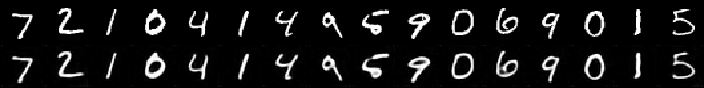
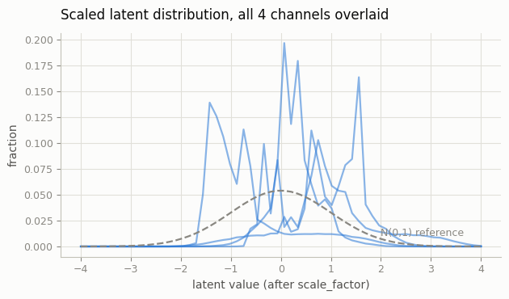

# Train a VAE for Diffusion

## Key Insight

Every [latent diffusion](/shared/glossary/#ldm) model is only as good as the [VAE](/shared/glossary/#vae) it generates in, so this project trains that compressor properly before any diffusion happens — on [CelebA](/shared/glossary/#celeba) faces, where it is easy to judge whether reconstructions look real. The recipe is the one [Stable Diffusion](/shared/glossary/#stable-diffusion)'s VAE descends from: combine a [perceptual loss (LPIPS)](/shared/glossary/#perceptual-loss-lpips) for sharp textures, an adversarial loss from a [discriminator](/shared/glossary/#discriminator) so fine detail looks real instead of blurry, and a light [KL](/shared/glossary/#kl-divergence) penalty to keep the latent space smooth enough to diffuse in. The point is to verify the VAE is a faithful compressor first — a leaky one silently caps the quality of any diffusion model you later train on its latents.

## What's in this directory

| File | Role |
|------|------|
| `vae.py` | The KL-regularized autoencoder (32×32×1 → 8×8×4 latent) and the three-part loss |
| `train_vae.py` | Training, plus computing the SD-style latent scale factor |
| `evaluate_vae.py` | The "is it a good compressor?" audit: recon grid, metrics, latent histograms |

The recorded demo runs on MNIST (padded to 32×32) so the whole project fits
a CPU coffee break; the guide's CelebA target is the same code with a photo
dataset and the adversarial term enabled — see the scale notes below.

```bash
python train_vae.py            # ~4 min on a multicore CPU
python evaluate_vae.py
```

## The recipe, and which parts this demo keeps

The SD-class VAE loss is `recon + w_lpips * LPIPS + w_adv * GAN + w_kl * KL`
with `w_kl` tiny. This project keeps the structure at MNIST scale:

- **Reconstruction (MSE)** — the backbone.
- **Perceptual term** — feature-space distance under project 26's MNIST
  classifier, standing in for LPIPS: match what a recognition network sees,
  not just pixels.
- **KL, weight 1e-4** — deliberately ~4 orders of magnitude lighter than a
  generative VAE's (compare project 07). We do not want `N(0, I)` latents we
  can sample from; we want a *smooth, bounded* latent space. The diffusion
  model does the generating. This weighting is the single biggest conceptual
  difference between "a VAE" and "a VAE for diffusion."
- **Adversarial term — omitted.** At photo scale, plain-MSE VAEs go blurry
  because MSE averages over plausible textures, and a patch discriminator is
  what buys back crispness. MNIST strokes have no such texture to lose. At
  CelebA scale, add a small PatchGAN on reconstructions with weight ramped in
  after the VAE stabilizes (the LDM paper's exact schedule).

**The scale factor.** After training, `train_vae.py` measures the latent
standard deviation on held-out data and stores `1/std` in the checkpoint —
the same statistic SD ships as its famous `0.18215`. Diffusion assumes
roughly unit-variance data at `t = 0` (every schedule in phases 5–6 was
built on that assumption); an unscaled latent space quietly breaks the noise
schedule. Project 38 multiplies by this factor on encode and divides on
decode.

## Results

**The eyeball test** — originals (top) and reconstructions (bottom) through
the 4×-fewer-numbers bottleneck:



**The audit** (`outputs/metrics.csv`, recorded run): pixel MSE, perceptual
distance, and — the most decision-relevant row — how often project 26's
classifier gives the original and its reconstruction the same label. If the
compressor loses class identity, no diffusion model in this latent space can
draw a legible digit.

**Latent-space health.** All four channels of the *scaled* latents, overlaid
against a `N(0, 1)` reference. Roughly centered, roughly unit scale, no
channel wildly different from the others — the property the scale factor
exists to guarantee:



## Things to try

- Retrain with `--kl-weight 1.0` (a real VAE) and rerun project 38 on it:
  reconstructions blur and the diffusion samples inherit the blur — the
  leaky-compressor ceiling, demonstrated.
- Retrain with `--kl-weight 0` (a plain autoencoder): reconstruction
  improves slightly, but check the latent histograms — outliers and
  per-channel scale drift are what the "light KL" was suppressing.
- Drop the perceptual term and compare reconstruction sharpness by eye —
  even on MNIST the difference is visible in stroke edges.
