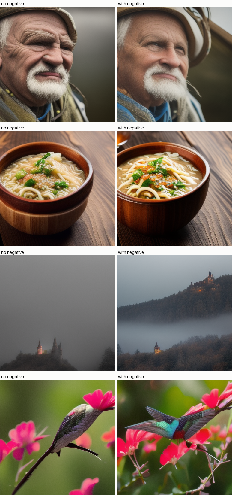

# Negative Prompts Study

## Key Insight

A [negative prompt](/shared/glossary/#negative-prompt) is a second prompt naming what you *don't* want ("ugly, blurry, low quality"), and it costs nothing extra because it simply replaces the blank unconditional input that [classifier-free guidance (CFG)](/shared/glossary/#cfg-classifier-free-guidance) already runs — the model is pushed away from the negative prompt's prediction and toward your real one. This project measures whether that actually helps by generating 50 prompts with and without negatives and scoring both sets: [FID](/shared/glossary/#fid) for realism, a [CLIP](/shared/glossary/#clip) score for prompt adherence, and an [aesthetic score](/shared/glossary/#aesthetic-score) for human-judged appeal. The result builds honest intuition for when negatives genuinely improve images versus when they merely shift the style.

## What's in this directory

| File | Role |
|------|------|
| `negative_prompts.py` | Generates each prompt with and without the standard negative (same seed), builds side-by-side pairs, and CLIP-scores every image against its prompt |

The recorded run is a scaled-down version of the guide's protocol so it
finishes in minutes on CPU: 4 prompts × 2 conditions with the distilled
SD 1.5 (`segmind/tiny-sd`, see project 36) and CLIP ViT-B/32 scoring. The
full study is the same loop with bigger constants — 50 prompts, FID against
a real-image set, and a learned aesthetic head on the CLIP features. Nothing
about the mechanism changes with scale, only the error bars.

```bash
python negative_prompts.py       # ~5 min on a multicore CPU
```

## Where the negative enters (the whole trick)

Project 32 established CFG:
`eps = eps_uncond + s * (eps_cond - eps_uncond)`. A negative prompt is one
line: the `""` used to compute `eps_uncond` becomes `"ugly, blurry, low
quality, deformed"`. The extrapolation now points *from* that description
*toward* yours — every step actively walks away from "blurry" instead of
away from "average image." That is the entire implementation; `diffusers`
exposes it as the `negative_prompt` argument. You reinvented this in
project 32's "Things to try" by guiding class 3 away from class 8.

## Results

**The pairs** (same seed left/right — every visible difference is caused by
the negative alone):



**CLIP adherence scores** (`outputs/clip_scores.csv`): prompt-image cosine
similarity for each pair. Two honest observations from the recorded run,
which the full 50-prompt protocol would quantify with confidence intervals:

- CLIP moved in *both directions* (−0.05 to +0.04 across the four pairs).
  Encouragingly, the two pairs that look clearly better to a human — the
  hummingbird, which goes from malformed to properly-shaped, and the castle,
  which gains structure through the fog — are exactly the two whose CLIP
  score rose; the two that merely shifted style paid a small adherence cost.
  With n = 4 none of this is statistically meaningful, which is itself the
  argument for the guide's 50-prompt protocol with FID and an aesthetic
  score: pick metrics (and sample sizes) that can see the thing you changed.
- The visual effect is real but not uniformly positive: some pairs get
  cleaner and more contrasty, others just get *different* — shifted palette
  and framing. "Negatives help" is prompt-dependent, which is exactly what
  the guide's phrase "when they merely shift the style" is warning about.

## Things to try

- Use a *semantic* negative ("trees, forest") on the castle prompt and
  watch content actually disappear — negatives are strongest when they name
  concrete things, not quality adjectives.
- Put the standard negative in as the *positive* prompt to see what the
  model thinks "ugly, blurry, low quality" looks like — that image is what
  every step pushes away from.
- Sweep CFG scale with the negative fixed: the negative's influence scales
  with `s`, same as the positive's.
