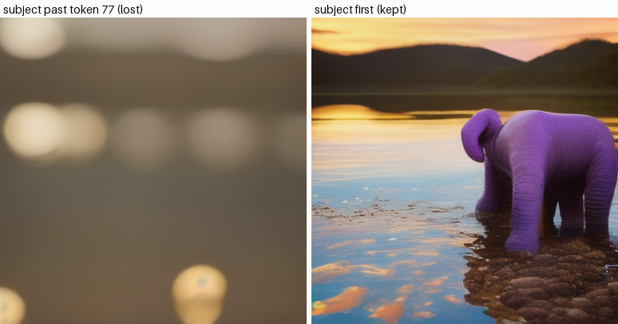

# Long-Prompt Test

## ELI5 (Explain Like I'm 5)

- **The Big Idea:** The text encoder a model uses decides how well it understands a long, detailed prompt. Early models used CLIP, which could only read short sentences (up to 77 words) and would get confused by long, complex instructions. Modern models also use T5, a text encoder trained on massive amounts of text that can understand long paragraphs and complex relationships between words. This project compares how well both encoders follow a 200-word prompt.
- **Analogy:** Imagine giving instructions to a delivery driver. CLIP is like a driver who only reads the first few words of your text: "Go to Main Street..." and ignores the rest. T5 is like a driver who reads the entire paragraph: "Go to Main Street, turn left at the red mailbox, and leave the package behind the blue flower pot."
- **Example:** For the prompt "A small red mouse wearing a blue hat sitting next to a yellow cheese block on a wooden table," CLIP might generate a red mouse but forget the hat or make the cheese red. T5 will correctly generate all elements and place them in the right spots.


## Key Insight

The text encoder a model uses decides how well it understands a long, detailed prompt. The original [Stable Diffusion](/shared/glossary/#stable-diffusion) used [CLIP](/shared/glossary/#clip)'s text encoder (the "CLIP-L" variant), which was trained only to match images to short captions and tops out around 77 tokens — so it tends to drop or blur details in a paragraph-long prompt. [T5](/shared/glossary/#t5), trained on general language tasks, tracks word order and long-range detail far better, which is why newer models feed it through [cross-attention](/shared/glossary/#cross-attention) for stronger adherence. Running the same 200-token prompts through each and comparing the images makes the gap visible: T5 follows compositional, multi-clause descriptions that CLIP-L quietly collapses.

## What's in this directory

| File | Role |
|------|------|
| `long_prompt.py` | Makes the 77-token truncation visible (tokenizer round-trip), then demonstrates its behavioral consequence with a same-seed A/B generation |

The guide's full framing compares CLIP-L against T5 conditioning on
200-token prompts, which requires a T5-conditioned generator (SD3/Flux
scale — far beyond a CPU session). The recorded demo isolates the half of
the comparison that runs anywhere and is the part people actually get bitten
by: **what CLIP-L does to a long prompt**. The T5 side is discussed below.

```bash
python long_prompt.py       # ~2 min on a multicore CPU
```

## Experiment 1: the truncation, made visible

The test prompt is 89 tokens of photography boilerplate with the actual
subject — *"a bright purple elephant standing in a shallow river"* —
mentioned **last**. `long_prompt.py` tokenizes it exactly the way the
pipeline does and decodes back both halves. From the recorded run
(`outputs/truncation_report.txt`): the model keeps the first 77 tokens of
camera-settings filler and **silently drops the entire subject**. No
warning, no error — the elephant never reaches the text encoder.

## Experiment 2: the behavioral consequence

Same seed, same settings, two orderings of the same words:



Subject-last (left): a generic golden-hour photograph assembled from the
filler that survived — no elephant, no river, because the model never saw
them. Subject-first (right): the elephant appears. The single most useful
practical rule for SD 1.x falls out: **put the subject in the first
sentence; token position is a budget.**

## Where T5 changes the story

Why CLIP-L behaves this way: it was contrastively trained to pool short
alt-text captions into ONE vector aligned with an image embedding — long
compositional text was never in its training distribution, and its 77-token
context is a hard architectural cap. T5 is a general language encoder:
thousands-of-tokens context, trained on tasks where word order and clause
structure carry meaning. Models that feed T5 (or CLIP + T5 dual encoders —
SD3, Flux; the guide's "vibe + literal meaning" split) through
cross-attention demonstrably follow multi-clause, spatially-precise prompts
that SD 1.x collapses. To run the guide's full comparison on a GPU:
generate the same 200-token prompts with SD 1.5 and with SD3-medium or
Flux-schnell via this same `diffusers` API, and score adherence per-clause.
The truncation mechanics you just measured are the control arm of that
experiment.

Community workarounds for SD 1.x (worth knowing, all with caveats):
chunking the prompt into 77-token windows and concatenating the embeddings
(what "prompt weighting" extensions do), or piping the long description
through img2img in stages. Both are patches over an encoder that simply
cannot represent the whole sentence.

## Things to try

- Move the subject to token ~70 so it straddles the boundary: partially
  seen concepts produce partial adherence — sometimes a purple *something*.
- Re-run the A/B with the filler removed entirely. Shorter prompts are not
  worse: adherence comes from what fits, not from prompt length.
- Tokenize your own favorite mega-prompt and read what actually survives —
  almost everyone is surprised the first time.
