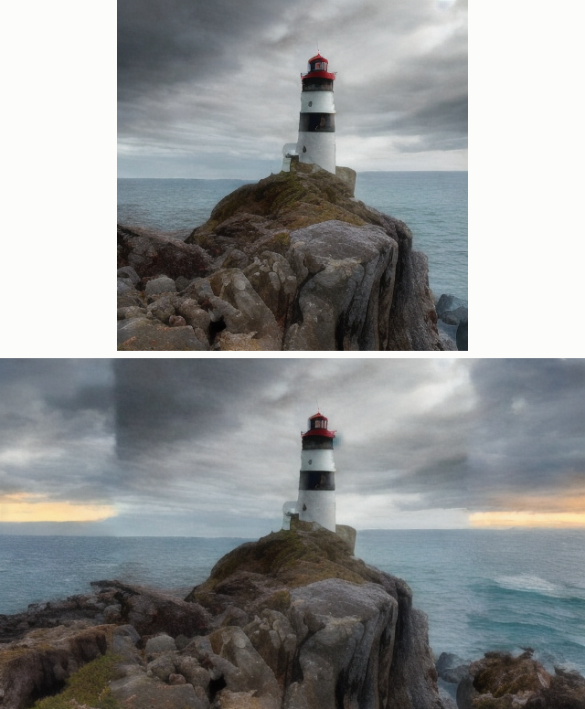

# Outpainting

## Key Insight

[Outpainting](/shared/glossary/#outpainting) extends an image *beyond* its original borders — turning a portrait into a full scene — and the trick is that it is just [inpainting](/shared/glossary/#inpainting) pointed outward: you paste the original onto a larger blank canvas, mark the new border region as the area to fill, and let the [diffusion model](/shared/glossary/#diffusion-model) generate only there while keeping the original pixels fixed. Because the model conditions on the surviving edge, the new content continues the scene's lighting, texture, and lines naturally instead of starting fresh. This project builds it directly on top of an inpainting loop, which is the whole point: no new training, just a bigger canvas and the right mask.

## What's in this directory

| File | Role |
|------|------|
| `outpaint.py` | Canvas construction (with mirrored-edge pre-fill), the border mask, and the call into the [img2img and inpainting](../37-img2img-and-inpainting/README.md) project's inpainting loop |

The heavy lifting is imported from the [img2img and inpainting](../37-img2img-and-inpainting/README.md) project's `diy_pipeline.py` —
literally the same `inpaint()` function, handed a wider canvas and a mask
that is the *complement* of the usual one. If you have read the [img2img and inpainting](../37-img2img-and-inpainting/README.md) project,
this file contains almost nothing new, and that is the lesson.

```bash
python outpaint.py       # ~3 min on a multicore CPU
```

## The three decisions that make it work

1. **The canvas.** A 384×384 lighthouse photo becomes a 640×384 canvas with
   128 new pixels on each side. Everything, as always, happens in latent
   space: the canvas encodes to 80×48 latents and the mask marks the outer
   16 latent columns per side as "generate."
2. **The pre-fill.** The new border is filled with *mirrored copies of the
   image edges* before encoding, not zeros. The known-region latents that
   the loop re-imposes each step are only defined where the image existed;
   the pre-fill gives the very first denoising steps a plausible color and
   luminance context to look at instead of a gray void. (Try filling with
   gray to see why this matters: the model anchors early global structure
   on whatever is there.)
3. **The prompt describes the WHOLE scene**, not the border: "a wide
   panoramic photo of a lighthouse on a cliff… coastline stretching into
   the distance." The model generates only where the mask allows, but its
   cross-attention reads the prompt globally — a prompt about "the edges of
   an image" would produce edges of *something else*.

## Results

Top: the original 384×384 image on the extended canvas. Bottom: the
outpainted panorama — sky, ocean, and cliff line continue across the seam
because every denoising step conditioned on the noised original at the
boundary:



Look closely at the seams — at this budget (15 steps, latent-resolution
mask) faint transitions are visible where lighting extrapolates. Production
outpainting adds the same fixes dedicated inpainting models use: feed the
mask to a U-Net trained for it, feather the mask over a few latent columns,
and outpaint in several overlapping strips for very wide extensions.

## Things to try

- Outpaint iteratively: run this script's output through itself for another
  128 pixels per side. Drift accumulates — each generation conditions on
  the previous generation's inventions.
- Change the prompt to contradict the original ("…at night, under stars")
  and watch the border fight the fixed center — a clean demonstration that
  the known region wins inside the mask boundary and loses outside it.
- Extend downward instead of sideways (mask rows, not columns): grounds and
  foregrounds are harder than skies — more structured content to invent.
