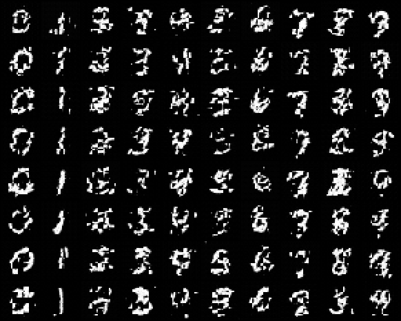

# Implement DiT-S/2

## Key Insight

This project replaces the [U-Net](/shared/glossary/#u-net) at the heart of a diffusion model with a [Diffusion Transformer (DiT)](/shared/glossary/#dit): you cut the noisy [latent](/shared/glossary/#latent-space) into 2×2 [patches](/shared/glossary/#patchification) (that is the "/2"), feed the resulting sequence of tokens through 12 transformer blocks of width 384 (the "S", for small), and predict the added noise just as before. The conditioning — the timestep plus the class label — enters through [AdaLN-Zero](/shared/glossary/#adaln-zero), which predicts per-channel shift/scale/gate values that start at zero, so each block begins as a do-nothing identity and only gradually learns to modulate the activations. Training it [class-conditionally](/shared/glossary/#class-conditioning) on [CIFAR-10](/shared/glossary/#cifar-10) and comparing [FID](/shared/glossary/#fid) against your earlier U-Net baseline reveals the transformer's real selling point: it is not magically better at this small scale, but it [scales](/shared/glossary/#scaling-laws) far more predictably as you add parameters and compute.

## What's in this directory

| File | Role |
|------|------|
| `dit.py` | The full architecture: patchify, AdaLN-Zero blocks, hand-rolled attention, final modulated projection, unpatchify |
| `train_dit.py` | Class-conditional training — the [DDPM on MNIST](../24-ddpm-on-mnist/README.md) project's diffusion math, unchanged |
| `sample_dit.py` | Per-class sample grid |

The recorded demo is a **DiT-mini**: 6 blocks, dim 128, patch 4 on 28×28
MNIST pixels (~1.9M params, 49 tokens), against the reference DiT-S/2's 12
blocks of dim 384 on 32×32×4 latents. Same architecture, same code paths —
only the constructor numbers differ (`DIT_MINI` in `dit.py`), and the
class-conditional CIFAR target from the guide is this plus the [DDPM on CIFAR-10](../25-ddpm-on-cifar-10/README.md) project's
loader and the [Train a VAE for diffusion](../39-train-a-vae-for-diffusion/README.md) project's VAE.

```bash
python train_dit.py            # ~9 min on a multicore CPU (see below for why)
python sample_dit.py
```

## The architecture, piece by piece

**Patchify** — a strided conv turns `(1, 28, 28)` into 49 tokens of dim 128,
plus a learned position vector per token (the [2D RoPE for DiT](../44-2d-rope-for-dit/README.md) project replaces exactly this
piece). From here on, the image is a sequence; nothing downstream knows or
cares that tokens have 2D structure.

**AdaLN-Zero blocks** — a standard pre-norm transformer block whose two
LayerNorms have no learned affine parameters of their own; instead the
conditioning vector (timestep embedding + class embedding) predicts six
values per block: `(shift, scale, gate)` for the attention branch and again
for the MLP branch. The gates are **zero-initialized**, so at step 0 every
block is the identity function and the whole network outputs zero — the
same "start from nothing" trick as the U-Net's zero-initialized output conv
(the [DDPM on MNIST](../24-ddpm-on-mnist/README.md) project), applied at every block. This is the entire conditioning
mechanism: no cross-attention, no concatenation; the label reaches every
block through 6 x dim numbers.

**Attention is written out by hand** (`qkv` linear +
`scaled_dot_product_attention`) rather than using `nn.MultiheadAttention` —
deliberate, because the [2D RoPE for DiT](../44-2d-rope-for-dit/README.md) project needs to rotate `q` and `k` before the dot
product (RoPE) and the [MMDiT block](../46-mmdit-block/README.md) project needs to concatenate two token streams, and
neither is possible through the closed module.

**Unpatchify** — the final layer applies one more AdaLN modulation, then a
zero-initialized linear maps each token back to its `patch x patch` pixels.

**What did NOT change from phase 5**: `GaussianDiffusion`, the loss, the
sampler, EMA — the training script imports them from the [DDPM on MNIST](../24-ddpm-on-mnist/README.md) project untouched.
Diffusion is indifferent to what predicts the noise; "DiT" is one changed
constructor call.

## Results

Per-class grid (columns = requested digits 0–9), full 300-step sampling from
the EMA weights after 3 500 steps:



**The honest small-scale finding.** Our first run used the U-Net's budget
(1 500 steps, lr 3e-4) and produced fragmented, patch-boundary-artifacted
samples with *no visible class control* — at a training loss comparable to
the U-Net's (the eps loss is dominated by high-noise timesteps and barely
sees the low-noise regime where patch seams live; never judge a diffusion
model by its loss alone). The recorded run above uses 3 500 steps and a
hotter transformer-appropriate lr (1e-3, which we measured to double
effective training speed): class control is now unmistakable column by
column, but strokes remain rougher than the U-Net's at similar wall-clock.
That remaining gap **is** the guide's "U-Net is faster per FLOP at small
scales" — convolution's locality and translation equivariance are hard-coded
priors the transformer must instead *learn* from data, and at 1.9M params on
60k images that purchase is still in progress. The [Compare DiT and U-Net scaling](../48-compare-dit-and-u-net-scaling/README.md) project turns this
observation into a measured curve, and the DiT paper's answer to it is
simply: keep scaling — the transformer's ceiling is higher even though its
floor is slower to leave.

## Things to try

- Set `patch=2` (196 tokens): finer detail, ~2.5x the cost per step —
  the patch-size/compute trade every DiT paper negotiates.
- Zero out the label embedding at sampling time: AdaLN conditioning degrades
  gracefully into an unconditional model.
- Delete the `nn.init.zeros_` lines in the block and retrain: watch early
  training destabilize — "Zero" is not decoration.
